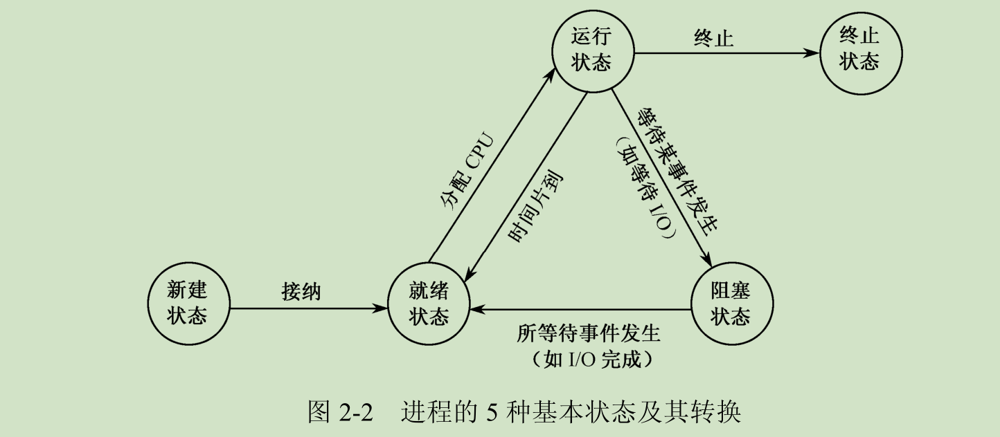

- [后端试题总结](https://github.com/HamRadioDXer/language-leaning/blob/master/%E5%90%8E%E7%AB%AF.md)
- [《UNIX系统高级编程》](https://github.com/HamRadioDXer/language-leaning/blob/master/apue.md)
- [腾讯面](https://github.com/HamRadioDXer/language-leaning/blob/master/%E8%85%BE%E8%AE%AF%E9%9D%A2.md)
- [牛客网剑指offer刷题](https://github.com/HamRadioDXer/language-leaning/blob/master/%E5%89%91%E6%8C%87offer%E7%89%9B%E5%AE%A2%E7%BD%91%E9%A1%BA%E5%BA%8F%E6%B1%87%E6%80%BB.pdf)


---
## 真棒！ 20 张图揭开内存管理的迷雾，瞬间豁然开朗

Original 小林coding [小林coding](javascript:void(0);) *6/29*

来自专辑

图解操作系统

##### 每日英语，每天进步一点点


------

## 前言

之前有不少读者跟我反馈，能不能写图解操作系统？

既然那么多读者想看，我最近就在疯狂的复习操作系统的知识。

操作系统确实是比较难啃的一门课，至少我认为比计算机网络难太多了，但它的重要性就不用我多说了。

学操作系统的时候，主要痛苦的地方，有太多的抽象难以理解的词语或概念，非常容易被劝退。

即使怀着满腔热血的心情开始学操作系统，不过 `3` 分钟睡意就突然袭来。。。

该啃的还是得啃的，该图解的还是得图解的，万众期待的「**图解操作系统**」的系列来了。

本篇跟大家说说**内存管理**，内存管理还是比较重要的一个环节，理解了它，至少对整个操作系统的工作会有一个初步的轮廓，这也难怪面试的时候常问内存管理。

干就完事，本文的提纲：

本文提纲

------

## 正文

### 虚拟内存

如果你是电子相关专业的，肯定在大学里捣鼓过单片机。

单片机是没有操作系统的，所以每次写完代码，都需要借助工具把程序烧录进去，这样程序才能跑起来。

另外，**单片机的 CPU 是直接操作内存的「物理地址」**。


在这种情况下，要想在内存中同时运行两个程序是不可能的。如果第一个程序在 2000 的位置写入一个新的值，将会擦掉第二个程序存放在相同位置上的所有内容，所以同时运行两个程序是根本行不通的，这两个程序会立刻崩溃。

> 操作系统是如何解决这个问题呢？

这里关键的问题是这两个程序都引用了绝对物理地址，而这正是我们最需要避免的。

我们可以把进程所使用的地址「隔离」开来，即让操作系统为每个进程分配独立的一套「**虚拟地址**」，人人都有，大家自己玩自己的地址就行，互不干涉。但是有个前提每个进程都不能访问物理地址，至于虚拟地址最终怎么落到物理内存里，对进程来说是透明的，操作系统已经把这些都安排的明明白白了。

进程的中间层

**操作系统会提供一种机制，将不同进程的虚拟地址和不同内存的物理地址映射起来。**

如果程序要访问虚拟地址的时候，由操作系统转换成不同的物理地址，这样不同的进程运行的时候，写入的是不同的物理地址，这样就不会冲突了。

于是，这里就引出了两种地址的概念：

- 我们程序所使用的内存地址叫做**虚拟内存地址**（*Virtual Memory Address*）
- 实际存在硬件里面的空间地址叫**物理内存地址**（*Physical Memory Address*）。

操作系统引入了虚拟内存，进程持有的虚拟地址会通过 CPU 芯片中的内存管理单元（MMU）的映射关系，来转换变成物理地址，然后再通过物理地址访问内存，如下图所示：

虚拟地址寻址

> 操作系统是如何管理虚拟地址与物理地址之间的关系？

主要有两种方式，分别是**内存分段和内存分页**，分段是比较早提出的，我们先来看看内存分段。

------

### 内存分段

程序是由若干个逻辑分段组成的，如可由代码分段、数据分段、栈段、堆段组成。**不同的段是有不同的属性的，所以就用分段（\*Segmentation\*）的形式把这些段分离出来。**

> 分段机制下，虚拟地址和物理地址是如何映射的？

分段机制下的虚拟地址由两部分组成，**段选择子**和**段内偏移量**。

内存分段-寻址的方式

- **段选择子**就保存在段寄存器里面。段选择子里面最重要的是**段号**，用作段表的索引。**段表**里面保存的是这个**段的基地址、段的界限和特权等级**等。
- 虚拟地址中的**段内偏移量**应该位于 0 和段界限之间，如果段内偏移量是合法的，就将段基地址加上段内偏移量得到物理内存地址。

在上面了，知道了虚拟地址是通过**段表**与物理地址进行映射的，分段机制会把程序的虚拟地址分成 4 个段，每个段在段表中有一个项，在这一项找到段的基地址，再加上偏移量，于是就能找到物理内存中的地址，如下图：

内存分段-虚拟地址与物理地址

如果要访问段 3 中偏移量 500 的虚拟地址，我们可以计算出物理地址为，段 3 基地址 7000 + 偏移量 500 = 7500。

分段的办法很好，解决了程序本身不需要关心具体的物理内存地址的问题，但它也有一些不足之处：

- 第一个就是**内存碎片**的问题。
- 第二个就是**内存交换的效率低**的问题。

接下来，说说为什么会有这两个问题。

> 我们先来看看，分段为什么会产生内存碎片的问题？

我们来看看这样一个例子。假设有 1G 的物理内存，用户执行了多个程序，其中：

- 游戏占用了 512MB 内存
- 浏览器占用了 128MB 内存
- 音乐占用了 256 MB 内存。

这个时候，如果我们关闭了浏览器，则空闲内存还有 1024 - 512 - 256 = 256MB。

如果这个 256MB 不是连续的，被分成了两段 128 MB 内存，这就会导致没有空间再打开一个 200MB 的程序。

内存碎片的问题

这里的内存碎片的问题共有两处地方：

- 外部内存碎片，也就是产生了多个不连续的小物理内存，导致新的程序无法被装载；
- 内部内存碎片，程序所有的内存都被装载到了物理内存，但是这个程序有部分的内存可能并不是很常使用，这也会导致内存的浪费；

针对上面两种内存碎片的问题，解决的方式会有所不同。

解决外部内存碎片的问题就是**内存交换**。

可以把音乐程序占用的那 256MB 内存写到硬盘上，然后再从硬盘上读回来到内存里。不过再读回的时候，我们不能装载回原来的位置，而是紧紧跟着那已经被占用了的 512MB 内存后面。这样就能空缺出连续的 256MB 空间，于是新的 200MB 程序就可以装载进来。

这个内存交换空间，在 Linux 系统里，也就是我们常看到的 Swap 空间，这块空间是从硬盘划分出来的，用于内存与硬盘的空间交换。

> 再来看看，分段为什么会导致内存交换效率低的问题？

对于多进程的系统来说，用分段的方式，内存碎片是很容易产生的，产生了内存碎片，那不得不重新 `Swap` 内存区域，这个过程会产生性能瓶颈。

因为硬盘的访问速度要比内存慢太多了，每一次内存交换，我们都需要把一大段连续的内存数据写到硬盘上。

所以，**如果内存交换的时候，交换的是一个占内存空间很大的程序，这样整个机器都会显得卡顿。**

为了解决内存分段的内存碎片和内存交换效率低的问题，就出现了内存分页。

------

### 内存分页

分段的好处就是能产生连续的内存空间，但是会出现内存碎片和内存交换的空间太大的问题。

要解决这些问题，那么就要想出能少出现一些内存碎片的办法。另外，当需要进行内存交换的时候，让需要交换写入或者从磁盘装载的数据更少一点，这样就可以解决问题了。这个办法，也就是**内存分页**（*Paging*）。

**分页是把整个虚拟和物理内存空间切成一段段固定尺寸的大小**。这样一个连续并且尺寸固定的内存空间，我们叫**页**（*Page*）。在 Linux 下，每一页的大小为 `4KB`。

虚拟地址与物理地址之间通过**页表**来映射，如下图：

内存映射

页表实际上存储在 CPU 的**内存管理单元** （*MMU*） 中，于是 CPU 就可以直接通过 MMU，找出要实际要访问的物理内存地址。

而当进程访问的虚拟地址在页表中查不到时，系统会产生一个**缺页异常**，进入系统内核空间分配物理内存、更新进程页表，最后再返回用户空间，恢复进程的运行。

> 分页是怎么解决分段的内存碎片、内存交换效率低的问题？

由于内存空间都是预先划分好的，也就不会像分段会产生间隙非常小的内存，这正是分段会产生内存碎片的原因。而**采用了分页，那么释放的内存都是以页为单位释放的，也就不会产生无法给进程使用的小内存。**

> 如果内存空间不够，操作系统会把其他正在运行的进程中的「最近没被使用」的内存页面给释放掉，也就是暂时写在硬盘上，称为**换出**（*Swap Out*）。一旦需要的时候，再加载进来，称为**换入**（*Swap In*）。所以，一次性写入磁盘的也只有少数的一个页或者几个页，不会花太多时间，**内存交换的效率就相对比较高。**

换入换出

更进一步地，分页的方式使得我们在加载程序的时候，不再需要一次性都把程序加载到物理内存中。我们完全可以在进行虚拟内存和物理内存的页之间的映射之后，并不真的把页加载到物理内存里，而是**只有在程序运行中，需要用到对应虚拟内存页里面的指令和数据时，再加载到物理内存里面去。**

> 分页机制下，虚拟地址和物理地址是如何映射的？

在分页机制下，虚拟地址分为两部分，**页号**和**页内偏移**。页号作为页表的索引，**页表**包含物理页每页所在**物理内存的基地址**，这个基地址与页内偏移的组合就形成了物理内存地址，见下图。

内存分页寻址

总结一下，对于一个内存地址转换，其实就是这样三个步骤：

- 把虚拟内存地址，切分成页号和偏移量；
- 根据页号，从页表里面，查询对应的物理页号；
- 直接拿物理页号，加上前面的偏移量，就得到了物理内存地址。

下面举个例子，虚拟内存中的页通过页表映射为了物理内存中的页，如下图：

虚拟页与物理页的映射

这看起来似乎没什么毛病，但是放到实际中操作系统，这种简单的分页是肯定是会有问题的。

> 简单的分页有什么缺陷吗？

有空间上的缺陷。

因为操作系统是可以同时运行非常多的进程的，那这不就意味着页表会非常的庞大。

在 32 位的环境下，虚拟地址空间共有 4GB，假设一个页的大小是 4KB（2^12），那么就需要大约 100 万 （2^20） 个页，每个「页表项」需要 4 个字节大小来存储，那么整个 4GB 空间的映射就需要有 `4MB` 的内存来存储页表。

这 4MB 大小的页表，看起来也不是很大。但是要知道每个进程都是有自己的虚拟地址空间的，也就说都有自己的页表。

那么，`100` 个进程的话，就需要 `400MB` 的内存来存储页表，这是非常大的内存了，更别说 64 位的环境了。

#### 多级页表

要解决上面的问题，就需要采用的是一种叫作**多级页表**（*Multi-Level Page Table*）的解决方案。

在前面我们知道了，对于单页表的实现方式，在 32 位和页大小 `4KB` 的环境下，一个进程的页表需要装下 100 多万个「页表项」，并且每个页表项是占用 4 字节大小的，于是相当于每个页表需占用 4MB 大小的空间。

我们把这个 100 多万个「页表项」的单级页表再分页，将页表（一级页表）分为 `1024` 个页表（二级页表），每个表（二级页表）中包含 `1024` 个「页表项」，形成**二级分页**。如下图所示：

二级分页

> 你可能会问，分了二级表，映射 4GB 地址空间就需要 4KB（一级页表）+ 4MB（二级页表）的内存，这样占用空间不是更大了吗？

当然如果 4GB 的虚拟地址全部都映射到了物理内上的，二级分页占用空间确实是更大了，但是，我们往往不会为一个进程分配那么多内存。

其实我们应该换个角度来看问题，还记得计算机组成原理里面无处不在的**局部性原理**么？

每个进程都有 4GB 的虚拟地址空间，而显然对于大多数程序来说，其使用到的空间远未达到 4GB，因为会存在部分对应的页表项都是空的，根本没有分配，对于已分配的页表项，如果存在最近一定时间未访问的页表，在物理内存紧张的情况下，操作系统会将页面换出到硬盘，也就是说不会占用物理内存。

如果使用了二级分页，一级页表就可以覆盖整个 4GB 虚拟地址空间，但**如果某个一级页表的页表项没有被用到，也就不需要创建这个页表项对应的二级页表了，即可以在需要时才创建二级页表**。做个简单的计算，假设只有 20% 的一级页表项被用到了，那么页表占用的内存空间就只有 4KB（一级页表） + 20% * 4MB（二级页表）= `0.804MB`
，这对比单级页表的 `4MB` 是不是一个巨大的节约？

那么为什么不分级的页表就做不到这样节约内存呢？我们从页表的性质来看，保存在内存中的页表承担的职责是将虚拟地址翻译成物理地址。假如虚拟地址在页表中找不到对应的页表项，计算机系统就不能工作了。所以**页表一定要覆盖全部虚拟地址空间，不分级的页表就需要有 100 多万个页表项来映射，而二级分页则只需要 1024 个页表项**（此时一级页表覆盖到了全部虚拟地址空间，二级页表在需要时创建）。

我们把二级分页再推广到多级页表，就会发现页表占用的内存空间更少了，这一切都要归功于对局部性原理的充分应用。

对于 64 位的系统，两级分页肯定不够了，就变成了四级目录，分别是：

- 全局页目录项 PGD（*Page Global Directory*）；
- 上层页目录项 PUD（*Page Upper Directory*）；
- 中间页目录项 PMD（*Page Middle Directory*）；
- 页表项 PTE（*Page Table Entry*）；


四级目录

#### TLB

多级页表虽然解决了空间上的问题，但是虚拟地址到物理地址的转换就多了几道转换的工序，这显然就降低了这俩地址转换的速度，也就是带来了时间上的开销。

程序是有局部性的，即在一段时间内，整个程序的执行仅限于程序中的某一部分。相应地，执行所访问的存储空间也局限于某个内存区域。

程序的局部性

我们就可以利用这一特性，把最常访问的几个页表项存储到访问速度更快的硬件，于是计算机科学家们，就在 CPU 芯片中，加入了一个专门存放程序最常访问的页表项的 Cache，这个 Cache 就是 TLB（*Translation Lookaside Buffer*） ，通常称为页表缓存、转址旁路缓存、快表等。

地址转换

在 CPU 芯片里面，封装了内存管理单元（*Memory Management Unit*）芯片，它用来完成地址转换和 TLB 的访问与交互。

有了 TLB 后，那么 CPU 在寻址时，会先查 TLB，如果没找到，才会继续查常规的页表。

TLB 的命中率其实是很高的，因为程序最常访问的页就那么几个。

------

### 段页式内存管理

内存分段和内存分页并不是对立的，它们是可以组合起来在同一个系统中使用的，那么组合起来后，通常称为**段页式内存管理**。

段页式地址空间

段页式内存管理实现的方式：

- 先将程序划分为多个有逻辑意义的段，也就是前面提到的分段机制；
- 接着再把每个段划分为多个页，也就是对分段划分出来的连续空间，再划分固定大小的页；

这样，地址结构就由**段号、段内页号和页内位移**三部分组成。

用于段页式地址变换的数据结构是每一个程序一张段表，每个段又建立一张页表，段表中的地址是页表的起始地址，而页表中的地址则为某页的物理页号，如图所示：

段页式管理中的段表、页表与内存的关系

段页式地址变换中要得到物理地址须经过三次内存访问：

- 第一次访问段表，得到页表起始地址；
- 第二次访问页表，得到物理页号；
- 第三次将物理页号与页内位移组合，得到物理地址。

可用软、硬件相结合的方法实现段页式地址变换，这样虽然增加了硬件成本和系统开销，但提高了内存的利用率。

------

### Linux 内存管理

那么，Linux 操作系统采用了哪种方式来管理内存呢？

> 在回答这个问题前，我们得先看看 Intel 处理器的发展历史。

早期 Intel 的处理器从 80286 开始使用的是段式内存管理。但是很快发现，光有段式内存管理而没有页式内存管理是不够的，这会使它的 X86 系列会失去市场的竞争力。因此，在不久以后的 80386 中就实现了对页式内存管理。也就是说，80386 除了完成并完善从 80286 开始的段式内存管理的同时还实现了页式内存管理。

但是这个 80386 的页式内存管理设计时，没有绕开段式内存管理，而是建立在段式内存管理的基础上，这就意味着，**页式内存管理的作用是在由段式内存管理所映射而成的的地址上再加上一层地址映射。**

由于此时段式内存管理映射而成的地址不再是“物理地址”了，Intel 就称之为“线性地址”（也称虚拟地址）。于是，段式内存管理先将逻辑地址映射成线性地址，然后再由页式内存管理将线性地址映射成物理地址。

Intel X86 逻辑地址解析过程

这里说明下逻辑地址和线性地址：

- 程序所使用的地址，通常是没被段式内存管理映射的地址，称为逻辑地址；
- 通过段式内存管理映射的地址，称为线性地址，也叫虚拟地址；

逻辑地址是「段式内存管理」转换前的地址，线性地址则是「页式内存管理」转换前的地址。

> 了解完 Intel 处理器的发展历史后，我们再来说说 Linux 采用了什么方式管理内存？

**Linux 内存主要采用的是页式内存管理，但同时也不可避免地涉及了段机制**。

这主要是上面 Intel 处理器发展历史导致的，因为 Intel X86 CPU 一律对程序中使用的地址先进行段式映射，然后才能进行页式映射。既然 CPU 的硬件结构是这样，Linux 内核也只好服从 Intel 的选择。

但是事实上，Linux 内核所采取的办法是使段式映射的过程实际上不起什么作用。也就是说，“上有政策，下有对策”，若惹不起就躲着走。

**Linux 系统中的每个段都是从 0 地址开始的整个 4GB 虚拟空间（32 位环境下），也就是所有的段的起始地址都是一样的。这意味着，Linux 系统中的代码，包括操作系统本身的代码和应用程序代码，所面对的地址空间都是线性地址空间（虚拟地址），这种做法相当于屏蔽了处理器中的逻辑地址概念，段只被用于访问控制和内存保护。**

> 我们再来瞧一瞧，Linux 的虚拟地址空间是如何分布的？

在 Linux 操作系统中，虚拟地址空间的内部又被分为**内核空间和用户空间**两部分，不同位数的系统，地址空间的范围也不同。比如最常见的 32 位和 64 位系统，如下所示：

用户空间与内存空间

通过这里可以看出：

- `32` 位系统的内核空间占用 `1G`，位于最高处，剩下的 `3G` 是用户空间；
- `64` 位系统的内核空间和用户空间都是 `128T`，分别占据整个内存空间的最高和最低处，剩下的中间部分是未定义的。

再来说说，内核空间与用户空间的区别：

- 进程在用户态时，只能访问用户空间内存；
- 只有进入内核态后，才可以访问内核空间的内存；

虽然每个进程都各自有独立的虚拟内存，但是**每个虚拟内存中的内核地址，其实关联的都是相同的物理内存**。这样，进程切换到内核态后，就可以很方便地访问内核空间内存。

每个进程的内核空间都是一致的

接下来，进一步了解虚拟空间的划分情况，用户空间和内核空间划分的方式是不同的，内核空间的分布情况就不多说了。

我们看看用户空间分布的情况，以 32 位系统为例，我画了一张图来表示它们的关系：

虚拟内存空间划分

通过这张图你可以看到，用户空间内存，从**低到高**分别是 7 种不同的内存段：

- 程序文件段，包括二进制可执行代码；
- 已初始化数据段，包括静态常量；
- 未初始化数据段，包括未初始化的静态变量；
- 堆段，包括动态分配的内存，从低地址开始向上增长；
- 文件映射段，包括动态库、共享内存等，从低地址开始向上增长（跟硬件和内核版本有关）
- 栈段，包括局部变量和函数调用的上下文等。栈的大小是固定的，一般是 `8 MB`。当然系统也提供了参数，以便我们自定义大小；

在这 7 个内存段中，堆和文件映射段的内存是动态分配的。比如说，使用 C 标准库的 `malloc()` 或者 `mmap()` ，就可以分别在堆和文件映射段动态分配内存。

------

### 总总结结

为了在多进程环境下，使得进程之间的内存地址不受影响，相互隔离，于是操作系统就为每个进程独立分配一套的**虚拟地址空间**，每个程序只关心自己的虚拟地址就可以，实际上大家的虚拟地址都是一样的，但分布到物理地址内存是不一样的。作为程序，也不用关心物理地址的事情。

每个进程都有自己的虚拟空间，而物理内存只有一个，所以当启用了大量的进程，物理内存必然会很紧张，于是操作系统会通过**内存交换**技术，把不常使用的内存暂时存放到硬盘（换出），在需要的时候再装载回物理内存（换入）。

那既然有了虚拟地址空间，那必然要把虚拟地址「映射」到物理地址，这个事情通常由操作系统来维护。

那么对于虚拟地址与物理地址的映射关系，可以有**分段**和**分页**的方式，同时两者结合都是可以的。

内存分段是根据程序的逻辑角度，分成了栈段、堆段、数据段、代码段等，这样可以分离出不同属性的段，同时是一块连续的空间。但是每个段的大小都不是统一的，这就会导致内存碎片和内存交换效率低的问题。

于是，就出现了内存分页，把虚拟空间和物理空间分成大小固定的页，如在 Linux 系统中，每一页的大小为 `4KB`。由于分了页后，就不会产生细小的内存碎片。同时在内存交换的时候，写入硬盘也就一个页或几个页，这就大大提高了内存交换的效率。

再来，为了解决简单分页产生的页表过大的问题，就有了**多级页表**，它解决了空间上的问题，但这就会导致 CPU 在寻址的过程中，需要有很多层表参与，加大了时间上的开销。于是根据程序的**局部性原理**，在 CPU 芯片中加入了 **TLB**，负责缓存最近常被访问的页表项，大大提高了地址的转换速度。

**Linux 系统主要采用了分页管理，但是由于 Intel 处理器的发展史，Linux 系统无法避免分段管理**。于是 Linux 就把所有段的基地址设为 `0`，也就意味着所有程序的地址空间都是线性地址空间（虚拟地址），相当于屏蔽了 CPU 逻辑地址的概念，所以段只被用于访问控制和内存保护。

另外，Linxu 系统中虚拟空间分布可分为**用户态**和**内核态**两部分，其中用户态的分布：代码段、全局变量、BSS、函数栈、堆内存、映射区。

------

## 唠唠叨叨

发布的 `300` 页的「图解网络」 PDF 也有一段时间了，近期得到了很多读者的勘误反馈，大部分都是错别字和漏字等问题，非常感谢这些细读 PDF 的读者。

其中，就有个非常硬核的读者，把近 9W 字的 PDF 的错别字都纠正完了。

而且非常的细节，细节到什么程度呢？细节到多了空格，标点符合不对，“在”和“再”的区别等等。。

给大家看看小林到底写了多少的 `BUG` 。。。


那一串串红色的，就是这位读者纠正的记录，再次感谢这位硬核且细心的读者。说实话，有这样的读者，小林还是蛮骄傲的哈哈。

小林也重新整理了 PDF，大家可以重新下载更正后的「图解网络 V2.0」，**在公众号回复「网络」就获取下载地址链接了。**


如果大家在阅读过程中，发现了不理解或有错误的地方，欢迎跟小林反馈和交流。

公众号回复「网络」获取下载地址

------

最近小林创了**读者交流群，里面的人说话又好听，各个都是人才，时不时还会天降红包**，有兴趣的读者，可以扫一扫我的二维码，备注「加群」即可。

PS：读者交流群 1 群准备满了，还有不到 20 个坑位，满了也没关系，小林会准备会开 2 群了。


**小林是专为大家图解的工具人，Goodbye，我们下次见！**


Modified on 2020-06-30


Scan to Follow

<iframe id="blockbyte-bs-sidebar" class="notranslate" aria-hidden="true" __idm_frm__="53" data-pos="left" style="margin: 0px; padding: 0px; opacity: 0; pointer-events: none; position: fixed; top: 0px; left: 0px; width: 350px; max-width: none; height: 0px; z-index: 2147483646; speak: none; border: none; transform: translate3d(-350px, 0px, 0px); transition: width 0s ease 0.3s, height 0s ease 0.3s, opacity 0.3s ease 0s, transform 0.3s ease 0s; background-color: rgba(0, 0, 0, 0.6) !important; display: block !important; color: rgb(51, 51, 51); font-family: -apple-system-font, BlinkMacSystemFont, &quot;Helvetica Neue&quot;, &quot;PingFang SC&quot;, &quot;Hiragino Sans GB&quot;, &quot;Microsoft YaHei UI&quot;, &quot;Microsoft YaHei&quot;, Arial, sans-serif; font-size: 16px; font-style: normal; font-variant-ligatures: normal; font-variant-caps: normal; font-weight: 400; letter-spacing: 0.544px; orphans: 2; text-align: start; text-indent: 0px; text-transform: none; white-space: normal; widows: 2; word-spacing: 0px; -webkit-text-stroke-width: 0px; text-decoration-style: initial; text-decoration-color: initial;"></iframe>


## 进程和线程基础知识全家桶，30 张图一套带走

Original 小林coding [小林coding](javascript:void(0);) *7/9*

来自专辑

图解操作系统


------

## 前言

> 先来看看一则小故事

我们写好的一行行代码，为了让其工作起来，我们还得把它送进城（**进程**）里，那既然进了城里，那肯定不能胡作非为了。

城里人有城里人的规矩，城中有个专门管辖你们的城管（**操作系统**），人家让你休息就休息，让你工作就工作，毕竟摊位（**CPU**）就一个，每个人都要占这个摊位来工作，城里要工作的人多着去了。

所以城管为了公平起见，它使用一种策略（**调度**）方式，给每个人一个固定的工作时间（**时间片**），时间到了就会通知你去休息而换另外一个人上场工作。

另外，在休息时候你也不能偷懒，要记住工作到哪了，不然下次到你工作了，你忘记工作到哪了，那还怎么继续？

有的人，可能还进入了县城（**线程**）工作，这里相对轻松一些，在休息的时候，要记住的东西相对较少，而且还能共享城里的资源。

> “哎哟，难道本文内容是进程和线程？”

可以，聪明的你猜出来了，也不枉费我瞎编乱造的故事了。


进程和线程对于写代码的我们，真的天天见、日日见了，但见的多不代表你就熟悉它们，比如简单问你一句，你知道它们的工作原理和区别吗？

不知道没关系，今天就要跟大家讨论**操作系统的进程和线程**。

提纲

------

## 正文

### 进程

我们编写的代码只是一个存储在硬盘的静态文件，通过编译后就会生成二进制可执行文件，当我们运行这个可执行文件后，它会被装载到内存中，接着 CPU 会执行程序中的每一条指令，那么这个**运行中的程序，就被称为「进程」**。

现在我们考虑有一个会读取硬盘文件数据的程序被执行了，那么当运行到读取文件的指令时，就会去从硬盘读取数据，但是硬盘的读写速度是非常慢的，那么在这个时候，如果 CPU 傻傻的等硬盘返回数据的话，那 CPU 的利用率是非常低的。

做个类比，你去煮开水时，你会傻傻的等水壶烧开吗？很明显，小孩也不会傻等。我们可以在水壶烧开之前去做其他事情。当水壶烧开了，我们自然就会听到“嘀嘀嘀”的声音，于是再把烧开的水倒入到水杯里就好了。

所以，当进程要从硬盘读取数据时，CPU 不需要阻塞等待数据的返回，而是去执行另外的进程。当硬盘数据返回时，CPU 会收到个**中断**，于是 CPU 再继续运行这个进程。

进程 1 与进程 2 切换

这种**多个程序、交替执行**的思想，就有 CPU 管理多个进程的初步想法。

对于一个支持多进程的系统，CPU 会从一个进程快速切换至另一个进程，其间每个进程各运行几十或几百个毫秒。

虽然单核的 CPU 在某一个瞬间，只能运行一个进程。但在 1 秒钟期间，它可能会运行多个进程，这样就产生**并行的错觉**，实际上这是**并发**。

> 并发和并行有什么区别？

一图胜千言。

并发与并行

> 进程与程序的关系的类比

到了晚饭时间，一对小情侣肚子都咕咕叫了，于是男生见机行事，就想给女生做晚饭，所以他就在网上找了辣子鸡的菜谱，接着买了一些鸡肉、辣椒、香料等材料，然后边看边学边做这道菜。


突然，女生说她想喝可乐，那么男生只好把做菜的事情暂停一下，并在手机菜谱标记做到哪一个步骤，把状态信息记录了下来。

然后男生听从女生的指令，跑去下楼买了一瓶冰可乐后，又回到厨房继续做菜。

**这体现了，CPU 可以从一个进程（做菜）切换到另外一个进程（买可乐），在切换前必须要记录当前进程中运行的状态信息，以备下次切换回来的时候可以恢复执行。**

所以，可以发现进程有着「**运行 - 暂停 - 运行**」的活动规律。

#### 进程的状态

在上面，我们知道了进程有着「运行 - 暂停 - 运行」的活动规律。一般说来，一个进程并不是自始至终连续不停地运行的，它与并发执行中的其他进程的执行是相互制约的。

它有时处于运行状态，有时又由于某种原因而暂停运行处于等待状态，当使它暂停的原因消失后，它又进入准备运行状态。

所以，**在一个进程的活动期间至少具备三种基本状态，即运行状态、就绪状态、阻塞状态。**

进程的三种基本状态

上图中各个状态的意义：

- 运行状态（*Runing*）：该时刻进程占用 CPU；
- 就绪状态（*Ready*）：可运行，但因为其他进程正在运行而暂停停止；
- 阻塞状态（*Blocked*）：该进程正在等待某一事件发生（如等待输入/输出操作的完成）而暂时停止运行，这时，即使给它CPU控制权，它也无法运行；

当然，进程另外两个基本状态：

- 创建状态（*new*）：进程正在被创建时的状态；
- 结束状态（*Exit*）：进程正在从系统中消失时的状态；

于是，一个完整的进程状态的变迁如下图：

进程五种状态的变迁

再来详细说明一下进程的状态变迁：

- *NULL -> 创建状态*：一个新进程被创建时的第一个状态；
- *创建状态 -> 就绪状态*：当进程被创建完成并初始化后，一切就绪准备运行时，变为就绪状态，这个过程是很快的；
- *就绪态 -> 运行状态*：处于就绪状态的进程被操作系统的进程调度器选中后，就分配给 CPU 正式运行该进程；
- *运行状态 -> 结束状态*：当进程已经运行完成或出错时，会被操作系统作结束状态处理；
- *运行状态 -> 就绪状态*：处于运行状态的进程在运行过程中，由于分配给它的运行时间片用完，操作系统会把该进程变为就绪态，接着从就绪态选中另外一个进程运行；
- *运行状态 -> 阻塞状态*：当进程请求某个事件且必须等待时，例如请求 I/O 事件；
- *阻塞状态 -> 就绪状态*：当进程要等待的事件完成时，它从阻塞状态变到就绪状态；

另外，还有一个状态叫**挂起状态**，它表示进程没有占有物理内存空间。这跟阻塞状态是不一样，阻塞状态是等待某个事件的返回。

由于虚拟内存管理原因，进程的所使用的空间可能并没有映射到物理内存，而是在硬盘上，这时进程就会出现挂起状态，另外调用 sleep 也会被挂起。

虚拟内存管理-换入换出

挂起状态可以分为两种：

- > 阻塞挂起状态：进程在外存（硬盘）并等待某个事件的出现；

- > 就绪挂起状态：进程在外存（硬盘），但只要进入内存，即刻立刻运行；

这两种挂起状态加上前面的五种状态，就变成了七种状态变迁（留给我的颜色不多了），见如下图：

七种状态变迁

#### 进程的控制结构

在操作系统中，是用**进程控制块**（*process control block，PCB*）数据结构来描述进程的。

那 PCB 是什么呢？打开知乎搜索你就会发现这个东西并不是那么简单。

知乎搜 PCB 的提示

打住打住，我们是个正经的人，怎么会去看那些问题呢？是吧，回来回来。

**PCB 是进程存在的唯一标识**，这意味着一个进程的存在，必然会有一个 PCB，如果进程消失了，那么 PCB 也会随之消失。

> PCB 具体包含什么信息呢？

**进程描述信息：**

- 进程标识符：标识各个进程，每个进程都有一个并且唯一的标识符；
- 用户标识符：进程归属的用户，用户标识符主要为共享和保护服务；

**进程控制和管理信息：**

- 进程当前状态，如 new、ready、running、waiting 或 blocked 等；
- 进程优先级：进程抢占 CPU 时的优先级；

**资源分配清单：**

- 有关内存地址空间或虚拟地址空间的信息，所打开文件的列表和所使用的 I/O 设备信息。

**CPU 相关信息：**

- CPU 中各个寄存器的值，当进程被切换时，CPU 的状态信息都会被保存在相应的 PCB 中，以便进程重新执行时，能从断点处继续执行。

可见，PCB 包含信息还是比较多的。

> 每个 PCB 是如何组织的呢？

通常是通过**链表**的方式进行组织，把具有**相同状态的进程链在一起，组成各种队列**。比如：

- 将所有处于就绪状态的进程链在一起，称为**就绪队列**；
- 把所有因等待某事件而处于等待状态的进程链在一起就组成各种**阻塞队列**；
- 另外，对于运行队列在单核 CPU 系统中则只有一个运行指针了，因为单核 CPU 在某个时间，只能运行一个程序。

那么，就绪队列和阻塞队列链表的组织形式如下图：

就绪队列和阻塞队列

除了链接的组织方式，还有索引方式，它的工作原理：将同一状态的进程组织在一个索引表中，索引表项指向相应的 PCB，不同状态对应不同的索引表。

一般会选择链表，因为可能面临进程创建，销毁等调度导致进程状态发生变化，所以链表能够更加灵活的插入和删除。

#### 进程的控制

我们熟知了进程的状态变迁和进程的数据结构 PCB 后，再来看看进程的**创建、终止、阻塞、唤醒**的过程，这些过程也就是进程的控制。

**01 创建进程**

操作系统允许一个进程创建另一个进程，而且允许子进程继承父进程所拥有的资源，当子进程被终止时，其在父进程处继承的资源应当还给父进程。同时，终止父进程时同时也会终止其所有的子进程。

创建进程的过程如下：

- 为新进程分配一个唯一的进程标识号，并申请一个空白的 PCB，PCB 是有限的，若申请失败则创建失败；
- 为进程分配资源，此处如果资源不足，进程就会进入等待状态，以等待资源；
- 初始化 PCB；
- 如果进程的调度队列能够接纳新进程，那就将进程插入到就绪队列，等待被调度运行；

**02 终止进程**

进程可以有 3 种终止方式：正常结束、异常结束以及外界干预（信号 `kill` 掉）。

终止进程的过程如下：

- 查找需要终止的进程的 PCB；
- 如果处于执行状态，则立即终止该进程的执行，然后将 CPU 资源分配给其他进程；
- 如果其还有子进程，则应将其所有子进程终止；
- 将该进程所拥有的全部资源都归还给父进程或操作系统；
- 将其从 PCB 所在队列中删除；

**03 阻塞进程**

当进程需要等待某一事件完成时，它可以调用阻塞语句把自己阻塞等待。而一旦被阻塞等待，它只能由另一个进程唤醒。

阻塞进程的过程如下：

- 找到将要被阻塞进程标识号对应的 PCB；
- 如果该进程为运行状态，则保护其现场，将其状态转为阻塞状态，停止运行；
- 将该 PCB 插入的阻塞队列中去；

**04 唤醒进程**

进程由「运行」转变为「阻塞」状态是由于进程必须等待某一事件的完成，所以处于阻塞状态的进程是绝对不可能叫醒自己的。

如果某进程正在等待 I/O 事件，需由别的进程发消息给它，则只有当该进程所期待的事件出现时，才由发现者进程用唤醒语句叫醒它。

唤醒进程的过程如下：

- 在该事件的阻塞队列中找到相应进程的 PCB；
- 将其从阻塞队列中移出，并置其状态为就绪状态；
- 把该 PCB 插入到就绪队列中，等待调度程序调度；

进程的阻塞和唤醒是一对功能相反的语句，如果某个进程调用了阻塞语句，则必有一个与之对应的唤醒语句。

#### 进程的上下文切换

各个进程之间是共享 CPU 资源的，在不同的时候进程之间需要切换，让不同的进程可以在 CPU 执行，那么这个**一个进程切换到另一个进程运行，称为进程的上下文切换**。

> 在详细说进程上下文切换前，我们先来看看 CPU 上下文切换

大多数操作系统都是多任务，通常支持大于 CPU 数量的任务同时运行。实际上，这些任务并不是同时运行的，只是因为系统在很短的时间内，让各个任务分别在 CPU 运行，于是就造成同时运行的错觉。

任务是交给 CPU 运行的，那么在每个任务运行前，CPU 需要知道任务从哪里加载，又从哪里开始运行。

所以，操作系统需要事先帮 CPU 设置好 **CPU 寄存器和程序计数器**。

CPU 寄存器是 CPU 内部一个容量小，但是速度极快的内存（缓存）。我举个例子，寄存器像是你的口袋，内存像你的书包，硬盘则是你家里的柜子，如果你的东西存放到口袋，那肯定是比你从书包或家里柜子取出来要快的多。

再来，程序计数器则是用来存储 CPU 正在执行的指令位置、或者即将执行的下一条指令位置。

所以说，CPU 寄存器和程序计数是 CPU 在运行任何任务前，所必须依赖的环境，这些环境就叫做 **CPU 上下文**。

既然知道了什么是 CPU 上下文，那理解 CPU 上下文切换就不难了。

CPU 上下文切换就是先把前一个任务的 CPU 上下文（CPU 寄存器和程序计数器）保存起来，然后加载新任务的上下文到这些寄存器和程序计数器，最后再跳转到程序计数器所指的新位置，运行新任务。

系统内核会存储保持下来的上下文信息，当此任务再次被分配给 CPU 运行时，CPU 会重新加载这些上下文，这样就能保证任务原来的状态不受影响，让任务看起来还是连续运行。

上面说到所谓的「任务」，主要包含进程、线程和中断。所以，可以根据任务的不同，把 CPU 上下文切换分成：**进程上下文切换、线程上下文切换和中断上下文切换**。

> 进程的上下文切换到底是切换什么呢？

进程是由内核管理和调度的，所以进程的切换只能发生在内核态。

所以，**进程的上下文切换不仅包含了虚拟内存、栈、全局变量等用户空间的资源，还包括了内核堆栈、寄存器等内核空间的资源。**

通常，会把交换的信息保存在进程的 PCB，当要运行另外一个进程的时候，我们需要从这个进程的 PCB 取出上下文，然后恢复到 CPU 中，这使得这个进程可以继续执行，如下图所示：

进程上下文切换

大家需要注意，进程的上下文开销是很关键的，我们希望它的开销越小越好，这样可以使得进程可以把更多时间花费在执行程序上，而不是耗费在上下文切换。

> 发生进程上下文切换有哪些场景？

- 为了保证所有进程可以得到公平调度，CPU 时间被划分为一段段的时间片，这些时间片再被轮流分配给各个进程。这样，当某个进程的时间片耗尽了，就会被系统挂起，切换到其它正在等待 CPU 的进程运行；
- 进程在系统资源不足（比如内存不足）时，要等到资源满足后才可以运行，这个时候进程也会被挂起，并由系统调度其他进程运行；
- 当进程通过睡眠函数 sleep 这样的方法将自己主动挂起时，自然也会重新调度；
- 当有优先级更高的进程运行时，为了保证高优先级进程的运行，当前进程会被挂起，由高优先级进程来运行；
- 发生硬件中断时，CPU 上的进程会被中断挂起，转而执行内核中的中断服务程序；

以上，就是发生进程上下文切换的常见场景了。

------

### 线程

在早期的操作系统中都是以进程作为独立运行的基本单位，直到后面，计算机科学家们又提出了更小的能独立运行的基本单位，也就是**线程。**

#### 为什么使用线程？

我们举个例子，假设你要编写一个视频播放器软件，那么该软件功能的核心模块有三个：

- 从视频文件当中读取数据；
- 对读取的数据进行解压缩；
- 把解压缩后的视频数据播放出来；

对于单进程的实现方式，我想大家都会是以下这个方式：

单进程实现方式

对于单进程的这种方式，存在以下问题：

- 播放出来的画面和声音会不连贯，因为当 CPU 能力不够强的时候，`Read` 的时候可能进程就等在这了，这样就会导致等半天才进行数据解压和播放；
- 各个函数之间不是并发执行，影响资源的使用效率；

那改进成多进程的方式：

多进程实现方式

对于多进程的这种方式，依然会存在问题：

- 进程之间如何通信，共享数据？
- 维护进程的系统开销较大，如创建进程时，分配资源、建立 PCB；终止进程时，回收资源、撤销 PCB；进程切换时，保存当前进程的状态信息；

那到底如何解决呢？需要有一种新的实体，满足以下特性：

- > 实体之间可以并发运行；

- > 实体之间共享相同的地址空间；

这个新的实体，就是**线程( `Thread` )**，线程之间可以并发运行且共享相同的地址空间。

#### 什么是线程？

**线程是进程当中的一条执行流程。**

同一个进程内多个线程之间可以共享代码段、数据段、打开的文件等资源，但每个线程都有独立一套的寄存器和栈，这样可以确保线程的控制流是相对独立的。

多线程

> 线程的优缺点？

线程的优点：

- 一个进程中可以同时存在多个线程；
- 各个线程之间可以并发执行；
- 各个线程之间可以共享地址空间和文件等资源；

线程的缺点：

- 当进程中的一个线程奔溃时，会导致其所属进程的所有线程奔溃。

举个例子，对于游戏的用户设计，则不应该使用多线程的方式，否则一个用户挂了，会影响其他同个进程的线程。

#### 线程与进程的比较

线程与进程的比较如下：

- **进程是资源（包括内存、打开的文件等）分配的单位，线程是 CPU 调度的单位；**
- **进程拥有一个完整的资源平台，而线程只独享必不可少的资源，如寄存器和栈；**
- **线程同样具有就绪、阻塞、执行三种基本状态，同样具有状态之间的转换关系；**
- **线程能减少并发执行的时间和空间开销；**

对于，线程相比进程能减少开销，体现在：

- 线程的创建时间比进程快，因为进程在创建的过程中，还需要资源管理信息，比如内存管理信息、文件管理信息，而线程在创建的过程中，不会涉及这些资源管理信息，而是共享它们；
- 线程的终止时间比进程快，因为线程释放的资源相比进程少很多；
- 同一个进程内的线程切换比进程切换快，`因为线程具有相同的地址空间（虚拟内存共享），这意味着同一个进程的线程都具有同一个页表，那么在切换的时候不需要切换页表。而对于进程之间的切换，切换的时候要把页表给切换掉，而页表的切换过程开销是比较大的；`
- 由于同一进程的各线程间共享内存和文件资源，那么在线程之间数据传递的时候，就不需要经过内核了，这就使得线程之间的数据交互效率更高了；

所以，线程比进程不管是时间效率，还是空间效率都要高。

#### 线程的上下文切换

在前面我们知道了，线程与进程最大的区别在于：**线程是调度的基本单位，而进程则是资源拥有的基本单位**。

所以，所谓操作系统的任务调度，实际上的调度对象是线程，而进程只是给线程提供了虚拟内存、全局变量等资源。

对于线程和进程，我们可以这么理解：

- 当进程只有一个线程时，可以认为进程就等于线程；
- 当进程拥有多个线程时，这些线程会共享相同的虚拟内存和全局变量等资源，这些资源在上下文切换时是不需要修改的；

另外，线程也有自己的私有数据，比如栈和寄存器等，这些在上下文切换时也是需要保存的。

> 线程上下文切换的是什么？

这还得看线程是不是属于同一个进程：

- 当两个线程不是属于同一个进程，则切换的过程就跟进程上下文切换一样；
- **当两个线程是属于同一个进程，因为虚拟内存是共享的，所以在切换时，虚拟内存这些资源就保持不动，只需要切换线程的私有数据、寄存器等不共享的数据**；

所以，线程的上下文切换相比进程，开销要小很多。

#### 线程的实现

主要有三种线程的实现方式：

- **用户线程（\*User Thread\*）**：在用户空间实现的线程，不是由内核管理的线程，是由用户态的线程库来完成线程的管理；
- **内核线程（\*Kernel Thread\*）**：在内核中实现的线程，是由内核管理的线程；
- **轻量级进程（\*LightWeight Process\*）**：在内核中来支持用户线程；

那么，这还需要考虑一个问题，用户线程和内核线程的对应关系。

首先，第一种关系是**多对一**的关系，也就是多个用户线程对应同一个内核线程：

多对一

第二种是**一对一**的关系，也就是一个用户线程对应一个内核线程：

一对一

第三种是**多对多**的关系，也就是多个用户线程对应到多个内核线程：

多对多

> 用户线程如何理解？存在什么优势和缺陷？

用户线程是基于用户态的线程管理库来实现的，那么**线程控制块（\*Thread Control Block, TCB\*）** 也是在库里面来实现的，对于操作系统而言是看不到这个 TCB 的，它只能看到整个进程的 PCB。

所以，**用户线程的整个线程管理和调度，操作系统是不直接参与的，而是由用户级线程库函数来完成线程的管理，包括线程的创建、终止、同步和调度等。**

用户级线程的模型，也就类似前面提到的**多对一**的关系，即多个用户线程对应同一个内核线程，如下图所示：

用户级线程模型

用户线程的**优点**：

- 每个进程都需要有它私有的线程控制块（TCB）列表，用来跟踪记录它各个线程状态信息（PC、栈指针、寄存器），TCB 由用户级线程库函数来维护，可用于不支持线程技术的操作系统；
- 用户线程的切换也是由线程库函数来完成的，无需用户态与内核态的切换，所以速度特别快；

用户线程的**缺点**：

- 由于操作系统不参与线程的调度，如果一个线程发起了系统调用而阻塞，那进程所包含的用户线程都不能执行了。
- 当一个线程开始运行后，除非它主动地交出 CPU 的使用权，否则它所在的进程当中的其他线程无法运行，因为用户态的线程没法打断当前运行中的线程，它没有这个特权，只有操作系统才有，但是用户线程不是由操作系统管理的。
- 由于时间片分配给进程，故与其他进程比，在多线程执行时，每个线程得到的时间片较少，执行会比较慢；

以上，就是用户线程的优缺点了。

> 那内核线程如何理解？存在什么优势和缺陷？

**内核线程是由操作系统管理的，线程对应的 TCB 自然是放在操作系统里的，这样线程的创建、终止和管理都是由操作系统负责。**

内核线程的模型，也就类似前面提到的**一对一**的关系，即一个用户线程对应一个内核线程，如下图所示：

内核线程模型

内核线程的**优点**：

- 在一个进程当中，如果某个内核线程发起系统调用而被阻塞，并不会影响其他内核线程的运行；
- 分配给线程，多线程的进程获得更多的 CPU 运行时间；

内核线程的**缺点**：

- 在支持内核线程的操作系统中，由内核来维护进程和线程的上下问信息，如 PCB 和 TCB；
- 线程的创建、终止和切换都是通过系统调用的方式来进行，因此对于系统来说，系统开销比较大；

以上，就是内核线的优缺点了。

> 最后的轻量级进程如何理解？

**轻量级进程（\*Light-weight process，LWP\*）是内核支持的用户线程，一个进程可有一个或多个 LWP，每个 LWP 是跟内核线程一对一映射的，也就是 LWP 都是由一个内核线程支持。**

另外，LWP 只能由内核管理并像普通进程一样被调度，Linux 内核是支持 LWP 的典型例子。

在大多数系统中，**LWP与普通进程的区别也在于它只有一个最小的执行上下文和调度程序所需的统计信息**。一般来说，一个进程代表程序的一个实例，而 LWP 代表程序的执行线程，因为一个执行线程不像进程那样需要那么多状态信息，所以 LWP 也不带有这样的信息。

在 LWP 之上也是可以使用用户线程的，那么 LWP 与用户线程的对应关系就有三种：

- `1 : 1`，即一个 LWP 对应 一个用户线程；
- `N : 1`，即一个 LWP 对应多个用户线程；
- `N : N`，即多个 LMP 对应多个用户线程；

接下来针对上面这三种对应关系说明它们优缺点。先下图的 LWP 模型：

LWP 模型

**1 : 1 模式**

一个线程对应到一个 LWP 再对应到一个内核线程，如上图的进程 4，属于此模型。

- 优点：实现并行，当一个 LWP 阻塞，不会影响其他 LWP；
- 缺点：每一个用户线程，就产生一个内核线程，创建线程的开销较大。

**N : 1 模式**

多个用户线程对应一个 LWP 再对应一个内核线程，如上图的进程 2，线程管理是在用户空间完成的，此模式中用户的线程对操作系统不可见。

- 优点：用户线程要开几个都没问题，且上下文切换发生用户空间，切换的效率较高；
- 缺点：一个用户线程如果阻塞了，则整个进程都将会阻塞，另外在多核 CPU  中，是没办法充分利用 CPU 的。

**M : N 模式**

根据前面的两个模型混搭一起，就形成 `M:N` 模型，该模型提供了两级控制，首先多个用户线程对应到多个 LWP，LWP 再一一对应到内核线程，如上图的进程 3。

- 优点：综合了前两种优点，大部分的线程上下文发生在用户空间，且多个线程又可以充分利用多核 CPU 的资源。

**组合模式**

如上图的进程 5，此进程结合 `1:1` 模型和 `M:N` 模型。开发人员可以针对不同的应用特点调节内核线程的数目来达到物理并行性和逻辑并行性的最佳方案。

------

### 调度

进程都希望自己能够占用 CPU 进行工作，那么这涉及到前面说过的进程上下文切换。

一旦操作系统把进程切换到运行状态，也就意味着该进程占用着 CPU 在执行，但是当操作系统把进程切换到其他状态时，那就不能在 CPU 中执行了，于是操作系统会选择下一个要运行的进程。

选择一个进程运行这一功能是在操作系统中完成的，通常称为**调度程序**（*scheduler*）。

那到底什么时候调度进程，或以什么原则来调度进程呢？

#### 调度时机

在进程的生命周期中，当进程从一个运行状态到另外一状态变化的时候，其实会触发一次调度。

比如，以下状态的变化都会触发操作系统的调度：

- *从就绪态 -> 运行态*：当进程被创建时，会进入到就绪队列，操作系统会从就绪队列选择一个进程运行；
- *从运行态 -> 阻塞态*：当进程发生 I/O 事件而阻塞时，操作系统必须另外一个进程运行；
- *从运行态 -> 结束态*：当进程退出结束后，操作系统得从就绪队列选择另外一个进程运行；

因为，这些状态变化的时候，操作系统需要考虑是否要让新的进程给 CPU 运行，或者是否让当前进程从 CPU 上退出来而换另一个进程运行。

另外，如果硬件时钟提供某个频率的周期性中断，那么可以根据如何处理时钟中断
，把调度算法分为两类：

- **非抢占式调度算法**挑选一个进程，然后让该进程运行直到被阻塞，或者直到该进程退出，才会调用另外一个进程，也就是说不会理时钟中断这个事情。
- **抢占式调度算法**挑选一个进程，然后让该进程只运行某段时间，如果在该时段结束时，该进程仍然在运行时，则会把它挂起，接着调度程序从就绪队列挑选另外一个进程。这种抢占式调度处理，需要在时间间隔的末端发生**时钟中断**，以便把 CPU 控制返回给调度程序进行调度，也就是常说的**时间片机制**。

#### 调度原则

*原则一*：如果运行的程序，发生了 I/O 事件的请求，那 CPU 使用率必然会很低，因为此时进程在阻塞等待硬盘的数据返回。这样的过程，势必会造成 CPU 突然的空闲。所以，**为了提高 CPU 利用率，在这种发送 I/O 事件致使 CPU 空闲的情况下，调度程序需要从就绪队列中选择一个进程来运行。**

*原则二*：有的程序执行某个任务花费的时间会比较长，如果这个程序一直占用着 CPU，会造成系统吞吐量（CPU 在单位时间内完成的进程数量）的降低。所以，**要提高系统的吞吐率，调度程序要权衡长任务和短任务进程的运行完成数量。**

*原则三*：从进程开始到结束的过程中，实际上是包含两个时间，分别是进程运行时间和进程等待时间，这两个时间总和就称为周转时间。进程的周转时间越小越好，**如果进程的等待时间很长而运行时间很短，那周转时间就很长，这不是我们所期望的，调度程序应该避免这种情况发生。**

*原则四*：处于就绪队列的进程，也不能等太久，当然希望这个等待的时间越短越好，这样可以使得进程更快的在 CPU 中执行。所以，**就绪队列中进程的等待时间也是调度程序所需要考虑的原则。**

*原则五*：对于鼠标、键盘这种交互式比较强的应用，我们当然希望它的响应时间越快越好，否则就会影响用户体验了。所以，**对于交互式比较强的应用，响应时间也是调度程序需要考虑的原则。**

五种调度原则

针对上面的五种调度原则，总结成如下：

- **CPU 利用率**：调度程序应确保 CPU 是始终匆忙的状态，这可提高 CPU 的利用率；
- **系统吞吐量**：吞吐量表示的是单位时间内 CPU 完成进程的数量，长作业的进程会占用较长的 CPU 资源，因此会降低吞吐量，相反，短作业的进程会提升系统吞吐量；
- **周转时间**：周转时间是进程运行和阻塞时间总和，一个进程的周转时间越小越好；
- **等待时间**：这个等待时间不是阻塞状态的时间，而是进程处于就绪队列的时间，等待的时间越长，用户越不满意；
- **响应时间**：用户提交请求到系统第一次产生响应所花费的时间，在交互式系统中，响应时间是衡量调度算法好坏的主要标准。

说白了，这么多调度原则，目的就是要使得进程要「快」。

#### 调度算法

不同的调度算法适用的场景也是不同的。

接下来，说说在**单核 CPU 系统**中常见的调度算法。

> 01 先来先服务调度算法

最简单的一个调度算法，就是非抢占式的**先来先服务（\*First Come First Severd, FCFS\*）算法**了。

FCFS 调度算法

顾名思义，先来后到，**每次从就绪队列选择最先进入队列的进程，然后一直运行，直到进程退出或被阻塞，才会继续从队列中选择第一个进程接着运行。**

这似乎很公平，但是当一个长作业先运行了，那么后面的短作业等待的时间就会很长，不利于短作业。

FCFS 对长作业有利，适用于 CPU 繁忙型作业的系统，而不适用于 I/O 繁忙型作业的系统。

> 02 最短作业优先调度算法

**最短作业优先（\*Shortest Job First, SJF\*）调度算法**同样也是顾名思义，它会**优先选择运行时间最短的进程来运行**，这有助于提高系统的吞吐量。

SJF 调度算法

这显然对长作业不利，很容易造成一种极端现象。

比如，一个长作业在就绪队列等待运行，而这个就绪队列有非常多的短作业，那么就会使得长作业不断的往后推，周转时间变长，致使长作业长期不会被运行。

> 03 高响应比优先调度算法

前面的「先来先服务调度算法」和「最短作业优先调度算法」都没有很好的权衡短作业和长作业。

那么，**高响应比优先 （\*Highest Response Ratio Next, HRRN\*）调度算法**主要是权衡了短作业和长作业。

**每次进行进程调度时，先计算「响应比优先级」，然后把「响应比优先级」最高的进程投入运行**，「响应比优先级」的计算公式：


从上面的公式，可以发现：

- 如果两个进程的「等待时间」相同时，「要求的服务时间」越短，「响应比」就越高，这样短作业的进程容易被选中运行；
- 如果两个进程「要求的服务时间」相同时，「等待时间」越长，「响应比」就越高，这就兼顾到了长作业进程，因为进程的响应比可以随时间等待的增加而提高，当其等待时间足够长时，其响应比便可以升到很高，从而获得运行的机会；

> 04 时间片轮转调度算法

最古老、最简单、最公平且使用最广的算法就是**时间片轮转（\*Round Robin, RR\*）调度算法**。
。

RR 调度算法

**每个进程被分配一个时间段，称为时间片（\*Quantum\*），即允许该进程在该时间段中运行。**

- 如果时间片用完，进程还在运行，那么将会把此进程从 CPU 释放出来，并把 CPU 分配另外一个进程；
- 如果该进程在时间片结束前阻塞或结束，则 CPU 立即进行切换；

另外，时间片的长度就是一个很关键的点：

- 如果时间片设得太短会导致过多的进程上下文切换，降低了 CPU 效率；
- 如果设得太长又可能引起对短作业进程的响应时间变长。将

通常时间片设为 `20ms~50ms` 通常是一个比较合理的折中值。

> 05 最高优先级调度算法

前面的「时间片轮转算法」做了个假设，即让所有的进程同等重要，也不偏袒谁，大家的运行时间都一样。

但是，对于多用户计算机系统就有不同的看法了，它们希望调度是有优先级的，即希望调度程序能**从就绪队列中选择最高优先级的进程进行运行，这称为最高优先级（\*Highest Priority First，HPF\*）调度算法**。

进程的优先级可以分为，静态优先级或动态优先级：

- 静态优先级：创建进程时候，就已经确定了优先级了，然后整个运行时间优先级都不会变化；
- 动态优先级：根据进程的动态变化调整优先级，比如如果进程运行时间增加，则降低其优先级，如果进程等待时间（就绪队列的等待时间）增加，则升高其优先级，也就是**随着时间的推移增加等待进程的优先级**。

该算法也有两种处理优先级高的方法，非抢占式和抢占式：

- 非抢占式：当就绪队列中出现优先级高的进程，运行完当前进程，再选择优先级高的进程。
- 抢占式：当就绪队列中出现优先级高的进程，当前进程挂起，调度优先级高的进程运行。

但是依然有缺点，可能会导致低优先级的进程永远不会运行。

> 06 多级反馈队列调度算法

**多级反馈队列（\*Multilevel Feedback Queue\*）调度算法**是「时间片轮转算法」和「最高优先级算法」的综合和发展。

顾名思义：

- 「多级」表示有多个队列，每个队列优先级从高到低，同时优先级越高时间片越短。
- 「反馈」表示如果有新的进程加入优先级高的队列时，立刻停止当前正在运行的进程，转而去运行优先级高的队列；

多级反馈队列

来看看，它是如何工作的：

- 设置了多个队列，赋予每个队列不同的优先级，每个**队列优先级从高到低**，同时**优先级越高时间片越短**；
- 新的进程会被放入到第一级队列的末尾，按先来先服务的原则排队等待被调度，如果在第一级队列规定的时间片没运行完成，则将其转入到第二级队列的末尾，以此类推，直至完成；
- 当较高优先级的队列为空，才调度较低优先级的队列中的进程运行。如果进程运行时，有新进程进入较高优先级的队列，则停止当前运行的进程并将其移入到原队列末尾，接着让较高优先级的进程运行；

可以发现，对于短作业可能可以在第一级队列很快被处理完。对于长作业，如果在第一级队列处理不完，可以移入下次队列等待被执行，虽然等待的时间变长了，但是运行时间也会更长了，所以该算法很好的**兼顾了长短作业，同时有较好的响应时间。**

> 看的迷迷糊糊？那我拿去银行办业务的例子，把上面的调度算法串起来，你还不懂，你锤我！

**办理业务的客户相当于进程，银行窗口工作人员相当于 CPU。**

现在，假设这个银行只有一个窗口（单核 CPU ），那么工作人员一次只能处理一个业务。

银行办业务

那么最简单的处理方式，就是先来的先处理，后面来的就乖乖排队，这就是**先来先服务（\*FCFS\*）调度算法**。但是万一先来的这位老哥是来贷款的，这一谈就好几个小时，一直占用着窗口，这样后面的人只能干等，或许后面的人只是想简单的取个钱，几分钟就能搞定，却因为前面老哥办长业务而要等几个小时，你说气不气人？

先来先服务

有客户抱怨了，那我们就要改进，我们干脆优先给那些几分钟就能搞定的人办理业务，这就是**短作业优先（\*SJF\*）调度算法**。听起来不错，但是依然还是有个极端情况，万一办理短业务的人非常的多，这会导致长业务的人一直得不到服务，万一这个长业务是个大客户，那不就捡了芝麻丢了西瓜

最短作业优先

那就公平起见，现在窗口工作人员规定，每个人我只处理 10 分钟。如果 10 分钟之内处理完，就马上换下一个人。如果没处理完，依然换下一个人，但是客户自己得记住办理到哪个步骤了。这个也就是**时间片轮转（\*RR\*）调度算法**。但是如果时间片设置过短，那么就会造成大量的上下文切换，增大了系统开销。如果时间片过长，相当于退化成退化成 FCFS 算法了。

时间片轮转

既然公平也可能存在问题，那银行就对客户分等级，分为普通客户、VIP 客户、SVIP 客户。只要高优先级的客户一来，就第一时间处理这个客户，这就是**最高优先级（\*HPF\*）调度算法**。但依然也会有极端的问题，万一当天来的全是高级客户，那普通客户不是没有被服务的机会，不把普通客户当人是吗？那我们把优先级改成动态的，如果客户办理业务时间增加，则降低其优先级，如果客户等待时间增加，则升高其优先级。

最高优先级（静态）

那有没有兼顾到公平和效率的方式呢？这里介绍一种算法，考虑的还算充分的，**多级反馈队列（\*MFQ\*）调度算法**，它是时间片轮转算法和优先级算法的综合和发展。它的工作方式：

多级反馈队列

- 银行设置了多个排队（就绪）队列，每个队列都有不同的优先级，**各个队列优先级从高到低**，同时每个队列执行时间片的长度也不同，**优先级越高的时间片越短**。
- 新客户（进程）来了，先进入第一级队列的末尾，按先来先服务原则排队等待被叫号（运行）。如果时间片用完客户的业务还没办理完成，则让客户进入到下一级队列的末尾，以此类推，直至客户业务办理完成。
- 当第一级队列没人排队时，就会叫号二级队列的客户。如果客户办理业务过程中，有新的客户加入到较高优先级的队列，那么此时办理中的客户需要停止办理，回到原队列的末尾等待再次叫号，因为要把窗口让给刚进入较高优先级队列的客户。

可以发现，对于要办理短业务的客户来说，可以很快的轮到并解决。对于要办理长业务的客户，一下子解决不了，就可以放到下一个队列，虽然等待的时间稍微变长了，但是轮到自己的办理时间也变长了，也可以接受，不会造成极端的现象，可以说是综合上面几种算法的优点。

------

##### 好文推荐

[真棒！20 张图揭开内存管理的迷雾，瞬间豁然开朗](https://mp.weixin.qq.com/s?__biz=MzUxODAzNDg4NQ==&mid=2247485033&idx=1&sn=bf9ba7aca126ad186922c57a96928593&scene=21#wechat_redirect)

------

## 唠叨唠叨

其实，关于进程和线程的部分，小林周末就已经写好了。

但是，写到调度算法的时候，我就懵逼了，在想用什么方式能更通俗易懂的表达这些晦涩难懂的算法，这一小结花了我非常多时间。唉，菜就是菜，小林我也不找借口了。。。


## c++中有了malloc/free，为什么还需要new/delete？

一：malloc/free是c/c++中的标准库函数，new/delete是c++中的运算符。它们都用于申请动态内存和释放内存。

二：对于非内部数据对象(eg：类对象)，只用malloc/free无法满足`动态对象`的要求。这是因为对象在创建的同时需要自动执行构造函数，对象在消亡之前要自动执行析构函数，而由于malloc/free是库函数而不是运算符，`不在编译器的控制权限内`，**也就不能自动执行构造函数和析构函数。**因此，不能将执行构造函数和析构函数的任务强加给malloc/free。所以，在c++中需要一个能完成`动态内存分配和初始化工作的运算符new`，以及一个能完成清理和释放内存工作的运算符delete。

三：

1：new建立的是一个对象，malloc分配的是一块内存区域，用指针来访问，并且可以在区域里面移动指针；

2：对于内部数据类型，由于其没有构造函数和析构函数的要求，对于内部数据类型来讲，malloc/free和new/delete的作用是等价的，都是用来申请动态内存和释放内存。

四：什么是内部数据类型和非内部数据类型？

1：内部数据类型是编译器本身就认识的，不需要用户自己定义。如：基本数据类型：int，char，double等都是内部数据类型；2：非内部数据类型不是编译器本身就认识的，需要用户自己定义才能让编译器识别。如：由class，struct，union等关键字修饰 的变量都是非内部数据类型。

**五：为什么库函数不在编译器控制权限内，而运算符在？**

库函数是已经编译的代码，编译器不会在编译检查，由链接器将库同用户写的代码合成exe文件。而运算符是否正确，编译器在编译扫描分析时就可以判定。
---

#### tip
- 进程终止
8中进程终止
- main返回
- 调用`exit`
- 调用`_exit` 或者 `_Exit`
- 最后一个线程从其启动例程返回
- 从最后一个线程调用`pthread_exit`
异常终止
- 调用`abort`
- 接收到一个信号
- 最后一个先后才能对取消请求作出响应

---
# 0. 关于学习资料

对于大部分知识，最好的学习资料还是书籍，因为书籍经过了长期的检验，质量有保证。而且书籍的知识体系更加完善，这是网络上的博客文章所不具备的，所以看书比看博客文章有用。

我的博客 [CS-Notes](https://github.com/CyC2018/CS-Notes) 知识体系也很完善，而且内容简洁易懂。你可以先看这个博客入门学习，然后某些内容再看书进行补充学习。

纸质书对眼睛好，排版好。但是不方便携带和查阅，不方便做笔记而且价格也更高。电子书优缺点基本和纸质书相反。建议某些很经典的书籍还是买纸质书，毕竟要经常翻。而那些就打算看几次，或者当做参考的书，可以买电子书，方便很多。如果有非常高质量的电子书，也比较推荐电子书。

在电商上买纸质书经常有满 200-100 的活动，会便宜很多，比如 618、双 11。电商上也有专门卖电子书的渠道，豆瓣和微信读书上也有很多电子书。图灵社区的书可以在它们官网上去购买，有文字版 PDF 或者 MOBI。其它电子书资料可以直接使用 Google 搜 xxx pdf、xxx mobi 进行查找。

在二手交易平台买书也不错，但是不推荐买盗版书，因为没有比电商做活动的时候便宜多少，而且纸张质量很差。

✏️

# 1. 数据结构与算法

**1.1 《算法》**

[豆瓣](https://book.douban.com/subject/19952400/) 9.4 分，873 人评分。


非常适合作为数据结构与算法的入门书籍，比算法导论容易理解得多。使用 Java 实现，但不会涉及太多的 Java 高级语法，因此也适合其它语言使用者使用。

Coursera 上有配套视频课程：[Algorithms](https://www.coursera.org/learn/algorithms-part1)，如果课程还没到该课程的注册时间，还是可以点进去观看视频，只是没有作业和证书。

**1.2《数据结构》**

[豆瓣](https://book.douban.com/subject/25859528/) 9.4 分，139 人评分。


使用 C++ 实现，可以结合配套视频学习：[清华大学 数据结构](https://www.xuetangx.com/courses/course-v1:TsinghuaX+30240184+sp/about)。

**1.3 《剑指 Offer》**

[豆瓣](https://book.douban.com/subject/6966465/) 8.3 分，572 人评分。


基本涵盖了高频代码面试题，在面试之前很有必要把这本书里面的题目都刷完。

原书使用 C++ 实现，官方提供了第二版的源代码：[CodingInterviewChinese2](https://github.com/zhedahht/CodingInterviewChinese2)。

该书的刷题网站推荐 [牛客网](https://www.nowcoder.com/ta/coding-interviews)。

**1.4 Leetcode**

[Leetcode](https://leetcode.com/problemset/algorithms/)

剑指 Offer 上的题目基本能在 Leetcode 上找到，而且 Leetcode 更全面，如果时间充足的话建议先刷 Leetcode 再刷剑指 Offer。刷 200 题就足够应对大多数公司的代码面试题。

最开始可以按 Acceptance 逆序来刷，不会的题目可以先看看 Discuss 上的高票答案，先学习别人是怎么做的。建议使用 Leetcode 英文版，因为英文版 Discuss 上的优质答案比较多。

**1.5《程序员代码面试指南》**

[豆瓣](https://book.douban.com/subject/26638586/) 8.9 分，82 人评分。


适合当做 Leetcode 的辅助书籍，对一些题目讲解的不错。除了算法题之外，还有一些海量数据分析的题目很值得看一下。

**1.6 玩转算法面试 从真题到思维全面提升算法思维**

[慕课网](https://coding.imooc.com/class/82.html)

在线视频课程，主要讲解 Leetcode 上面的题目，画图和讲解都很用心。

**1.7 《挑战程序设计竞赛》**

[豆瓣](https://book.douban.com/subject/24749842/) 9.0 分，203 人评分。


大厂面试可能会出现一些简单 ACM 题目，所以这本书也值得看一部分内容，比如线段树、网络流等。

☁️

# 2. 计算机网络

**2.1 《计算机网络 自顶向下方法》**

[豆瓣](https://book.douban.com/subject/26176870/) 8.9 分，297 人评分。


适合当做入门书籍，重点阅读前四章内容。

**2.2《计算机网络》**

[豆瓣](https://book.douban.com/subject/24740558/) 8.0 分，142 人评分。


大部分学校的教材，可以当做上一本书的辅助书籍，结合着看。

**2.3 《TCP/IP 详解 卷 1：协议》**

[豆瓣](https://book.douban.com/subject/1088054/) 9.2 分，1963 人评分。


TCP/IP 是网络中最重要的一部分，对于某些面试高频知识点，建议阅读这本书的相应章节进行深入学习。

**2.4 《UNIX 网络编程 卷 1：套接字联网 API》**

[豆瓣](https://book.douban.com/subject/1500149/) 9.5 分，915 人评分。


UNIX 网络编程（UNP）和 UNIX 环境高级编程（APUE）被称为腾讯的敲门砖，C++ 岗位的同学都应该学习一下。Java 或者其它岗位的同学倒是没那么高的要求，但是某些内容还是需要学习一下。这两本书是大部头，从头看到尾不太现实，比较适合当做工具书，在你碰到问题的时候再去查找书中的内容。

**2.5 《Linux 多线程服务端编程》**

[豆瓣](https://book.douban.com/subject/20471211/) 8.8 分，394 人评分。


比 UNP 更贴近实践，如果想做 Web Server 等项目的话，建议先看这本书。

**2.6 《图解 HTTP》**

[豆瓣](https://book.douban.com/subject/25863515/) 8.1 分，1669 人评分。


HTTP 也是网络中非常重要的部分，这本书使用大量图示进行讲解，所以非常通俗易懂。

💻

# 3. 操作系统

**3.1 《现代操作系统》**

[豆瓣](https://book.douban.com/subject/3852290/) 8.9 分，656 人评分。


建议重点阅读：进程与线程、死锁、存储管理章节。

**3.2《深入理解计算机系统》**

[豆瓣](https://book.douban.com/subject/5333562/) 9.7 分，2211 人评分。


可以当做计算机导论来看，涉及方方面面的内容。豆瓣评分数 9.7 分的书没几本，真的算是神书了。第三四章可以先不看，因为面试和工作中涉及到的体系结构内容比较少。

**3.3 《UNIX 环境高级编程》**

[豆瓣](https://book.douban.com/subject/1788421/) 9.4 分，2187 人评分。


APUE，和 UNP 类似，都是 C++ 岗位必备书籍。

**3.4 《Unix/Linux 编程实践教程》**

[豆瓣](https://book.douban.com/subject/1219329/) 9.2 分，369 人评分。


非常适合当作 Unix/Linux 系统编程的入门书籍，比 APUE 更容易理解。

**3.5 《鸟哥的 Linux 私房菜》**

[豆瓣](https://book.douban.com/subject/4889838/) 9.1 分，2604 人评分。


适合当做 Linux 的入门书籍，通俗易懂，不过太过通俗有点啰嗦了。

**3.6《The Linux Command Line》**

[豆瓣](https://book.douban.com/subject/6806862/) 9.3 分，290 人评分。


比鸟哥的书简洁很多，有 [中文版](http://billie66.github.io/TLCL/book/) 可以阅读。

💾

# 4. 数据库

**4.1 《MySQL 必知必会》**

[豆瓣](https://book.douban.com/subject/3354490/) 8.4 分，904 人评分。


学习数据库第一步是学习 SQL，这本书很适合当做 SQL 的入门书籍，实践性很强。


---

##  C++ 学习


如果一个迭代器提供某个操作，那么所有提供相同相同操作的迭代器对这个操作的实现方式都是相同的

啥意思？？？

~~~c++
*iter
    iter->men
    ++iter
    --iter
    iter1 == iter2
    iter1 != iter2
    
  //只能适合于 STRING VECTOR /DEQUE /ARRAY	  
~~~

**类型库一般用iterator和const_iterator**


迭代器范围：begin 和 end

[begin,end)

~~~c++
while(begin != end){
    *begin = vale;
    ++begin;
}
~~~

容器类型成员

如果需要元素类型的一个引用，可以使用 **reference**或者 **const_reference**类型别名在泛型编程中有用

~~~c++
list<string>::iterator iter; //iter是一个迭代器类型，通过list<string>定义
vector<int>::difference_type count;
//通过作用域::说明了我们希望使用list<string>类的iterator成员
~~~

**begin 和 end**

最常用用法是生成一个包含容器中所有元素的迭代器范围

版本： 带r的反向迭代版本， 带c的const版本

###### 容器的拷贝

两个容器的类型必须匹配，元素类型也得匹配。不过当穿戴迭代器参数来拷贝一个范围时就不用时相同 类型的了

接收两个迭代器参数的构造函数用两个迭代器表示我们想要拷贝的一个元素的范围，新容器和这个范围相同

~~~c++
deque<string> authoe (authoe.begin , it);//假设it【是authoe中的一个元素
~~~

#### 列表初始化

~~~c++
list<string> list =  {"a","b","c"};

~~~

##### 与顺序容器大小（带有数字）的构造函数

如果容器内的元素类型是内置类型，可以只提供一个容器大小参数。如果是没默认构造函数，除了大小参数外还需有显示的元素初始值

> zhi只有顺序容器的构造函数才接受大小参数，关联容器不支持

##### array有固定大小，不适合很多容器的操作

#### 使用push_back

**除array和forward_list外都适用**

~~~c++
string word;
while(cin >> word)
    container.push_back(word);//vector deque list is OK 
~~~

~~~c++

~~~

**当使用一个对象来初始化容器时，或将一个对象插入到容器，实际上是放入到容器的是一个拷贝值，不是对象本身。对容器的任何改变都不会影响到对象本身**

#### 使用push_front，支持 deque list forwar_list 

deque有象vector一样的随机访问能力，还有vector不支持的push_front，在首尾插入常数时间，在中间插入费时

##### 容器的特定位置添加

inser 更一般的插入操作，是在迭代器之前插入。在vector deque string 插入会很费时

##### 插入范围

~~~c++
service.insert(svg.end,10,"my");//在svg的末尾添加10个元素，并初始化为my

~~~

insert返回的是第一个插入元素的迭代器

##### 使用insert的返回值

~~~c++
list<string> lst;
auto iter = lst.begin();
while(cin >> word )
    iter = list.insert(iter,word);//相当于调用push_front
~~~

##### emplace 操作

试讲参数传递给元素类型的构造函数，emplace成员使用这些参数在，容器管理的内存空间直接构造元素

#### 访问元素

直接方法： 调用front 和back

间接方法： 通过解引用 **begin**返回的迭代器来获得元素的引用，同过递减--a后解引用end返回的迭代器来获得元素的引用

**访问成员函数返回的是引用， front、back、下标、at** 但是也需要一个引用来接收返回的引用

**下标操作**

返回该位置元素的引用，建议使用at代替下标操作

##### 删除元素


删除元素会使迭代器 ， 引用，指针失效


string vector不支持前向插入删除

## 最近几节不记录

### 容器适配器

~~~c++
deque<int> deq ;
stack<int> sta(deq);
~~~

stack 和 queue是基于deque实现的，

在创建适配器时可以将一个明名的顺序容器作为第二个类型参数，来重载默认容器类型

~~~c++
stack<string,vector<string>> str_stk;
stack<string,vector<string>> str_stk(sevec);
~~~

#### 栈适配器

看书吧

默认基于deque实现，也可以list vector实现

~~~c++
s.pop();
s.push(item);
s.emplace(args);     //构造
s.top(); // 返回zhandingyuansu，但不将元素弹出栈
~~~

#### 队列适配器

~~~c++
queue基于deque实现，priority_queue基于vector实现
q.pop(); //返回首元素，但不删除
q.front();// 返回受元素或尾元素
q.back();//适用于queue
q.top(); //返回最高级元素，但不删除
q.push(item);//
q.emplace(args);
~~~


### #类外访问私有函数的几种方法

~~~c++
#include<iostream>
 
class CBox
{
public://公有的函数成员
	//显式构造函数
	 explicit CBox(double lv = 1.0, double wv = 1.0, double hv = 1.0) :
	 m_length{ lv }, m_width{ wv }, m_height{ hv }
	{
		std::cout << "调用构造函数" << std::endl;		
	}
	//函数成员
	 double volume()
	{
		return m_length * m_width *m_height; //返回盒子的体积
	}
private://私有的数据成员   类的成员函数可以访问它
	double m_length;
	double m_width;
	double m_height;
 
	inline double volume1(); //类外定义函数的类内声明
	double volume2();
	friend double volume3(const CBox& aBox);
};
inline double CBox:: volume1()//类的内联函数
{
	return m_length;
}
 double CBox::volume2()//类外定义，类内声明的成员函数
{
	return m_length;
}
 double volume3(const CBox& aBox)// 友元函数
 {
	 return aBox.m_height * aBox.m_length * aBox.m_width;
 }
int main()
{
	//声明三个类对象
	CBox box1{ 78.0, 24.0, 18.0 };//调用构造函数
	CBox box2{8.0,5.0,1.0};//调用构造函数
	CBox box3;//调用默认参数的构造函数
	
	std::cout << "Volume of box1 :" << ' ' << box1.volume() << std::endl;
	std::cout << "Volume of box2 :" << ' ' << box2.volume() << std::endl;
	std::cout << "Volume of box3 :" << ' ' << box3.volume() << std::endl;
	std::cout << "Volume of box1 :" << ' ' << volume3(box1) << std::endl;
 
	system("pause");
	return 0;

~~~

作者：eupho
链接：https://www.nowcoder.com/discuss/380168?type=0&order=0&pos=17&page=1
来源：牛客网

三面面完已经过了三天了，大概是凉了
================================
一面：
自我介绍
介绍项目
手撕题：1. 判断两个链表是否相交 2. 非递归前序遍历二叉树
线程同步方式
计网：
1. socket编程，最基础的client server的构建流程
2. tcp拥塞控制
3. tcp消息边界问题（就是经常说的“黏包”）以及解决方法

c++：
1. 虚函数
2. c++11语法特性有多少说多少
3. static_cast, const_cast, xxx一共四种cast
4. const成员函数有什么不一样的地方
5. 标准容器有哪些，map底层是啥
6. vector扩容机制
7. vector的push_back和emplace_back
8. 拷贝构造函数，赋值运算符函数都是怎么用的，传参调用的是哪种
9. 深浅拷贝，怎么样实现深拷贝

二面：（大部分和项目有关，感觉没什么参考价值）
自我介绍+项目
与项目有关的问题：
并发哈希表的底层实现
项目的结构设计。你为什么使用这种方式，你觉得他好在哪里
你这个项目中为什么要用这个东西，能否介绍一下。

其他问题：
并发和并行的区别
asio是阻塞还是非阻塞
epoll水平触发，边沿触发
阻塞和非阻塞，同步和异步
知不知道一致性哈希（不知道，扯了扯其他的，最后被吐槽这两个不是一个东西，尴尬）
手撕题：
1. 递归查找数组最大值
2. 写一个类，类里有一个方法负责接收请求，要让每秒处理的请求限制在十个以内，超过返回false（计时器有关的库不会用，随便写了下伪代码，主要考的是锁和整体逻辑）

三面：
自我介绍+项目
对百度的看法，优点和缺点
项目中遇到的困难，如何解决
为什么没有留在前公司
protol buffer原理（在头条吃过亏，这次就说的非常详细）
平常都是怎么获取知识的
设计题：百度几千几万xx（忘记单位了，总之很大）的网页，让你设计一个存储他们的系统架构（感觉说的不好，我眼界太小了，他问我知不知道这种环境下常用的中间件，我只说了一个redis= =）
未来职业规划（暂时没规划，只想把手头工作做好）

总结：
大概是我校招以来表现的最好的一次面试了，当然只针对前两面，不卑不亢，很有自信，问项目我能哗啦啦说一大堆。
至于三面，之后和小伙伴讨论了一下，他说职业规划应该很认真的回答，其他也有答得不好的地方。感觉很悬。

> 作者：always123
> 链接：https://www.nowcoder.com/discuss/373011?type=post&order=create&pos=&page=1
> 来源：牛客网
>
> 
>
> 1.cpp内存分类 堆栈区别 问堆栈存储（申请)哪个存储更大的  
>
>   2.展开讲讲C++三特性  
>
>   3.聊多态 聊虚函数 聊纯虚函数 纯虚函数可不可以在子类里不定义（可以）  
>
>   4.sizeof和strlen问‘abc’用sizeof和strlen的结果 strlen具体内部实现 （一个4一个3）  
>
> 
>
>   5.访问一个私有成员函数 有什么方法  
>
>   6.C语言的函数？在C++中如何使用（C++调用C的函数比较简单，直接使用extern "C" {}告诉编译器用C的规则去调用C函数就可以了）  
>
>   7.C语言参数压栈顺序 ：从右到左  然后问为什么这样  
>
>   8.聊全局变量 静态全局变量extern关键字 还往下问了啥 我卡了就换问题了  
>
>   9.结构体和类的区别：结构体默认是public类是private（又说反了）  
>
>   10.static修饰类成员 访问是如何访问的 （必须实例化吗 ）  
>
>   11.宏定义和内联函数的区别 （时期：编译前 编译时 返回值 检查参数）  
>
>   12.重载和重写的区别  
>
>   13.析构函数可以是虚函数吗 构造函数可以是虚函数吗 为什么  
>
>   14.问malloc和new问区别 讲调用析构函数 问返回值  
>
>   15.TCP和UDP区别  
>
>   16.会linux吗 有socket网络编程经验吗  答：不怎么用 没有 就没有接着问了  
>
>   17.常用数据结构都有啥  
>
>   18.用两个队列实现一个栈  
>
>   19.用过STL吗 我:用过，但没了解底层  用过啥vector string  
>
>   20.map呢 知道 有个关键字 有个键值 不了解  
>
>   21.vector是个动态数组知道吧 内部怎么实现的  
>
>   22.讲项目 项目用了多长时间(深度学习项目 面试官不是很清楚这块 就主要我自己在扯）  
>
>   23.有没有什么C/C++项目经验可以拿出来讲讲的  没有什么实战项目  
>
>   24.你有什么要问的  
>
>   被问了快50min，回答的也很不理想。。春招以来的第一场面试 我好惨
>    
>
>   基本上就是每个问题答不出来就会换个方式问一下，实在不会也不会难为人，答出来就会往深层次的问，直到问到不会为止。


>
>
>作者：leeyatwah
>链接：https://www.nowcoder.com/discuss/374698
>来源：牛客网
>
>
>
>一面： 
>
>  自我介绍。 
>
>  项目介绍并且怼项目。（怼项目挺难的..但是挺有意思） 
>
>  其中几个问题就是：假如服务器运行到一半服务器的ip地址和端口变了怎么处理？假如两个逻辑服务器在处理任务，其中一个处理的任务比较复杂，另一个比较轻松，请求发需要在两个服务器之间选择一个负荷小的，那请求方如何知道哪两个逻辑服务器哪个负荷更小。如果说某一个逻辑服务器挂了，怎么知道问题是在逻辑服务器还是你自己的服务器运行出问题..（这几个关于项目的问题印象深刻点） 
>
>  基础： 
>
>  用c++什么标准？有哪些新特性？ 
>
>  说一下智能指针。哪个被废弃了为什么。 
>
>  说一下多态。 
>
>  说一下类型转换。 
>
>  进程间通信。 
>
>  有什么要问的。 
>
>  
> 
>
>  二面： 
>
>  没有自我介绍，也没有项目介绍，一些语言基础也没问。 
>
>  你觉得上一次面试情况怎样，具体说说。 
>
>  有哪些上次面试答得不好的点，说说，之后有没有查过。 
>
>  项目中的难点亮点，如何解决 
>
>  然后就是偏向应用方面的问题了。我基本上没几个能回答出来.... 
>
>  gcc和g++编译同一个c或者c++文件有什么不同。 
>
>  g++或者gcc编译c或者c++程序有什么区别，怎么查看他们之间的区别。 
>
>  main函数的返回值如果我主动返回-1会发生什么，怎么查看。 
>
>  如何让程序开机就运行。 
>
>  如何部署一个c++程序。 
>
>  调试过内存泄漏吗，讲一下如何定位调试内存泄漏。 
>
>  设计模式有了解过吗，讲一下。单例模式饿汉式和懒汉式区别。 
>
>  遇到过死锁的情况吗，讲一下如何调试死锁程序，大型项目的代码量都很大，如果死锁了怎么调试。有什么工具方法。 
>
>  远程调试知道吗，有什么远程调试的服务或者工具。 
>
>  c++有很多方面应用，想做什么方面的，比如qt（我回答服务端开发） 
>
>  那服务端开发有哪些著名的程序，说一下.我随便答了个nginx。 
>
>  nginx是做什么的，有什么代理服务，既然他这么出名有什么优点。 
>
>  http代理和socks代理有什么区别... 
>
>  有什么要问的。
> 
>
>  
> 
>
>  期间还有一些问题我不记得了，因为不了解也没怎么听过，都是偏向实际应用的问题，算法也没问...常规能套路的问题也没问 
>
>  
> 
>
>  
> 
>
>  总结，一面还行，聊得挺好的，面试官主要看你遇到问题的应变能力，本人的项目都挺简单的类似demo...他能给你的项目想到很多不同的问题..按自己的想法讲一下，差不多意思就可以的，面试官也比较友好.....二面就被吊打了，二面感觉更像是问实际应用中工程化的问题..原谅我只是个大三小白...


# C/C++面试知识点

## 语言基础

### 空间的配置与释放 std::alloc(SGI实现)

设计时需要考虑的问题：

- 从堆区申请内存空间
- 考虑多线程
- 考虑内存不足时的应对措施
- 考虑大量小区块可能造成的内存碎片问题

SGI使用了双层配置器，以分别处理大内存请求和小内存请求，以避免内存碎片问题。
代码通过检查是否定义了 __USE_MALLOC 来决定是否使用二级配置器。

- 当没有定义 __USE_MALLOC 时，使用一级配置器。一级配置器使用 malloc、realloc、free 函数执行实际的内存申请和释放，
  并实现了 new-handler 用于允许用户设置内存不足时的处理函数。
- 否则，使用二级配置器处理用户请求。二级配置器主要用于处理对小内存块的请求，如果发现用户请求的内存块大于128bytes，
  就会将工作转交到一级配置器。

下面主要介绍二级配置器如何处理对小内存块(<= 128bytes)的请求。这涉及两个部分：free_list和内存池。
free_list保存了不同的固定大小的内存块，内存块大小分别是 8bytes、16bytes、...、128bytes，总计16种。
数据结构如下所示：

```c++
int` `Align = 8;``int` `MaxBytes = 128;``int` `NFreeLists = MaxBytes/Align; ``// 16` `// 注意这种数据结构，内存管理者使用next指针，用于形成一个链表。``// 对于用户，管理者按照用户请求分配空间，用户就可以使用 client_data 作为空间起始地址，申请大小即为内存大小。``union` `obj``{``  ``union` `obj *next;``  ``char` `client_data[1];``};` `// 用一个数组维护每种内存块链表的起始地址，free_list 元素的下标与内存块大小一一对应。``// 内存块同样用 union obj 来表示，当其在链表中时，表示没有被用户使用，其 next 成员就指向下一个空闲内存块。``// 值得一提的是这里我们没有用额外的空间记录空闲内存，而是直接利用空闲内存来记录，这增大了空闲的利用率，但是这是以固定内存块大小为代价的。``// 当分配给用户时，我们可以直接将链表首部指向的整块内存分配给用户。``obj * ``volatile` `free_list[NFreeLists];
```

当响应用户的小内存块请求时，首先将其转换为能满足需求的最小的固定内存块大小，再以此为用户分配内存。过程为：

1. 如果 free_list 中对应固定块的链表不为空，直接将其分配给用户，并更新 free_list。
2. 否则重新填充 free_list，填充成功就返回对应内存给用户，否则返回 NULL。

下面详细介绍填充 free_list 的过程，主要是获取内存，默认是填充20个内存块：

1. 如果内存池空间足够满足20个内存块，直接取得空间。
2. 否则，如果内存池空间可以满足 k(0 < k < 20) 个内存块，返回可用的 k 个内存块。
3. 将内存池空间分配给其他的较小的内存块链表。
4. 从堆中申请空间，补充内存池。一般申请的空间比需要的空间多。
5. 申请成功，则递归调用自身，继续分配。
6. 申请失败，从 free_list 中更大内存块链表中寻找可用内存。如果找到，将其分配到内存池，再递归调用自身。
   如果没有找到，就调用一级空间配置器，由其调用 new-handler 处理空间不足的情况/抛出异常。

### 初始化

**默认初始化**发生在下面的情形中:

```
T obj;` `new` `T;
```

- 定义一个变量但是没有给出初始值.
- 用 new 创建一个对象, 但是没有给出初始值.(提供了括号就认为提供了初值)
- 当父类或非静态数据成员没有出现在构造函数初始化列表中时.

此时其效果为:

- 如果变量是类类型, 就调用默认构造函数进行初始化.
- 如果变量是数组类型, 就对每个成员进行默认初始化.
- 否则, 不做任何事. 此时变量的值是不确定的.

定义数组时, 如果不给出初始值列表, 数组的值是不定的, 如果给出的初始值列表长度小于数组长度,
甚至是0, 也会使得没有给出初值的部分被值初始化.

### const

- 用于声明常量, 表明变量是不可以修改的.
- const 引用可以延长临时变量的生命期, 例如将函数返回值赋予一个常量引用时, 该返回值的生命期会持续到引用的作用域结束.

### constexpr

- 用于指明函数/表达式/变量的值在编译时就能确定下来.
- 用于修饰类的数据成员时, 隐式声明数据成员为 const.

### volatile

计算机有时会将变量缓存到寄存器中, 而不从内存获取变量的值, 有时候这可能会带来错误.
volatile 将会阻止这样的优化, 使得每次访问(读, 写, 成员调用)值时都会访问内存.

可以定义 const volatile 变量, const 表明程序不能修改变量, 但是外部设备可能会修改变量.
例如只读寄存器, 程序不可以写, 但是 CPU 可能会更新其值.

### mutable

- 用于修饰类的非静态数据成员, 成员不能是引用, 不能是 const.
- 表明即使类对象是常量, 或通过常量引用访问该数据成员, 或在 const 函数中访问该成员时, 也可以写该成员.

### 引用

- 类的非静态引用成员必须在类内给定初始值或在构造函数初始化列表中初始化, 当两者都存在时, 忽略前者.

### decltype

*decltype* 得到变量或表达式的类型, 但是不会计算表达式. 注意:

```
int` `a, *b = &a, &c = a ;``decltype(a)  d; ``// int``decltype((a)) e; ``// int&, 这是一个表达式, 变量被这样使用时, 结果永远是引用.``decltype(*b) f; ``// int&, 因为这是一个表达式, 解引用得到的是左值.``decltype(c)  g; ``// int&. 通常情况下, 引用都是其所指对象的同义词, 只有在decltype中例外.``decltype(a+0) h; ``// 类型是 int.
```

### static

可以用于声明类静态成员, 表明类成员与对象无关. 静态数据成员一般需要在类外初始化, 除了下面几种情况:

- inline static: 可以在类内初始化
- const static: 可以在类内初始化
- constexpr static LiteralType: 必须在类内初始化

可以用于函数中, 声明静态局部变量. 变量在第一次调用该语句时被初始化, 以后经过该语句时不再初始化.
并且从 C++11 开始, 这是线程安全的. 如果没有给定初始值, 会进行零初始化或调用默认构造函数.

用于声明静态全局变量, 表示该变量只在本文件内可见, 即使其他文件声明了该变量, 链接时也无法找到他.

用于声明静态函数, 表示该函数只在本文件内可见.

### this

- 在类的非静态函数中, 隐含了 this 指针, 隐式声明为 ClassName * const this, 因此不能对 this 赋值.
- 当对象是常量, 或通过常引用调用函数, 或函数被声明为 const 时, this 指针被隐式声明为 const ClassName * const this,
  因此不能修改对象成员, 对于前两者, 不能调用对象的非 const 函数.
- this 是一个右值, 因此不能取 this 的地址.

### inline

- inline 只是建议内联, 并不能保证, 是否内联由编译器决定.
- inline 是在编译期实现的, 因此对于通过引用或指针调用的虚函数, 不会发生内联,
  这是因为在运行期才会知道实际调用的是哪个函数.

### sizeof

sizeof(type or expr), sizeof expression: 前者用于类型和表达式, 后者用于表达式, 但是不会执行.

### pragma pack

详细解释参考[gcc onlinedocs 6.62.11](https://gcc.gnu.org/onlinedocs/gcc/Structure-Layout-Pragmas.html).
其作用是改变默认的最大对齐方式, 针对的是随后的 struct, union, class 的成员的对齐. 要求指定的对齐大小必须是2的幂.

```
// 设置新的对齐大小.``#pragma pack(n)` `// 使用编译时通过参数给出的对齐大小.``#pragma pack()` `// 将当前的对齐大小入栈, 也可以将指定大小的对齐方式入栈(第二种形式)``#pragma pack(push)``#pragma pack(push, n)` `// 将栈顶数字出栈, 并将对齐大小设置为该值.``#pragma pack(pop)
```

### extern

首先介绍一下**链接**, 是指将不同的编译单元组合为一个可执行文件的过程. 其中涉及的一个问题是一个编译单元引用了其他编译单元定义的函数,
在链接过程中就需要将这个引用修改为正确的函数地址, 因此就需要保证链接器能找到引用的函数.
这就需要两个编译单元使用同样的 calling convention, name mangling algorithm 等.
对于 name mangling, C++由于支持重载, name mangling 还包含了函数的参数.
而C语言不支持重载, name mangling 只使用了函数名.

因此C++和C语言混合使用时，需要使用**extern "C"**声明，保证能互相调用。具体包括下面的几种情况：

- 用于C++代码中，修饰C函数声明，函数定义在C编译单元中。这使得C++编译单元可以和C编译单元链接，即在C++中可以调用C编译单元中定义的代码。例如：

  `// C++ source code``extern` `"C"``{``  ``int` `open(``const` `char` `*pathname, ``int` `flags); ``// C function declaration``}``int` `main()``{``  ``int` `fd = open(``"test.txt"``, 0); ``// calls a C function from a C++ program``}`

- 用于C++代码中，修饰函数定义。这使得在其他C编译单元中可以调用该函数，在函数定义中可以使用C++语法、标准库等。例如：

  `// C++ source code``extern` `"C"` `void` `handler(``int``) ``// can be called from C source code``{``  ``std::cout<<``"Callback invoked\n"``;``}`

但是注意，当块中出现类成员声明和类函数声明时，即使声明了 extern "C"，仍然会被作为 extern "C++"。

### switch 和 goto

不允许出现可能跳过变量定义, 而后面的语句仍然使用该变量的情况. 例如:

```
switch` `(n)``{``case` `1:``  ``int` `i = 10;``  ``++i;``  ``break``;``case` `2:``  ``i = 11; ``// n 值为 2 时导致跳过 i 的定义语句.``  ``++i;``  ``break``;``default``:``  ``cout<`  ``break``;``}` `{``  ``goto` `END;``  ``int` `j = 10;` `  ``END:``  ``j += 10; ``// 提过了 j 的定义``}
```

### 强制类型转换

- static_cast: 非多态类型的转换, 可以将子类(引用/指针)转换为父类(引用/指针), 不能向下转换.

- const_cast: 用于改变对象的 const/volatile. 如果对象本身是一个常量, 移除 const 属性后对其修改是 UB.

- reinterpret_cast: 为运算对象的位模式提供较低层次上的重新解释, 常用于改变指针的类型.
  能保证对象被转换为某种中间类型, 再转换回原类型时值不会改变.
  尽量不要使用 reinterpret_cast, 无关类型的转换是不安全的.

  `int` `i = 11;``char` `*cp = ``reinterpret_cast``<``char` `*>(&i);``reinterpret_cast```int``&>(i) = 22; ``// now i is 22`

- dynamic_cast: 用于执行多态类型的转换, 只能用于指针或引用, 会进行**运行时检查**, 转换指针失败时返回 nullptr,
  转换引用失败时抛出 std::bad_cast 异常. 这是他区别于 static_cast 的地方.

- C风格的强制类型转换: 当替换为 static_cast/const_cast 也合法时, 就是等价的, 不合法时,
  等价于 reinterpret_cast.

static_cast 的能执行的转换并不多, 例如不能将 char* 转换为 string*, 这需要 reinterpret_cast.
static_cast 一般要求类型之间有一定联系, 例如都是数值类型, 指针类型存在父子关系等.
reinterpret_cast 在执行指针转换时没有这个限制, 可以执行任意指针类型间的转换.

### malloc 实现

malloc用于在堆上分配空间, 一般 malloc 实际申请的内存比用户请求的内存要大.
对于已经从操作系统取得的内存, malloc 将其组织为一个**空闲链表**(元素不一定是空闲的).
链表元素为一块内存, 内存开始为上一块和下一块内存的地址, 另外是一个标志位, 记录此块内存是否已经被程序使用, 其余就是程序可以使用的空间.
当进程调用 malloc 时, 就在这个链表中搜索可用的内存空间, 第一次遇到可用的并且空间大于申请空间的时,
就将其分配给进程, 返回对应的地址. 如果分配后还剩余部分空间, 就将其拆分为另一个内存块, 加入到链表中, 并更新原来内存块的记录.
当搜索整个链表都没有发现可用块时, 就调用 brk/sbrk 以从操作系统获取内存, 并将其加入到空闲链表中. 或者在空闲链表中合并相邻空闲块.
实际 malloc 的实现可能更加复杂, 例如使用内存池, 位图等.

## 类

### 三种继承方式

继承方式的作用不是限制父类成员在子类中的访问权限(这是由父类中的成员权限声明决定的), 而是规定了外部对象通过子类访问父类成员时的权限.
在子类中, 可以访问父类的 public 成员和 protected 成员. 父类成员继承到子类后的权限为:

- public 继承: 保持不变.
- protected 继承: 父类的 public 成员在子类中变为 protected, 其余不变.
- private 继承: 全部变为 private, 通过子类对象, 不能访问父类的任一成员.

### 数据成员

- 在类中给定数据成员的初始值时, 只能使用 = 或 花括号, 不能使用小括号, 因为当括号为空时无法区分是变量初始化还是函数声明.
- 类中的非静态的引用成员, 常量成员, 无默认构造函数的类类型对象: 必须在类中给出初值, 或在构造函数初始化列表中初始化.
- 类中的静态数据成员不能在类内给定初值, 必须在类外定义赋值, **例外是**静态常量或constexpr可以在类内赋值.

### 函数成员

- 类成员函数可以基于 const 重载, 例如:

  `class` `A``{``public``:``  ``void` `f() ``const` `{}``  ``void` `f() {}``}`

- 重载与作用域

  > 名字查找发生在类型检查之前.

  在局部作用域定义的函数/变量会隐藏定义在外部的同名函数, 注意函数的多个重载类型都会被隐藏.

- 一般情况下, 函数和函数指针可以混用, 但是当函数返回一个函数指针时, 不能替换成返回一个函数.
  decltype(func) 得到的是函数类型, 不是函数指针类型.

### 虚函数

- 只能用于非静态成员函数, virtual 关键字只能出现在类内的函数声明/定义中, 不能出现在类外的成员函数定义中.

- 父类函数为 virtual 时, 子类函数如果具有相同的

  - 函数名
  - 参数列表(不包括返回值类型, 但是要求返回值类型要么相同, 要么是 **covariant** 的)
  - const 类型
  - 引用类型

  那么在子类中函数也是虚函数(即使没有声明为 virtual).

  covariant 一般用于: 父类和子类的虚函数返回值类型同时是引用/指针, 分别为 Tb*, Td*(或 Tb&, Td&),
  并且 Tb 是 Td 的基类, 并且后者的 cv 标记符不能多于前者的. 总之, 后者可以隐式转换为前者.

- 尽量将基类析构函数声明为虚函数, 保证对象能被正确析构.

- 父类和子类的虚函数不必具有相同的访问级别.

- 可以用 final 关键字来禁止子类重写 virtual 函数, final 放在函数声明头部的最后.

- 可以用 override 关键字表明重写父类 virtual 函数, 如果声明不满足重写条件, 则会报错.

- 构造函数, 复制构造函数, 静态函数不能是虚函数.

- 在构造函数或析构函数中调用虚函数时, 只会调用在构造函数所属类层次可见的函数,
  即使构造函数所属类是其他类的父类. 因为此时这些子类的构造函数还没有被调用, 也就不存在.
  当存在多个继承分支时, 如果通过其他分支获取基类(即两个分支都继承了该基类)对象, 并访问虚函数, 行为是 UB.

- 当虚函数的参数存在默认参数值时, 其值是在编译期决定的, 即由对象的静态类型决定.
  当基类虚函数定义了默认参数值时, 如果通过基类引用/指针访问子类虚函数, 使用的是默认参数值是基类定义的.
  另外, 如果基类虚函数定义了默认参数值, 而子类重写该函数时没有定义默认参数值, 那么通过子类直接调用虚函数就是违法行为.

  `struct` `base``{``  ``virtual` `void` `f(``int` `a = 1);``  ``virtual` `void` `g(``int` `a = 2);``};``struct` `derived: base``{``  ``void` `f(``int` `a = 11) override;``  ``void` `g(``int` `a) override;``};` `derived d;``base &b = d;``b.f(); ``// a = 1;``b.g(); ``// a = 2;``d.f(); ``// a = 11;``d.g(); ``// illegal, need parameter.`

### 纯虚函数

- 仍然可以定义, 但是不能在类内定义. 可以在子类对象中通过类名加限定符的方式调用之.
- 析构函数可以声明为纯虚函数, 但是必须在类外提供其定义.
- 当父类虚函数不是纯虚函数时, 子类仍然可以将其声明为纯虚函数.
- 不能在抽象类的构造函数和析构函数中调用纯虚函数, 不论该函数是否有定义.
- 即使是抽象类, 当其作为基类时, 子类的构造函数也会调用其构造函数.

### 虚继承

- 为了解决菱形继承导致的二义性问题, 并节省存储空间.

### 虚函数表

参考<<深度探索C++对象模型>>的笔记.

## 其他

- 自动类型转换

  - 一个表达式中同时含有无符号整型和有符号整型时, 有符号整型会被提升到无符号整型,
    此时如果有符号数为负数, 就会带来错误, 因为它提升后的值为原来的值(负数)加上无符号类型的最大值再加一.

    `int` `i1 = -42;``unsigned ``int` `i2 = 10;` `// equal``cout<<(i1 + i2)<<``' '``<<(std::numeric_limits`int``>::max() - 42 + 1 + 10)<

  - 计算表达式中, char, unsigned char, signed char, short, unsigned short 等类型的变量,
    只要其值能出现在 int 中, 都会被转换为 int, 即使表达式中没有 int. 这被称为 *integer promotion*.
    其原因是转换为 int 后往往会带来更高的效率, 体积更小的可执行文件.

    `short` `sval;``char` `cval;``sval + cval; ``// sval 和 cval 都会被先转换为 int.`

  - 数组转换成指针: 大多数情况下都会自动转换, 除了:

    - 数组被作为 decltype 的参数,
    - 数组作为取地址符(&), sizeof 和 typeid 等运算符的运算对象. 对数组取地址得到的值等于数组首地址,
      但是类型是 type (*) [n], 即加一之后指向数组后的地址.
    - 用数组初始化一个数组的引用.

    `int` `arr[10];``decltype(arr) arr2; ``// int [10]``sizeof` `arr; ``// 40``auto p = &arr; ``// == &arr[0]``++p; ``// point to &arr[10]`

- 异常安全

- 编译相关: 例如不同编译单元的编译顺序, non-local static 对象的初始化顺序等.

## C++11 相关

- shared_ptr, weak_ptr

  - use_count 方法是线程安全的, 并且资源管理是线程安全的, 也就是说多线程环境下能保证资源被安全释放.
    但是资源访问不是安全的, 因此多线程访问资源时仍然需要同步.

  - 两个智能指针内部最主要的两个数据成员如下(这里和下面提到的数据成员不一定是类内直接定义的, 有的是在父类内),
    分别是一个指向对应数据的指针和一个计数器, 计数器并不直接保存之所以不是指针是为了保证在复制时能更新计数器.

    `element_type* _M_ptr;        ``// pointer to data``__shared_count<_Lp> _M_refcount;  ``// counter in shared_ptr``__weak_count<_Lp> _M_refcount;   ``// counter in weak_ptr`

    两种计数器都将对方声明为友元, 这样就能直接用一方来初始化另一方. 二者内部数据成员相同, 如下:

    `_Sp_counted_base<_Lp>* _M_pi;` `template``<_Lock_policy _Lp = __default_lock_policy>``class` `_Sp_counted_base: ``public` `_Mutex_base<_Lp>``{``  ``/*``   ``* 相关函数等``   ``*/``  ``_Atomic_word _M_use_count; ``// #shared, 记录shared_ptr指针个数``  ``_Atomic_word _M_weak_count; ``// #weak + (#shared != 0), 记录weak_ptr指针个数``};`

    这个指针指向真正的计数器. 其内部有两个数据成员, 分别记录 shared_ptr 和 weak_ptr 指针的个数.
    对这两个值的改变是原子的, 也就保证了 use_count 方法的原子性.

- enable_shared_from_this

  - 当需要在类内部通过 this 指针构造 shared_ptr 时, 需要让类继承 enable_shared_from_this 类,
    然后通过 shared_from_this 来构造 shared_ptr.

  - 注意, 当使用继承了 enable_shared_from_this 的类时, 最好不要直接构造对象(静态/动态),
    而应该通过智能指针来访问和管理类对象. 也就是说, 当我们调用成员函数, 并在函数中通过 this 构造 shared_ptr 时,
    对象已经被其他 shared_ptr 管理着.

  - 其实现方法是: enable_shared_from_this 类中定义了 weak_ptr, 当 shared_ptr 管理一个对象时,
    会先检查他是否继承自 enable_shared_from_this. 如果是的话, 就会初始化这个 weak_ptr(指针及引用计数).
    其后调用 shared_from_this 时就通过此 weak_ptr 来构造 shared_ptr.

  - shared_ptr循环引用

    当两个对象中都包含对方的智能指针时, 产生循环引用, 因此无法释放资源.
    下面的代码中, p1 先销毁, 此时发现其管理对象的引用是2, 因此不会调用析构函数来销毁对象, p2 销毁时同理.
    最终两个对象都没有被释放, 造成内存泄漏.

    `struct` `A``{``  ``shared_ptr p;``};``shared_ptr p1(``new` `A), p2(``new` `A);``p1->p = p2;``p2->p = p1;` `// 还可以自指, 同样会造成资源无法释放``shared_pt p3(``new` `A);``p3->p = p3;`

- allocator类

  new 将内存分配和对象初始化组合起来, 简化了操作, 但是有时候对象的初始化是没有必要的, 这就带来了额外的开销.
  allocator的作用是将内存分配和对象初始化分离, 将内存释放和对象析构分离, 并提供一个通用的内存管理和对象管理的接口.
  主要是利用 operator new/malloc 来申请内存, place new 来构造对象.

- 右值和左值引用成员函数

  可以通过引用限定符来限制成员函数只能用于左值或右值对象, 方法是在成员函数的声明和定义中加上 & 或 && 符号,
  位置与 const 成员函数中 const 的位置相同. 当引用限定符应用于 const 成员函数时, 必须放在 const 之后.
  注意: 如果一个成员函数有引用限定符, 则有相同参数列表的所有版本都必须有引用限定符, 此属性可参与重载.
  不带引用限定符的函数可用于左值和右值.

- auto和decltype是基于模板推导实现的.

- **std::move**和**std::forward**的实现

参考[博客](https://blog.csdn.net/analogous_love/article/details/78318110).

首先介绍**引用折叠原则(reference collapsing rule)**, 使用typedef可一窥其容:

```
typedef` `int``& lref;``typedef` `int``&& rref;``int` `n;``lref& r1 = n; ``// type of r1 is int&``lref&& r2 = n; ``// type of r2 is int&``rref& r3 = n; ``// type of r3 is int&``rref&& r4 = 1; ``// type of r4 is int&&
```

即有下面的引用折叠规则：

1. T& & 被折叠为 T&
2. T&& & 被折叠为 T&
3. T& && 被折叠为 T&
4. T&& && 被折叠为 T&&

而当在模板函数中使用右值引用类型的参数时，有特殊的规则，举例说明：

```
template``<``typename` `T>``int` `f(T&&);` `int` `i = 1;``f(i); ``// 实参是左值，函数 f 被实例化为 int f(int&)，T 类型是 T&。``f(0); ``// 实参是右值，函数 f 被实例化为 inf f(int&&)，T 类型是 int。
```

即在使用右值作为参数的模板函数中，推断规则是：

1. 实参是左值时，T 类型被推断为 T&。
2. 实参是右值时，T 类型被推断为 T。而不是 T&&。

然后就可以分析 std::move 和 std::forward 的实现代码了，如下所示。对于 std::move，无需解释。对于 std::forward，假设实参是int类型。
当传递的是一个左值时，调用第一种实现，T 被指定为 int，强制类型转换后成为 int& 类型，与返回类型折叠后成为 int&。
当传递的是一个右值时，调用第二种实现，T 被指定为 int&&，强制类型转换后成为 int&& 类型，与返回类型折叠后厨成为 int&&。
注意这里的两个函数都存在两次引用折叠，折叠遵循上面的**引用折叠原则**。

```
template``<``typename` `T>``constexpr ``typename` `std::remove_reference::type&& move(T&& __t) noexcept``{``  ``return` `static_cast``<``typename` `std::remove_reference::type&&>(__t);``}` `template``<``typename` `T>``constexpr T&& forward(``typename` `std::remove_reference::type& __t) noexcept``{``  ``return` `static_cast``(__t);``}` `template``<``typename` `T>``constexpr T&& forward(``typename` `std::remove_reference::type&& __t) noexcept``{``  ``static_assert(!std::is_lvalue_reference::value, ``"template argument substituting T is an lvalue reference type"``);``  ``return` `static_cast``(__t);``}
```

### 线程相关

thread 类用于创建一个线程, 对象一建立线程就开始运行. 传递给构造函数的是要运行的函数和传递给函数的参数,
一个要注意的问题是如果函数形参是引用, 需要用 std::ref(var) 来传递引用.

mutex 类表示互斥锁, shared_mutex 表示共享锁.

std::lock, std::try_lock 函数用于两个或两个以上的锁. 前者可以避免死锁. 当发生异常时, 二者会保证释放已lock的锁.

lock_guard 模板类是 RAII 的代表, 使用时用一个锁变量(如mutex)来构造它, 析构时析构函数为自动释放锁,
避免了忘记释放锁导致的问题. 如下所示:

```
std::mutex m;``void` `f()``{``  ``std::lock_guard lg(m); ``// call m.lock() in constructor.``  ``// do some job;``  ``// ...``} ``// call m.unlock() in lock_guard's destructor
```

unique_lock 实现了对锁的 RAII, 并且允许将锁的拥有权转移到其他 unique_lock 变量. 并且允许更加精细的对锁的操作, 如下:

```
std::mutex m1, m2;``void` `f0()``{``  ``// 在构造函数中用 lock 获取锁, 等价于 lock_guard.``  ``std::unique_lock ul1(m1);``  ``std::unique_lock ul2(m2);``} ``// 析构函数释放锁.``void` `f1()``{``  ``// defer_lock 表示不获取锁, 由后面的其他语句获取锁.``  ``std::unique_lock ul1(m1, std::defer_lock);``  ``std::unique_lock ul2(m2, std::defer_lock);``  ``std::lock(m1, m2);``} ``// 析构函数释放锁.``void` `f2()``{``  ``// try_to_lock 表示在构造函数中用 try_to_lock 获取锁.``  ``std::unique_lock ul1(m1, std::try_to_lock);``  ``std::unique_lock ul2(m2, std::try_to_lock);``  ``std::lock(m1, m2);``} ``// 析构函数释放锁.``void` `f1()``{``  ``std::lock(m1, m2);``  ``// adopt_lock 表示假定线程已经获得了锁, 不再在构造函数中获取锁.``  ``std::unique_lock ul1(m1, std::adopt_lock);``  ``std::unique_lock ul2(m2, std::adopt_lock);``} ``// 析构函数释放锁.
```

call_once 函数结合 once_flag 实现保证可调用对象只会被调用一次. 如下:

```
std::once_flag flag;` `void` `f(``int` `i1, ``int` `i2);` `std::call_once(flag, f, i1, i2);
```

condition_variable 表示条件变量类. 使用方式如下:

```
std::mutex m;``std::condition_variable cv;` `void` `reader()``{``  ``m.lock();``  ``cv.wait(lk, callable); ``// 表示当调用 callable() 为 true 时才会返回.` `  ``// process ...` `  ``m.unlock();``}` `void` `writer()``{``  ``m.lock();` `  ``// process ...` `  ``m.unlock();``  ``cv.notify_one();``}
```

promise 类用于线程之间的通信, 创建者将该类型的变量传递给线程函数, 当线程设置该变量的值时, 会通知创建者, 从而获取值.
其中还需要结合 future 类. 如下所示, 还可以将promise保存的对象类型设为 void 来实现线程和创建者间的同步.

```
void` `worker(std::promise work_promise)``{``  ``// process ...``  ``work_promise.set_value(str);``}` `std::promise work_promise;``std::``thread` `t(worker, work_promise);``std::future work_future = work_promise.get_future();` `work_future.wait(); ``// blocked until worker call set_value.``work_future.get(); ``// return value set by worker.
```

原子操作. 用 atomic 类包装数据, 支持整型, 指针, bool类型.

### 内存序(memory order)

存在的问题:

1. 编译器为了提高程序效率, 可能会将用户的指令重新排序. CPU也存在乱序执行的情况. 而在多线程背景下,
   这样的乱序可能引发错误. 因此, 如果是一个没有锁保护的变量访问, 可能由于指令乱序导致错误.
2. 在多线程中, 多个线程共享同一个变量时, 一个线程对变量的写可能无法立刻在另一个线程可见, 这也会导致两个线程出现不一致的情况.
   这个问题比较令人迷惑, 表面上看, 多个CPU可以拥有自己的缓存, 可以分别缓存同一变量, 分别对缓存进行操作时就会出现不一致.
   但是实际上CPU会有**缓存一致性机**制来避免此问题.

为此, C++提供**内存序**类来解决此问题, 他可以用来指明一个原子操作周围的普通指令(非原子)如何被排序,
例如不能将某个指令后的命令重排到该指令之前. 对于原子操作, 我们可以分为几类(不严格的分类):

- load operation: 原子地读取数据
- store operation: 原子地写入数据
- read-modify-write(RMW) operation: 原子地读取并写入数据, 读取和写入中间可能还包括比较原始数据的操作.

有下面几种内存序, 可以在进行原子操作时指定对应的内存序:

- memory_order_relaxed: 用于 load/store operation. 不做限制, 允许任何的指令乱序.
- memory_order_comsume: 用于 load operation. 在本线程中, 该指令后的依赖于对应变量的操作不允许重排到该指令前.
  这一般只会影响到编译器的优化.
- memory_order_acquire: 用于 load operation. 在本线程中, 该指令后的读写操作(包括对其他变量的?)不会被重排到该指令前.
  其他线程对该变量的写会立即同步到本线程.
- memory_order_release: 用于 store operation. 在本线程中, 该指令前的读写操作(包括对其他变量的?)不会被重排到该指令后.
  本线程对该变量的写会立即同步到那些对该变量使用了 acquire 和 consume 的线程中.
- memory_order_acq_rel: 用于 read-modify-write operation. 在本线程中,
  该指令后的读写操作(包括对其他变量的?)不会被重排到该指令前, 该指令前的读写操作(包括对其他变量的?)不会被重排到该指令后.
- memory_order_seq_cst: 可用于所有操作, 保证满足 acquire 和 release, 并且保证对于所有线程,
  观察到的对数据的修改都是一致的.

从系统角度来说, 上面的限制可以分为**优化屏障**和**内存屏障**. 在 linux 部分对此详述.

## 问题

- 复制构造函数参数为什么不能是值, 必须是引用? 可以是非const, 那么为什么一般定义成const?

  当参数定义为值类型时, 将参数传递到复制构造函数中需要一次复制, 又会调用复制构造函数,
  这样会导致无限地递归调用. 因此C++规定复制构造函数参数必须是引用.

  定义成const引用有下面几个原因:

  1. 复制一个对象时, 按照语义不应该修改原对象. 即使做一些计数类的操作, 也应该将这些成员声明为mutable.
  2. 当原对象是const类型时, 如果不将参数定义为const, 就无法复制该对象.
  3. 如果不将参数定义为const, 就无法复制一个临时对象. 临时对象是一个右值, 非常量引用无法绑定到右值.

- 用C++实现单例模式

  Lazy Singleton(懒汉模式): 单例实例在第一次使用时才进行初始化, 称为延迟初始化.

  `// legal since C++11``// Init of static local variable is UB in multithread-enviroment before C++11.``class` `Singleton``{``private``:``  ``Singleton()``  ``{``    ``// ...``  ``}``public``:``  ``Singleton(``const` `Singleton&) = ``delete``;``  ``Singleton& operator = (``const` `Singleton&) = ``delete``;``  ``static` `Singleton& instance()``  ``{``    ``static` `Singleton instance;``    ``return` `instance;``  ``}``};` `// 使用``auto &s = Singletion::instance();`

  Eager Singleton(饿汉模式): 在使用实例前就初始化.

  `class` `Singleton``{``private``:``  ``Singleton()``  ``{``    ``// ...``  ``}``  ``static` `Singleton ins;``public``:``  ``Singleton(``const` `&Singleton) = ``delete``;``  ``Singleton& operator = (``const` `Singleton&) = ``delete``;``  ``static` `Singleton& instance()``  ``{``    ``return` `ins;``  ``}``};` `Singleton Singleton::ins;` `// 使用``auto &s = Singleton::instance();`

- 构造函数工作的过程

  首先初始化父类(直接父类和虚基类), 再初始化非静态数据成员, 最后执行构造函数的函数体.

  1. 如果当前构造函数是属于实际对象类型的, 就调用虚基类的构造函数.
     当有多个虚基类时, 按照类声明中虚基类的出现顺序从左到右调用构造函数.

  2. 初始化直接基类, 如果有多个, 按照当前类的继承声明, 从左到右的顺序初始化.

  3. 初始化虚表指针(vptr).

  4. 初始化非静态的数据成员, 按照成员在类中的定义顺序初始化.

  5. 执行构造函数的函数体.

     下面几点需要注意:

  6. 当虚基类/直接基类/非静态数据成员的部分或全部没有出现在初始化列表中时, 编译器仍然会按照上面的顺序初始化对象,
     并对那些没有出现在初始化列表中的数据成员采用默认初始化(如果类对象没有默认构造函数, 就会报错).
     (是的, 虚基类和直接基类也可以出现在构造函数初始化列表中)

  7. 对于有虚基类的情况, 即使没有出现菱形继承的情况, 也会先初始化虚基类.

  8. 当有多个虚基类时, 虚基类有时候并不是当前类的直接基类, 这时候顺序判断是: 看当前类的继承列表,
     从左到右检查该类是否有虚基类, 如果有就执行其构造函数(该虚基类也会执行其基类的构造函数, 并且虚基类的基类以后不会再次被构造).
     简而言而, 顺序是从左到右, 深度优先. 如果把当前类看做多叉树的根, 直接父类就是子节点(注意是父类作为子节点),
     子节点按照继承声明顺序从左到右排列. 初始化虚基类的顺序就是中序遍历的过程. 唯一的区别是,
     这里中序遍历的时候, 如果遇到了虚基类, 就不再继续向下遍历, 而是直接调用其构造函数, 由其构造函数负责其他子节点的初始化.

  9. 对虚基类的初始化要求"**当前构造函数是属于实际对象类型的**", 这是因为构造时会调用其他构造函数,
     例如父类的, 成员类对象的. 在调用父类的构造函数过程中, 我们不需要再次调用虚基类的构造函数.
     对于成员对象, 由于和当前类没有继承关系, 也就不存在这个问题, 其构造过程由其自己的构造函数决定.

  10. 注意vptr在初始化完基类之后就被设置. 因此在构造函数中调用虚函数时, 实际调用的是当前对象类型对应的虚函数,
      而不一定是我们想要的实际类型对应的虚函数. 因为C++根据vptr决定虚函数的调用. 析构函数中同样如此.

  11. 由于vptr在构造数据成员之前被初始化, 因此初始化列表中可以使用虚函数.

- 析构函数工作的过程

  和构造函数的执行顺序正好相反, 不过没有处理vptr的步骤.

  1. 执行析构函数函数体
  2. 对非静态数据成员调用析构函数
  3. 对直接父类调用析构函数
  4. 对虚基类调用析构函数

- 为什么不能根据返回值类型进行函数重载?

  因为在调用函数时无法显式地提供函数返回值类型, 这就导致编译器不能进行重载决议. 即使有时候会将函数返回值赋予某些变量,
  但是有时候程序员也不会保存函数的返回值, 仅仅是直接调用函数.


#  C++ STL库

## 容器

### vector

- 底层用数组实现, iterator 实际上是指针.
- 当空间不足时, 申请新的空间, 大小至少为当前空间的两倍(old_size + max(old_size + new_element_count)).
- 插入可能导致引用和迭代器失效(不论是在哪里插入), 删除会导致删除点之后的引用和迭代器失效.

### deque

- 采用固定大小的数组(array)来实现的, 并用一个数组(map)记录每个 array 的起始地址.
  前者用来保存实际数据, 后者用来保存 array 的地址.
- 其迭代器要保存 4 个指针, 分别指向当前在 map 的位置, array 的首, 尾, 元素在 array 的当前位置.
- 通过下标访问一个元素时需要两次指针解引用.
- 在首尾插入/删除元素时不会导致旧的迭代器和引用失效, 在中间插入/删除会导致该位置之前或之后的迭代器和引用失效.
  之前/之后取决于前面的元素少还是后面的元素少, 这与实现有关, 最好不要依赖于此.
- deque 的扩张涉及两个数据结构: 固定大小的 array 和记录 array 的 map.

### list

- 用双向循环链表实现的, 并用一个空的节点来表示 end(), 因此 ++end() 得到的是头结点(与实现有关).
- 插入删除操作不会影响旧的迭代器和引用.

### forward_list

- 最简单的单链表实现, 基本不会带来任何额外的负担, 不支持 size(), push_back()等.
- 用空指针表示 end(), 因此对 end() 的结果进行 ++ 操作会使得程序崩溃.
- 插入删除操作不会影响旧的迭代器和引用.

### stack, queue, priority_queue

- stack 和 queue 默认基于 deque, 可以由用户显式声明使用其他的合法容器, 如 stack 可以用 vector 实现.
  queue 可以用 list 实现.
- priority_queue 默认基于 vector, 并通过 algorithm 提供的 make_heap, push_heap, pop_heap, sort_heap 来维护,
  默认是大顶堆.

### map, multimap, set, multiset

- 底层用红黑树实现.
- 对于 multimap/multiset, key 相同时, 后插入的在遍历时出现在后面.

### unordered_map, unordered_multimap, unordered_set, unordered_multiset

- 用哈希函数实现, 一般用**链地址法**处理冲突.
- 维护一个 bucket, 每个哈希值相同的元素都保存在同一 bucket 下. bucket 实际上是一个数组指针,
  指针指向链表头部, 链表记录了实际的数据.

#### 碰撞冲突处理方法

- 线性探测: 哈希函数计算出来的位置如果被占用, 就从此位置开始不断向后搜索空闲位置, 直到遇到空闲位置或遇到重复元素或回到开始位置.
- 二次探测: 基于线性探测, 但是搜索下一个可用位置时不是查看下一个位置, 而是查看后面的第 i*i 个位置, i 为搜索次数.
- 链地址法/开链法: 为每个位置维护一个 list, 所有 hash 值相同的元素都存储到此链表中.

## 算法

### std::sort

要求传入支持随机访问的迭代器, 因此只有 vector 和 deque 能使用 std::sort.
C++11之前标准规定平均复杂度为 O(NlogN), C++11开始规定最坏时间复杂度为 O(NlogN).

底层采用了 introspective sorting(内省式排序), 这种算法综合使用快排, 堆排序, 插入排序三种算法.

- 在数据量很大时采用正常的快速排序, 此时效率为O(NlogN), 快排的划分值取首尾和中间三个数的中间值.
- 一旦分段后的数据量小于某个阈值, 就改用插入排序, 因为此时这个分段是基本有序的, 这时效率可达O(N),
  也避免了递归带来的代价.
- 在递归过程中, 如果递归层次过深, 分割行为有恶化倾向时, 它能够自动侦测出来, 使用堆排序来处理.
  在此情况下, 使其效率维持在堆排序的O(NlogN), 但这又比一开始使用堆排序好.

### std::copy

函数尽可能使用 memmove, 不可行时检查是否是 random iterator, 若是则采用 for 计数循环来复制,
最后才会采用迭代器循环复制.

- 首先通过重载为标量类型特化了 copy 函数, 采用 memmove(允许原区间与目的区间有交叉) 实现.
- 然后检查迭代器类型, 根据迭代器类型重载, 实现不同的复制.
- 如果源是 input iterator, 用迭代器循环赋值来实现. 如果是 random iterator, 可以直接计算元素个数,
  用 for 计数循环赋值来实现.

目的迭代器不可以在原迭代器区间之内, 这种情况应该使用 copy_backward.

### std::rotate

针对不同类型的迭代器, 有不同的实现.

- forward_iterator: 将左边的元素不断向右移动(与右边的元素交换). 需要 O(N) 次交换.
- bidirectional_iterator: 分别 reverse 左边和右边的元素, 再 reverse 整个区间. 需要 O(N) 次交换.
- random access iterator: 可以利用 memmove 来加速, 例如当左侧只有一个元素时, 可将该元素暂存,
  右边元素左移即可. 另一种优化方式是"跳转左移", 首先对左边的每个元素, 其位置应该放置的元素都是确定的,
  因此可以先保存该元素, 找到应该放置在此处的元素(例如左边的第i个位置, 应该放置的是右边第i个位置的元素).
  然后跳转到该位置, 找到应该放置在此位置的元素, 每一步都跨越 k (k 为左侧长度)个元素.

### std::permutation

寻找一个序列的下一个排列, 此排列是大于当前排列的最小排列. 原理是:
从后向前找到以最后一个元素结尾的最长的非递减序列, 设为 [ii, end), 并从此区域找到最小的并且大于 *(ii-1) 的元素 *j,
并交换 ii-1 和 j, 这样就能保证这样的排列比当前排列大, 然后再 reverse [ii, end) 即可.

- [C++ STL库](javascript:void(0);)
- [容器](javascript:void(0);)
- [vector](javascript:void(0);)
- [deque](javascript:void(0);)
- [list](javascript:void(0);)
- [forward_list](javascript:void(0);)
- [stack, queue, priority_queue](javascript:void(0);)
- [map, multimap, set, multiset](javascript:void(0);)
- [unordered_map, unordered_multimap, unordered_set, unordered_multiset](javascript:void(0);)
- [碰撞冲突处理方法](javascript:void(0);)
- [算法](javascript:void(0);)
- [std::sort](javascript:void(0);)
- [std::copy](javascript:void(0);)
- [std::rotate](javascript:void(0);)
- [std::permutation](javascript:void(0);)

[举报](javascript:void(0);)


# Linux 相关面试知识与问题

## 概念

## 常用命令

- grep命令

  ```bash
  grep -A 3 "pattern" file # 输出匹配行及其后面的3行，after
  grep -B 3 "pattern" file # 输出匹配行及其前面的3行，before
  grep -C 3 "pattern" file # 输出匹配行及其前后的3行
  grep -3 "pattern" file   # 输出匹配行及其前后的3行
  ```

  

- sed命令：文本流编辑，对指定的每一行执行对应的命令，行是通过地址指明的。因此主要包含指定地址的方式和命令。

  - 指定地址(基于行号)的方式

    - n 行号, n 是一个正整数.
    - $ 最后一行.
    - /regexp/ 使用BRE, 注意正则表达式通过斜杠字符界定, 也可以选择其他字符界定, 通过\cregexpc 来指定表达式, 这里c就是一个选择的界定字符.
    - line1,line2 闭区间, line1 line2可以使上面的任意形式. 即允许 /re1/,/re2/ 的形式.
    - first~step 匹配由数字 first 代表的文本行, 然后随后的每个在 step 间隔处的文本行.
    - line1,+n 匹配地址 line1 和随后的 n 个文本行.
    - line! 匹配所有的文本行, 除了 line 之外, line 可能是上述任意的地址形式. 注意在双引号中要用\修饰!, 单引号中则不必.

  - 命令

    - s命令：替换。形式为 sed "[addr]s/pattern/replace/[g12...]" addr可以使上面的语法指定，不指定时默认为1,$.
      pattern支持BRE，默认只替换每行第一个匹配的，g表示替换所有, 1,2...表示仅替换第k个.
    - d命令：删除行。形式为 sed "[addr]d"
    - N命令：把下一行的内容放入当前行之后, 一起放入缓冲区. 一般搭配其他命令一起使用。
    - a命令：append一行。形式为 sed "[addr]a str"，表示在addr指定的行后添加一行.
    - i命令：insert一行。形式为 sed "[addr]i str"，表示在addr指定的行前添加一行.
    - c命令：替换一行。形式为 sed "[addr]c str"
    - p命令：打印行。形式为 sed "[addr]p". 不过sed默认输出所有行, 可以使用-n选项关闭.

  - 注意:

    - 可以在一个引号内执行多个命令, 只需要用分号";"隔开即可
    - 可以使用大括号嵌套命令, 如：sed "1,${/hahaha/d;s/shabi/sb/g}" file

  - pattern space的概念，下面是sed处理文本的伪代码，表明每处理一行之前, 会先将该行读入pattern space,
    当没有-n选项时, 在处理完后将pattern space 的内容输出.

    ```c++
    foreach line in file
    {
        //放入把行Pattern_Space
        Pattern_Space <= line;
     
        // 对每个pattern space执行sed命令
        Pattern_Space <= EXEC(sed_cmd, Pattern_Space);
     
        // 如果没有指定 -n 则输出处理后的Pattern_Space
        if (sed option hasn't "-n")  {
           print Pattern_Space
        }
    }
    ```

    

  - hold space的概念：也是一个缓冲区, 但是sed不直接使用它, 由程序员显式使用. 使用方法如下.

    - g：将hold space中的内容拷贝到pattern space中, 原来pattern space里的内容清除
    - G：将hold space中的内容append到pattern space\n后
    - h：将pattern space中的内容拷贝到hold space中, 原来的hold space里的内容被清除
    - H：将pattern space中的内容append到hold space\n后
    - x：交换pattern space和hold space的内容

    例如, 下面的命令将文件行反序:

    ```bash
    sed "1\!G;h;\$\!d" file
    sed -n "1\!G;\$\!h;\$p" file	
    ```

    ```bash
    # 将文件file的第1到10行匹配pattern的部分替换为 replace, 默认只替换第一个，指定最后的g可以替换所有。
    # s 表示替换
    sed "1,10s/pattern/replace/[g12...]" file
     
    # 删除存在匹配pattern的字符串的行
    sed "/pattern/d"
     
    # 将文件 file 的每两行合并，偶数行在奇数行之后。
    # N的作用是提前读取下一行，放在当前缓冲区（此时已经保存了当前行）之后。“;”用于分隔两个命令，
    # s将缓冲区中的换行替换为逗号，于是将两行合并为一行。
    sed "N;s/\n/," file
     
    # 将文件按行反序
    sed "1\!G;h;\$\!d" file
    ```

    

- awk：用于文本处理和分析，可以参考[awk命令](http://man.linuxde.net/awk)。

  awk工作方式类似sed，也是读取文本的一**行**，然后对该行执行指定的命令。

  awk命令的模式一般如下所示，-F后面的参数指定了分隔字符，用于将一行分隔为多个**字段**，
  在随后的命令中可以用 1表示第一个字段，1 表示第一个字段，1表示第一个字段，0表示整行。
  第二个单引号中的部分就是这里说得命令。其中的 commands 可以是多个命令，由分号分隔。

  `awk -F ``':'` `'BEGIN{commands} pattern{commands} END{commands}'`

  首先是 BEGIN{commands} 部分，commands 是在读取第一行之前执行的命令，一般用于做初始化工作，
  例如将计数器初始化为0、打印标题等。这一部分可以省略。
  然后是 pattern{commands} 部分，此时会对文本的每一行执行 commands 命令，pattern为模式匹配项，
  用于判断处理到当前行时，是否满足pattern指定的条件，满足才会执行后面的commands，留空时表示不过滤。
  pattern可以是正则表达式、关系表达式、模式匹配表达式等。
  最后是 END{commands} 部分，当处理完文本后，最后执行这里指定的命令。例如输出最后的统计信息。

- umask：限制文件的默认权限。

  `umask ``022` `# 新建文件的权限是 ``777``-``022``=``755``， 即rwxr-xr-x`

- 进程栈, 线程栈, 内核栈, 中断栈

  首先介绍linux下程序的内存结构. 从低地址到高地址, 如下所示. 堆是向上增长, 栈是向下增长.
  堆栈之间是空闲的空间, mmap 使用的就是这一段空间.

  - 代码段
  - 数据段
  - BSS段: 保存未初始化的静态变量, 会被进行 0 初始化. 因此生成的可执行文件中不需要记录这一段的值,
    只需要在加载到内存中时在内存中开辟对应大小的空间即可.
  - 堆
  - 栈
  - 内核栈

  **进程栈**就是上面的栈, 随着函数调用不断增长.
  **线程栈**由 mmap 获得, 即与进程在同一地址空间, 可以参考Linux下线程的实现. 注意线程栈是事先分配好的, 不能动态增长.
  **内核栈**在地址空间的最高地址处, 当用户调用系统调用时, 就进入内核栈. 进程间的内核栈是互相独立的.
  **中断栈**用于运行中断响应例程.

## 进程

一个进程关联的用户有很多:

- **实际用户id, 实际组id**: 是谁在执行本进程, 一般是执行程序的用户, 在登录会话期间不变, root进程可以改变此值.
- **有效用户id, 有效组id**: 用于文件访问权限检查, 一般就是实际用户/组ID, 但是如果可执行文件设置了set-user-ID位和set-group-ID位,
  则执行此文件时, 将文件的所有者/所在组设置为有效用户/组ID. 该权限位在chmod命令中用 s 表示(一般替代x).
- **保存的设置用户id, 保存的设置用户id**: 由exec函数保存.

Linux下进程有5种状态:

- task_running: 进程已就绪或正在执行.
- task_interruptible: 进程被阻塞, 处于休眠状态, 当等待的条件满足时可以转变为 task_running.
  当收到信号时也可以被唤醒而运行.
- task_uninterruptible: 进程被阻塞, 处于休眠状态, 当等待的条件满足时可以转变为 task_running.
  但是不能被信号唤醒. 例如在终端中kill某些进程时无法结束进程, 这些进程就处于此状态.
  kill 默认发送的是 TERM 信号, 可以被屏蔽. 可以改为发送 KILL 信号, 此信号无法进程被捕获, 动作是直接结束进程.
- task_traced: 进程被其他进程跟踪.
- task_stopped: 进程停止执行. 当进程收到 SIGSTOP, SIGSTP, SIGTTIN, SIGTTOU 等信号时会转变为此状态.

### 进程调度(CFS, completely fair scheduler)

CFS调度策略不是将nice值映射为固定的时间片长度, 而是将其作为分配时间片的权值,
即nice值大的进程分配的时间片比nice值小的进程获得的时间片短.

linux 对**实时进程**和**普通进程**采用不同的调度策略.

对于实时进程, linux 分为两种: *先进先出的实时进程(SCHED_FIFO)\*和*时间片轮转的实时进程(SCHED_RR)*.
对于前者, linux 采用抢占式的优先级调度算法, 进程可以一直占用cpu直到被更高优先级的进程抢占或进程终止/阻塞.
对于后者, linux 同样支持高优先级进程抢占, 并且进程阻塞/终止/时间片用尽时也会放弃cpu.
实时进程的优先级为0-99.

每个普通进程都有自己的**静态优先级**(100到139, 100表示最高优先级, 139表示最小)和**动态优先级**(100-139, 100最高, 139最小).
子进程会继承父进程的静态优先级, 也可以通过 nice() 和 setpriority() 来改变自己拥有的进程的静态优先级.
100到139分别对应了nice值的-20到19.

静态优先级决定了进程的**基本时间片**, 值越小, 静态优先级越高, 时间片越长.
基本时间片是进程用完了之前的时间片时, 系统分配给进程的时间片长度.
动态优先级是调度程序在选择新的进程来运行时使用的, 是通过静态优先级和 bonus([0, 10]) 计算得到,
bonus 与进程的**平均睡眠时间**正相关, 这避免了进程饿死.

动态优先级=max(100,min(静态优先级−bonus+5,139))动态优先级 = max(100, min(静态优先级 - bonus + 5, 139))动态优先级=*m**a**x*(100,*m**i**n*(静态优先级−*b**o**n**u**s*+5,139))

为了防止进程饿死, linux将进程分为**活动进程**和**过期进程**.
**活动进程**指那些还没有用完自己时间片的进程, **过期进程**指已经用完了时间片, 但是还可以继续运行(即没有阻塞, 处于就绪状态)的进程.
活动进程被允许运行, 而过期进程要等活动进程运行完之后才可以运行.
但是为了保证**交互式进程**能及时被响应, 即使已经用完了时间片, 调度程序也会将其作为活动进程.

每个CPU都有一个数据结构(rq, kernel/sched/sched.h), 记录了自己的运行队列. 其中有多个不同的**调度类**成员, 保存着对应的进程.

linux中定义了多种**调度类**(scheduler class), 不同的调度类执行不同的调度算法.
例如 cfs 就是一种调度类, 采用的是 cfs 调度算法, 一般普通进程使用此调度类.
还有 rt 调度类(real time, 实时), 实时进程采用此调度类, 还有 dl 调度类(dead line).
调度类内部一般用红黑树组织进程, 将进程优先级作为键值, 保证了log(n)的复杂度.
调度类实现了标准接口, 可以从其中选出最先运行的进程, 或者加入/删除进程.

shedule() 实现了调度程序, 在其任务是从运行队列的链表中找到一个进程, 并将CPU分配给该进程, 使之开始运行.
shedule() 由几个内核控制路径调用, 可以采取**直接调用**或**延迟调用**的方式.

**直接调用**: 如果当前的进程阻塞(如等待IO), 调度程序会被调用. 过程如下:

1. 将当前进程插入到对应的等待队列.
2. 将当前进程的状态设为 task_interruptible 或 task_uninterruptible.
3. 调用shedule().
4. 检查资源是否可用, 如果不可用就转到第2步, 如果可用就将进程从等待队列中移除.

**延迟调用**: 可以将当前进程的 TIF_NEED_RESCHED 标志设为1, schedule() 会在随后的某个时刻被明确调用.
这是因为内核返回用户态前(即从系统调用中退出)会检查此标志, 如果标志被设置, 就会调用 schedule() 函数.
例如:

- 当前进程用完CPU时间片时, 内核会设置该标志, 随后 schedule() 被调用.
- 当一个被唤醒的进程的优先级比当前进程优先级高时.
- 当调用系统调用 sched_setshceduler() 时.

那么, schedule() 函数如何要运行的进程呢. schedule() 选择优先级最高的调度类(rt > cfs),
从中选出优先级最高(注意说的这不是前面的动态优先级, 动态优先级越高, 这里的优先级越低)的使之运行.

### 进程间的关系

**进程组(process group)**是一个或多个进程的集合. 每个进程都有一个进程组id(pgid)表明自己属于哪个进程组.

- 每个进程组有一个组长进程, 组长进程的pid等于进程组的pgid.
- 进程组一直存在, 直到进程组中的进程都终止/离开, 而与组长进程是否终止没有关系. 进程组从出现到最后一个进程终止/离开的时间称为其生命期.
- 子进程默认父进程的进程组id, 每个进程都可以设置自己和子进程的进程组. 当子进程执行了 exec 之后父进程就不能设置其pgid.
- 进程可以指定新的进程组id为自己的pid, 从而创建新的进程组, 并使自己成为进程组组长.
- 通常用管道将几个进程编为一组, 例如在shell中用管道把几个命令连接起来. 通常shell会为每个命令创建一个独立的进程,
  并他们组织为一个进程组, 第一个命令对应的进程是进程组组长. 也将此进程组称为一个**作业(task)**.

------

**会话(session)**是一个或多个进程组的集合, 每个会话由一个**会话首进程(session leader)**创建,
通常也将*会话首进程*的pid作为会话的**会话id**, *会话首进程*是该进程所属进程组的进程组长.

可以调用 setsid() 来新建一个会话, 这也会导致新的进程组的建立. 要求当前进程不是进程组组长, 步骤如下:

1. 建立新的会话, 进程成为新会话的*会话首进程*. 此时, 会话中只有一个进程.
2. 建立新的进程组, 进程成为新的进程组组长, 新进程组id是当前进程的pid.
3. 进程没有控制终端. 如果在调用 setsid 之前该进程有一个控制终端, 联系也会被切断.

由于 setsid 要求进程不能是进程组组长, 因此一般先调用 fork, 父进程结束, 在子进程中调用 setsid, 就能保证这个要求.

------

在一个终端创建进程时, 可以将部分进程组设置为后台执行(在命令后面加 &), 将后台执行的进程组称为**后台进程组**,
在前台执行的称为**前台进程组**. 二者都属于同一会话, *会话首进程*一般是shell进程.

区分前台/后台进程组的原因是: 前台/后台进程组都可以向控制终端写, 但是控制终端的输入和信号只会发送给前台进程组的所有进程.
例如在键盘按下 ctrl+c 的时候, 终端产生一个 SIGINT 信号, 发送给前台进程组的所有进程.
唯一的例外是在远程登录/退出终端时, 如果终端接口检测到网络已断开连接, 就将挂断信号发送给*会话首进程*(控制进程).

- ctrl + c: SIGINT, 中断进程
- ctrl + : SIGQUIT, 退出
- ctrl + z: SIGTSTP, 挂起进程.

------

**守护进程(daemon)**是一种生存期很长的进程, 通常在系统引导装入时启动, 系统关机时终止, 没有控制终端.
使一个进程成为守护进程的步骤为:

1. 调用mask修改文件模式创建屏蔽字, 例如设为0.
2. 调用fork, 再结束父进程, 在子进程中继续进行操作. 这是为了防止当前进程是进程组的组长.
3. 调用setsid创建一个新的会话. 这会使得当前进程成为会话首进程, 并成为新的进程组的组长进程, 并切断与控制终端的联系.
4. 调用chdir/fchdir系统调用, 更改进程的当前工作目录, 例如可以更改为根目录. 这是因为进程初始的工作目录可能需要被卸载,
   如果不改变工作目录, 会导致其无法被卸载.
5. 关闭不再需要的文件描述符. 可以通过 getrlimit 函数来获取合法的最大文件描述符号(尽管进程可能没有使用到),
   再遍历所有合法的文件描述符, 一一关闭他们.
6. 将标准输入/输出, 错误输出(即0, 1, 2文件描述符)绑定到某些文件, 例如/dev/null. 这样, 当进程中有标准输入输出时不会有任何效果.

通常linux系统会实现一个集中的守护进程出错记录设施, 守护进程的错误输入可以通过提供的接口输出.

**单实例守护进程**可以通过文件锁实现, 即同一守护进程对同一文件加锁, 失败则退出, 就可以保证只会有一个同样的守护进程.

### 进程间通信

下面这些通信方式的实现大都是这样：由内核维护一个数据结构，对数据结构的访问是经过同步的（原子操作或某种锁，如自旋锁等），
当无法获取资源，需要需要等待时，就将进程加入到数据结构包含的等待队列中。一旦资源就绪，内核就将进程转移为就绪状态。

- 匿名管道

  一般是半双工, 使用 int pipe(int fd[]) 函数创建, fd[0]用于读, fd[1]用于写.
  fork子进程后, 在父子进程中分别关闭读/写文件描述符, 之后就可以开始写/读, 以实现父子进程的通信.
  多个进程可以同时写管道, 只要写的数据量不超过PIPE_BUF, 写操作就是原子的, 不会发生交叉.

  FILE* popen(const char *cmd, const char *type) 函数会创建子进程执行 cmd 命令,
  并在父子进程之间建立一个管道, type 指明是父进程是读还是写, 对应子进程是写/读管道,
  对应的管道会被绑定到进程的标准输出/输入.

  有引用计数, 当关联进程全部退出, 管道就会被删除.

- 命名管道(FIFO)

  命名管道基于FIFO类型的文件, 可以在两个无关进程中使用.

  首先通过 int mkfifo(const char *path, mode_t mode) 创建FIFO文件, 再在进程中用 open 函数打开文件,
  就可以实现进程间的通信.

  多个进程可以同时写管道, 只要写的数据量不超过PIPE_BUF, 写操作就是原子的, 不会发生交叉.

  有引用计数, 当关联进程全部退出, 管道就会被删除.

- XSI IPC

  在内核中维护一个IPC结构, 用一个非负整数标识符标识, 每个IPC结构都关联一个键(key),
  进程通过键来使用IPC结构.

  进程可以通过指定 key = IPC_PRIVATE 来新建一个IPC结构,
  也可以通过 key_t ftok(const char *path, int id) 函数来获得一个 key, 然后通过其他函数创建key指定的IPC结构.

  XSI IPC 没有引用计数, 因此当向一个消息队列发送数据之后, 消息队列和数据会一直留在系统中, 直到:
  某个进程接收消息或删除队列; 系统重启时删除队列.

- XSI消息队列

  int msgget(key_t key, int flag) 可以获取一个消息队列, 返回一个 msqid,
  之后可以通过msgsnd, msgrcv函数来向此队列发送/接受数据.

  int msgsnd(int msqid, const void *ptr, size_t nbytes, int flag)函数用于向队列发送消息.
  ssize_t msgrcv(int msqid, void *ptr, size_t nbytes, long type, int flag)用于从队列中取出消息.

  不一定是先进先出, 可以通过type参数获取指定类型的消息.

- XSI信号量

  实际上是一个计数器, 用于为多个进程提供对共享数据对象的访问.

  在进行信号量操作申请资源时, 如果指定了SEM_UNDO, 那么内核会记住调用进程申请了多少资源.
  进程终止时, 内核会检验进程是否有尚未处理的信号量调整值, 如果有, 就会释放该资源.

  获取信号量的步骤，信号量包含一个表示资源数的值：

  1. 将值减去请求数，再检查值是否小于0。这个步骤是原子的。

  2. 如果值小于0，就将进程阻塞，加入到信号量对应的等待队列中（需要对队列加锁）。
     如果值大于等于0，表明进程获得了信号量，可以继续运行。

     释放信号量的步骤：

  3. 将值加上占用的资源数，再检查值是否小于0。这个步骤是原子的。

  4. 如果值小于0，表明还有进程在等待资源，就唤醒一个睡眠的进程。（那么如果可以唤醒多个进程呢？）
     如果值大于等于0，什么事也不做。

- XSI共享内存

  要注意在多个进程间同步对共享内存的访问.

  共享内存和mmap的区别是前者不要求存在实际的文件.

  int shmget(key_t kry, size_t size, inmt flag) 用于获取共享存储的ID, 返回共享存储的标识符.

  void* shmat(int shmid, const void* addr, int flag) 用于将共享存储连接到进程的地址空间,
  返回值是共享存储在进程地址空间的首地址.

  int shmdt(const void *addr) 用于将共享存储与进程分离. 此时该IPC结构及其标识符仍然存在,
  直到某个进程显式删除之(用shmctl函数).

  shmget基于VFS, 会创建一个文件对象, 然后进程可以利用mmap将其映射到自己的内存空间.

- POSIX信号量

  相比XSI信号量更加高效

- 信号

  用于通知进程某个事件已经发生.

- 套接字

## 线程

从 linux2.6 开始, glibc采用了新的线程库, NPTL(Native POSIX Threading Library).
内核仍然用 task_struct 结构保存线程信息, 并增加 tgid(thread group ID) 字段(也有pid字段).
创建新线程时, 仍然为其分配pid. 但是如果是主线程, 其 tgid 设为 pid. 如果不是主线程, 就将 tgid 设为所在进程在 pid.
因此获取进程信息时, 只要检查其 tgid 和 pid 是否相等, 就可以判断线程是否是主线程, 并获取其所在线程组的主线程.
参考[linux线程实现机制（上）](https://blog.csdn.net/HandsomeHong/article/details/73928873).

**线程的状态**分为两种:

- detached 状态: 线程被分离, 线程结束时其底层资源立即被回收, 也不能用pthread_join来等待其终止状态.
- joinable 状态: 线程的终止状态会保存, 直到对该线程调用pthread_join.

### 线程间同步

- 互斥锁

  `pthread_mutex_t mutex = PTHREAD_MUTEX_INITIALIZER;` `int` `pthread_mutex_init(pthread_mutex_t *restrict mutex,``          ``const` `pthread_mutexattr_t *restrict attr);` `int` `pthread_mutex_destroy(pthread_mutex_t *mutex);` `int` `pthread_mutex_lock(pthread_mutex_t *mutex);` `int` `pthread_mutex_trylock(pthread_mutex_t *mutex);` `int` `pthread_mutex_timedlock(pthread_mutex_t *restrict mutex,``              ``const` `struct timespec *restrict abstime); ``// abstime是绝对时间.` `int` `pthread_mutex_unlock(pthread_mutex_t *mutex);`

- 读写锁

  必须先对读写锁进行初始化, 最后必须用destory函数清理初始化时获得的资源.

  `pthread_rwlock_t rwlock = PTHREAD_RWLOCK_INITIALIZER;` 
  `int` `pthread_rwlock_init(pthread_rwlock_t *restrict rwlock,``    
  ``const` `pthread_rwlockattr_t *restrict attr);`
  `int` `pthread_rwlock_destroy(pthread_rwlock_t *rwlock);` 
  `int` `pthread_rwlock_rdlock(pthread_rwlock_t *rwlock);`
  `int` `pthread_rwlock_wrlock(pthread_rwlock_t *rwlock);` 
  `int` `pthread_rwlock_unlock(pthread_rwlock_t *rwlock);`
  `int` `pthread_rwlock_tryrdlock(pthread_rwlock_t *rwlock);`
  `int` `pthread_rwlock_trywrlock(pthread_rwlock_t *rwlock);`
  `int` `pthread_rwlock_timedrdlock(pthread_rwlock_t *restrict rwlock,``  
  ``const` `struct timespec *restrict abstime);`
  `int``pthread_rwlock_timedwrlock(pthread_rwlock_t *restrict rwlock,``      
  ``const` `struct timespec *restrict abstime); ``// abstime是绝对时间.`

- 自旋锁

  自旋锁是忙等, 未获得锁时不会陷入阻塞, 而是一直检测锁, 因此会一直占用CPU, 也因此效率更高.
  但是当线程因为时间片用完等原因被取消调度时, 线程进入休眠, 也就无法运行自旋锁,
  因此线程阻塞在自旋锁的时间可能会比预期长.

  自旋锁包含一个字段指示当前状态，为1时表示空闲，其他值表示已被占用，初始时为1。实现方式如下：
  获取自旋锁时：

  1. 将该字段与一个寄存器的值(值为0)交换, 该操作是原子的.

  2. 检查寄存器的值. 如果为0, 表明锁已经被占用. 则等待锁被释放.(此时还会更新一些其他字段.)
     如果为1, 表明锁是空闲的, 进程立即获得锁.

     释放自旋锁：

  3. 将该字段与一个寄存器的值（值为1）交换。

     ```c++
     // pshared 取值可以是 PTHREAD_PROCESS_PRIVATE 或 PTHREAD_PROCESS_SHARED.``int` 
     pthread_spin_init(pthread_spinlock_t *lock, ``int` `pshared);` `int` pthread_spin_destroy(pthread_spinlock_t *lock);` `int` pthread_spin_lock(pthread_spinlock_t *lock);` `int` pthread_spin_trylock(pthread_spinlock_t *lock);` `int` pthread_spin_unlock(pthread_spinlock_t *lock);`
     ```

     

- 条件变量

  `pthread_cond_t cond = PTHREAD_COND_INITIALIZER;` `int` `pthread_cond_init(pthread_cond_t *restrict cond,``          ``const` `pthread_condattr_t *restrict attr);` `int` `pthread_cond_destroy(pthread_cond_t *cond);` `// 调用wait前需要先lock mutex.``// wait 的行为可以分为几步: 先将线程放入条件变量的等待队列, 再unlock mutex. 当收到通知时,``// 尝试lock mutex, 获得锁后就返回, 程序继续执行.``// 最好在wait返回后再次检查条件是否满足.``int` `pthread_cond_wait(pthread_cond_t *restrict cond,``          ``pthread_mutex_t *restrict mutex);` `int` `pthread_cond_timedwait(pthread_cond_t *restrict cond,``            ``pthread_mutex_t *restrict mutex,``            ``const` `struct timespec *restrict abstime);` `int` `pthread_cond_signal(pthread_cond_t *cond);` `int` `pthread_cond_broadcast(pthread_cond_t *cond);`

  使用例子:

  `pthread_mutex_t lock = PTHREAD_MUTEX_INITIALIZER;``pthread_cond_t cond = PTHREAD_COND_INITIALIZER;` `int` `i = ``0``;` `void` `reader()``{``  ``for``(``int` `i = ``0``; i < ``10``; ++i)``  ``{``    ``pthread_mutex_lock(&lock);``    ``while``(i <= ``0``)``    ``{``      ``pthread_cond_wait(&cond, &lock);``    ``}``    ``// process read``    ``--i;``    ``pthread_mutex_unlock(&lock);``  ``}``}` `void` `writer()``{``  ``for``(``int` `i = ``0``; i < ``10``; ++i)``  ``{``    ``pthread_mutex_lock(&lock);``    ``// process write``    ``++i;``    ``pthread_cond_signal(&cond);``    ``pthread_mutex_unlock(&lock);``  ``}``}`

- 内存屏障

  `int` `pthread_barrier_init(pthread_barrier_t *restrict barrier,``             ``const` `pthread_barrierattr_t *restrict attr,``             ``unsigned count);``int` `pthread_barrier_destroy(pthread_barrier_t *barrier);``int` `pthread_barrier_wait(pthread_barrier_t *barrier);`

## Linux内核的同步方式

在内核中, 可能存在多个内核执行流, 因此需要同步对共享数据的访问, 特别是在多处理器系统中.

- **原子操作**: 操作绝不会被其他事件打断, 需要硬件的支持.
- **信号量**: 减1之后若信号量值小于0, 进程就阻塞在该信号量上, 否则可以运行, 进程释放信号信号量时对其加1.
  当信号量值大于负数时表明可以调度等待进程.
- **读写信号量**
- **自旋锁**
- **大内核锁(big kernel lock, BLK)**: 利用自旋锁实现, 但是支持一个进程递归地获得锁,
  释放次数等于获取次数时锁才会被释放. 大内核锁用于保护整个内核, 因此内核中只有一个BLK.
  进程持有BLK时如果被取消调度, 其BLK也会被释放, 再次获得调度时, 会重新获得BLK.
- **读写锁**
- **大读者锁(brlock, big reader lock)**: 比读写锁的性能更好, 读者可以快速地获得锁, 而写者获得锁的开销较大.
  实现机制是每个大读者锁都在所有CPU上有一个本地读者写者锁, 读者仅需要获取本地CPU的读者锁,
  而写者必须获得所有CPU上的锁.
- **读-拷贝修改(read-copy update, RCU)**: 读写锁的高性能版本, 比大读者锁具有更好的扩展性和性能.
  对于被RCU保护的共享数据结构, 读者不需要获得任何锁就可以访问它, 但写者在访问它时首先拷贝一个副本,
  然后对副本进行修改, 最后使用一个回调机制在适当的时机把指向原来数据的指针重新指向新的被修改的数据,
  这个时机就是所有引用该数据的CPU都退出对共享数据的操作.
- **顺序锁(seqlock)**: 允许读写操作同时进行, 不能同时进行多个写操作. 读操作期间如果发生写操作,
  需要重新读. 适合读写操作同时发生的概率比较小的情况.

### 优化和屏障

编译器和CPU为了效率会重排程序指令, 为了防止出现问题, 提供了屏障. 分为**优化屏障**和**内存屏障**.

- 优化屏障: 保证编译器不会混淆放在原语操作前和原语操作后的指令.

- 内存屏障: 对CPU的指令重排做出限制, 分为读屏障, 写屏障, 读写屏障, 如下(来自

  知乎

  ):

  - 读屏障作用于Invalidate queue, 每次cpu遇到这个指令都将自己积压已久的invalidate ack处理掉.
    具体就是使得对应的缓存失效, 这样自己再读的时候, 能保证读到最新的副本.
  - 写屏障作用于store buffer, 将处于store buffer中的写操作真正执行掉.
    具体就是向其他CPU发送invalidate cache 的消息, 写自己的独占缓存.
  - 全能型屏障这两件事都做.

## 系统编程

- read, write: 返回-1时都表示出错. read 成功时返回读到的字节数, 当读到文件尾时, 返回0;
  write 成功时返回已写的字节数, write 成功返回仅仅表示数据写到了缓冲区.
  read和write在内核的实现基本类似, 下面介绍其步骤:

  1. 从 fd 获取**文件对象**地址. 每次调用 open 都会生成一个文件对象, 文件描述符表中的元素指向了对应的文件对象.
  2. 检查文件对象中的权限, 能否进行读/写. 权限不满足就返回错误.
  3. 检查文件对象是否提供了读/写操作, 没有就返回错误.
  4. 验证参数, 保证提供的内存地址空间(缓冲区)在用户地址空间.
  5. 检查文件锁是否冲突.
  6. 调用文件对象的读/写函数来进行实际的操作. 此时文件偏移将会被更新.
  7. 释放文件对象, 返回实际读/写的字节数.

- creat: 等价于 open(path, O_WRONLY|O_CREAT|O_TRUCT, mode).

- 下面的函数用于复制一个文件描述符, 返回一个值不同, 但是与旧的fd等价的文件描述符, 旧的fd仍然有效.

  `// dup 返回当前可用的fd的最小值.``int` `dup(``int` `oldFd);` `// dup2 用 newFd 指定新的描述符的值, 返回新的的描述符的值.``// 如果 newFd 已经打开, 就先将其关闭, 并且保证关闭和重新使用不会被打断, 是一个原子操作,``// 因此不等价于先关闭 newFd, 再调用 dup.``// 如果 newFd == odlFd, 程序不做任何事.``// 除了上面两种情况, newFd 的 FD_CLOEXEC 标志都会被清除, 这样进程在 exec 后 newFd 仍然打开.``int` `dup2(``int` `oldFd, ``int` `newFd);` `// 除了下面两点, 等价于 dup2:``// 1. 可以通过 flags 显式设置 FD_CLOEXEC 标志.``// 2. 当 oldFd == newFd 时, 函数失败.``int` `dup3(``int` `oldFd, ``int` `newFd, ``int` `flags);`

- 内核设有缓冲区, 大多数磁盘IO都通过缓冲区进行. 当向文件写入时, 内核通常先将数据复制到缓冲区,
  然后排入队列, 晚些时候再写入磁盘. 这种方式称为**延迟写(dealyed write)**.
  为了保证数据及时写入到磁盘磁盘, 提供了下面几个函数, 返回 0 时表示成功, 返回 -1 时表示失败:

  `// 将所有修改过的块缓冲区排入写队列, 然后返回, 不等待实际写操作结束.``void` `sync();` `// 类似于 sync, 但是只针对 fd 指定的文件.``int` `syncfs(``int` `fd);` `// 只针对 fd 指定的文件, 等待磁盘写操作结束才返回. 更新文件的数据和属性.``int` `fsync(``int` `fd);` `// 类似于 fsync, 但是只更新文件的数据.``int` `fdatasync(``int` `fd);`

- 获取时间的函数, time和gettimeofday都返回墙上时间, 并且当系统时间被更改时, 得到的值也会受影响.
  例如可能后面的命令返回的时间比前面的早, 因此不能用他们来测量一段时间的长度(例如操作花了多久),
  而应该使用 clock_gettime, 并将第一个参数设为 CLOCK_MONOTONIC.

  `// 返回Unix时间, 参数不为NULL时也会写到对应变量中. 精确到秒.``time_t time(time_t *calptr);` `// tzp 必须设为 NULL. 精确到毫秒.``int` `gettimeofday(struct timeval *restrict tp, ``void` `*restrict tzp);` `// 获取指定时钟的时间, 写到 tsp 中. 成功返回 0, 否则返回 -1. 精确度可能更高, 最高到纳秒,``// 前提是系统支持.``int` `clock_gettime(clockid_t clock_id, struct timespec *tsp);`

- 程序执行C语言程序时, 在执行 main 函数之前, 会先执行一个特殊的**启动例程**, 用于从内核获得命令行参数和环境变量等,
  然后调用 main 函数. 一般是:

  `exit(main(argc, argv)); ``// 将 main 返回值作为 exit 参数.`

- 程序有 8 种终止方式, 其中 5 种是正常终止, 分别是:
  从main返回; 调用 exit; 调用 _exit或_Exit; 最后一个线程从其启动例程返回; 从最后一个线程调用 pthread_exit;
  3 种是异常终止, 分别是: 调用 abort; 接到一个信号; 最后一个线程对取消请求做出响应.

- 不论进程如何终止, 最后都会执行一段相同的内核代码以关闭进程的打开文件描述符, 释放使用的存储器.

- 几种退出函数:

  `// 等价于 return 语句, 会调用 _exit. 先执行清理操作, 再返回内核. 操作有:``// 1. 调用终止处理程序(用atexit注册).``// 2. 关闭IO流.(不一定)``void` `exit(``int` `status);` `// 下面两种都是直接返回内核, 但是属于进程的打开文件描述符都会被关闭.``// 可能会清理IO流, 由实现决定.``void` `_exit(``int` `status);``void` `_Exit(``int` `status);`

- 下面的函数用于动态申请/释放内存, 其中 brk 和 sbrk 是系统调用, 用于改变进程堆的大小.

  `// malloc, calloc, realloc 都是用 brk/sbrk 实现的.` `// 1. 当用 malloc 申请的内存超过一定大小时(MMAP_THRESHOLD, 一般是128kB), 会调用 mmap 来分配空间.``// 2. 对于多线程环境, 为了减少多个线程申请内存时发生的竞争, malloc 维护多个堆区域, 称为 arena,``// 不同线程在不同 arena 获取内存. 一般限制arena个数为核心数的8倍, 此限制同样可以修改.``// 3. malloc 是线程安全的, 不是可重入的.``// 前者是因为 malloc 的实现中采用了锁, 能保证不会发生冲突, 这样的实现也导致了后者.``// 例如当执行 malloc 时, 如果接收到信号, 执行信号处理函数时又调用了 malloc, 就很可能会发生死锁, 因为 malloc 使用的锁是非嵌套的.``// 如何避免这个问题呢: 要尽量简化信号处理函数, 不要在其中做太多工作. 例如可以简单的设置一个标志, 用户代码检测到标志时进行处理工作.``// 4. 具体 glibc malloc 的实现可以参考: https://sourceware.org/glibc/wiki/MallocInternals``void``* malloc(size_t size);``void``* calloc(size_t nobj, size_t objsize);``void``* realloc(``void` `*ptr, size_t new_size);` `// free的参数必须是malloc等函数的返回值, 不能对malloc的返回值增减之后再来调用free.``void` `free(``void` `*ptr);` `// brk 将进程的堆的地址增长到 addr 指定的位置. 成功返回 0, 否则返回 -1.``int` `brk(``void` `*addr);` `// sbrk 将进程的堆增长 increment bytes. 返回增长前堆的末尾的地址, 即增长的内存的起始地址,``// 发生错误时返回 (void*)-1.``void``* sbrk(intptr_t increment);`

- 创建新的进程的接口, 都利用 _do_fork 实现, 在 linux/kernel/fork.c 文件中.
  Linux 在内核中为每个进程维护一个 task_struct 数据结构以保存进程的所有相关信息, 其中包含: 进程状态, pid, 打开文件描述符表指针等.
  linux 中线程的实现类似于进程, 同样会为每个维护一个 task_struct. 主线程的 task_struct 就是进程的 task_struct.
  可以通过 task_struct 中的 tgid 字段识别是否是主线程, 主线程的 tgid 与 pid 相等.

  `// 父进程的虚拟地址空间都会被复制, 包括锁等.``// 为了提高效率, 并不立即复制父进程的数据段, 堆, 栈, 而是使用写时复制(COW).``// fork 后子进程还是父进程先运行是不确定的.``// IO缓冲区中的内容也会被复制到子进程中.``// 父进程的所有打开文件描述符都被复制到子进程中, 父子进程共享文件对象, 看到的文件状态(如偏移)是一致的.``//``// fork后父子进程的区别包括:``// 1. fork返回值, 进程id, 父进程id``// 2. 子进程不继承父进程的文件锁.``// 3. 子进程的未处理闹钟被清除, 未处理信号被设为空集.``//``// fork失败的原因一般是: 系统进程过多 or 实际用户的进程超过系统限制.``//``// fork得到的子进程是单线程的, 并从fork语句开始运行. 可以用 pthread_atfork 函数来处理多线程时资源的释放(如锁).``// 父进程是多线程时, 子进程一般fork后就直接调用 execve.``//``// 内核可能倾向于让子进程先运行, 其好处是: 因为一般子进程会马上调用 exec 函数, 这样可以避免写时复制的开销.``// 如果父进程先运行, 可能会在 fork 之后写地址空间, 引起写时复制, 而实际上这个复制很可能是不需要的,``// 因为子进程不会用到这些地址空间.``pid_t fork();` `// 不会将父进程的地址空间复制到子进程, 在子进程中应该立即调用 exec 或 _exit, 以避免引用父进程地址空间.``// 在调用 exec 或 _exit 之前, 子进程运行在父进程的地址空间, 因此对变量的修改, 函数的调用会带来未知的结果.``// vfork 保证子进程先运行, 只有当子进程调用 exec 或 _exit 后父进程才会继续运行.``// 注意: 不能用 exit 代替 _exit, 前者会导致 exit handler 被调用, 并且会冲洗 io 缓冲区.``pid_t vfork();` `// 创建进程, 执行 fn 指定的函数, arg 为传给函数的参数, child_stack 指定了进程的堆栈起始地址,``// flags 指定创建的进程的相关属性. 线程的创建就是基于 clone.``// clone 可以与父进程共享地址空间, clone 创建出的进程可以是子进程/兄弟进程.``int` `clone(``int` `(*fn)(``void` `*), ``void` `*child_stack, ``int` `flags, ``void` `*arg, ... /* pid_t *ptid, ``void` `*newtls, pid_t *ctid */);`

- 当一个进程终止时, 内核会为其保存部分信息, 如进程ID, 终止状态等, 父进程可以通过 wait/waitpid来获取这些信息.

- 一个进程的父进程已终止时, 内核将其父进程设为 init 进程(进程号是 1).

- 僵尸进程: 一个已经终止, 但是父进程尚未对其进行善后处理(获取其状态, 释放占用的资源)的进程称为僵尸进程.

- 非阻塞IO: 在 open 时指定 O_NONBLOCK 标志; 对于已经打开的文件, 可以用 fcntl 打开 O_NONBLOCK 标志.

  `oldFlag = fcntl(fd, F_GETFD, ``0``);``oldFlag |= O_NONBLOCK;``fcntl(fd, F_SETFD, oldFlag);`

- **记录锁(record locking)**: 对文件的一部分加锁, 以偏移量指定范围. 可以添加写锁或读锁.
  实现记录锁的方式有: fcntl, lockf, flock.
  系统通过进程 id 来记录进程对记录锁的占用. 因此:
  fork产生的子进程不会继承父进程的记录锁, 因为她有不同的进程ID.
  而exec后进程仍持有记录锁, 因为其进程ID未变.

- **flock**: 进程退出或关闭fd时会自动取消此记录锁. 不同进程分别调用open等函数获得相同文件的fd时,
  记录锁仍然正常作用. 获得锁的进程再次调用flcok获取锁时, 新的锁会代替旧的锁.
  flock 只能锁住整个文件, 而不能针对部分操作.

- wait, waitpid, waitid, wait3, wait4: 获取子进程的终止状态. wait 是阻塞的, waitpid 可以设为非阻塞.

- exec 系列函数.

  第一个参数是 pathname 的表示可执行文件通过路径名指定, 是 file 的如果以 '/' 开头就看做绝对路径,
  否则按 PATH 环境变量搜索文件.
  其中 l/v 的区别在于传递给要执行程序的参数的形式, 前者是通过多个参数指定(list), 这要求最后一个参数是NULL.
  后者是通过一个二维数组指定, 一般将 argv[0] 设为可执行文件的文件名.
  以 e 结尾的函数向可执行程序传递环境变量.
  这些函数最终都是通过 execve 实现的.

  `int` `execl(``const` `char` `*pathname, ``const` `char` `*arg0, ... /* (``char` `*)NULL */);``int` `execv(``const` `char` `*pathname, ``char` `*``const` `argv[]);``int` `execle(``const` `char` `*pathname, ``const` `char` `*arg0, ... /* (``char` `*)NULL */, ``char` `*``const` `envp[]);``int` `execve(``const` `char` `*pathname, ``char` `*``const` `argv[], ``char` `*``const` `envp[]);``int` `execlp(``const` `char` `*file, ``const` `char` `*arg0, ... /* (``char` `*)NULL */);``int` `execvp(``const` `char` `*file, ``char` `*``const` `argv[]);``int` `fexecve(``int` `fd, ``char` `*``const` `argv[], ``char` `*``const` `envp[]);`

- 线程控制函数. 一般线程终止时, 会保存部分状态信息, 直到其他线程对其调用 pthread_join.
  除非线程被分离.

  `// 创建线程, 从函数 fn 开始执行. 不能保证新旧线程的运行顺序. 新线程的线程id保存在 tidp.``int` `pthread_create(pthread_t * tidp, ``const` `pthread_attr_t * attr, ``void` `*(*fn)(``void` `*), ``void` `*arg);` `// retval 是传给其他线程的参数, 其他线程可以通过 pthread_join 函数获得.``void` `pthread_exit(``void` `*retval);` `// 等待指定线程终止, retval 指定的内存将保存 pthread_exit 的参数.``// 当目标线程被取消时, 该值被设为 PTHREAD_CANCELED.``// 如果线程已被分离, 调用会失败.``int` `pthread_join(pathread_t thread, ``void` `**retval);` `// 分离指定线程. 线程终止时底层资源会被立即释放, 不能对其调用 pthread_join.``int` `pthread_detach(pthread_t thread);`

- aio_read, aio_write: 异步io的读写.

- 存储映射IO

  mmap并不会立即将文件复制到内存中, 而是先分配虚拟地址空间, 并创建一个数据结构来维护这段虚拟地址空间.
  数据结构保存了这段的起始位置, 结束位置和其他相关参数. 多个mmap区域对应的数据结构被组织为一个链表.

  当程序访问该该段地址空间时, 产生一个缺页中断, 内核此时才会将文件对应页的数据复制到内存页.
  用 read 接口访问文件时, 需要先将文件复制到内核的内存空间, 再复制到用户的内存空间. 需要一次磁盘读取加一次内存复制.
  而 mmap 直接将数据从磁盘复制到用户内存空间, 只需要一次磁盘读取加一次缺页中断.

  `// 将 fd 和 offset 指定文件的部分映射到 addr 和 len 指定的内存区域，addr 可以设为 NULL，由系统决定放置位置。``// prot 指定了对内存区域的访问权限。``// 在映射之前必须保证文件已经打开，映射之后关闭 fd 不会导致映射区域关闭。``// 对映射区域的写操作，由内核决定何时更新到磁盘。``void``* mmap(``void``* addr, size_t len, ``int` `prot, ``int` `flags, ``int` `fd, off_t offset);` `// 主动关闭映射区域。进程终止时也会关闭映射区域。关闭映射区域不会使得映射区域的内容写到磁盘。``int` `munmap(``void``* addr, size_t len);` `// 将已修改的页更新到文件。``int` `msync(``void``* addr, size_t len, ``int` `flags):`

## 网络编程

- 接收数据

  `// 返回接收到的数据的字节数，没有可用数据或对方已经断开连接时返回0。失败时返回 -1。(TCP)``ssize_t recv(``int` `sockfd, ``void` `*buf, size_t nbytes, ``int` `flags);` `// 通常用于无连接的套接字(UDP)。``ssize_t recvfrom(``int` `sockfd, ``void` `*buf, size_t len, ``int` `flags,``         ``struct sockaddr *src_addr, socklen_t *addrlen);`

- 发送数据

  `// 成功时返回发送的字节数，注意这只是表示数据被写到了缓冲区，而不是发送到了目的地。错误时返回-1。(TCP)``int` `send(``int` `sockfd, ``const` `void` `*buf, size_t nbytes, ``int` `flags);` `// 用于对无连接的套接字发送数据(UDP)``ssize_t sendto(``int` `sockfd, ``const` `void` `*buf, size_t len, ``int` `flags,``        ``const` `struct sockaddr *dest_addr, socklen_t addrlen);`

### IO模型

同步IO和异步IO的区别在于进行IO时进程是否阻塞/是否能执行其他命令.
阻塞IO和非阻塞IO的区别在于当IO未就绪时是否等待, 阻塞/非阻塞IO都属于同步IO.

1. 同步IO

   - 阻塞式I/O: 当读写操作不能开始时, 进程会被阻塞. 当读写操作完成时才会返回.
   - 非阻塞式I/O: 当请求的IO操作需要阻塞进程时, 不阻塞进程, 而是返回一个错误.
     以后进程可以不断发起读写请求.
   - I/O复用: 同时等待多个文件描述符.
   - 信号驱动式I/O: 首先进程注册一个信号处理函数, 随后当IO就绪时, 操作系统会发送SIGIO信号,
     通知进程**可以进行IO**. 此时进程的信号处理程序被调用, 进程可以在信号处理程序中进行IO,
     也可以通知主程序来进行IO.

2. 异步I/O

   异步IO函数的机制是: 告知内核启动某个操作, 并让内核在整个**操作完成**后通知自己.
   信号驱动是可以进行IO时通知进程, 异步IO是IO操作完成后通知进程.

### IO复用接口

#### select

等待多个文件描述符, 当任意一个可用时, select 就返回, 否则一直阻塞. 函数返回时, 如果不是因为超时,
可以通过遍历文件描述符来找到就绪的描述符(用 FD_ISSET 检测文件描述符).

select 对等待的文件描述符数量有限制.

函数参数为: 三个集合大小中的最大值加一, 等待读的文件描述符集合, 等待写的文件描述符集合,
等待异常的文件描述符集合, 最长等待时间. 返回值是就绪的文件描述符数量.

#### poll

同样是等待多个文件描述符, 当一个就绪或超时时就返回, 需要遍历 fd 来获得就绪的 fd.

poll没有等待的数量的限制, 但是过多时性能会下降.

通过pollfd集合来指定文件描述符.

#### epoll

首先建立一个epoll句柄, 内核此时会建立一个数据结构来维护要等待的文件描述符及其事件.

然后通过epoll_ctl增删改等待的文件描述符及其事件.

最后通过epoll_wait来等待文件描述符就绪.

epoll有两种工作模式: 水平触发(level trigger)和边沿触发(edge trigger).
水平触发是默认的工作模式, 指当IO就绪时, epoll_wait 检测到事件后, 如果不处理, 事件不会立刻销毁,
下次调用 epoll_wait 时仍然可以检测到此事件.
边沿触发则不同, 当 epoll_wait 检测到事件后, 就会将事件销毁, 如果不处理, 下次 epoll_wait 就不能检测到此事件.

因此当采用边沿触发时, 如果读到的数据与请求的大小相同, 很可能还有数据没有读完. 因此此时要采用非阻塞读,
直到返回的数据少于请求的数据或返回EAGAIN错误.

epoll_wait 可以直接得到就绪的文件描述符以及对应的事件, 因此不需要扫描所有文件描述符.

epoll 相比 poll 和 select 的另一个优势是不需要在每次调用时都将文件描述符集合复制到内核空间.

epoll 的最大 fd 数等于最大的可打开文件数.

#### IO复用的实现原理

IO设备的驱动程序中有一个等待队列, 可以通过驱动程序提供的 poll 接口来获取IO设备是否就绪, 也可以将进程加入到等待对应的等待队列中.
当IO设备就绪时, 就可以通知等待队列中的进程, 将其从睡眠中唤醒.
select, poll 的实现是:

1. 扫描所有 fd, 利用 poll 接口检测对应的IO是否就绪, 并将进程加入到等待队列.
2. 如果存在就绪的 fd, 就在遍历后返回就绪 fd 的数量.
3. 如果没有就绪的 fd, 就睡眠一段时间.
4. 如果休眠结束或被IO驱动程序唤醒, 继续循环上面的过程. 如果是后者, 就会检测到就绪的 fd, 从而可以在第二步返回.

epoll 流程也类似上面, 只有下面几点不同:

- epoll 在创建句柄时将 fd 集合拷贝到内核, epoll_wait 时不需要再拷贝 fd 集合, 这样对同一集合多次调用 epoll_wait 时就只需要拷贝一次.
- epoll 的句柄通过一个红黑树来维护 fd 集合, 每次加入时会先在红黑树中查找是否已经保存了该 fd,
  时间复杂度是 log(N)log(N)*l**o**g*(*N*).
- epoll 第一次也要遍历 fd, 并将进程加入到等待队列, 但是同时为每个 fd 指定了回调函数, 当 fd 就绪时,
  设备驱动程序会唤醒进程, 并调用此回调函数. 这个回调函数的作用是将这个就绪的 fd 加入到就绪链表.
  因此, 当进程从等待中被唤醒时, 就可以直接通过检查这个就绪链表是否为空来判断是否有 fd 就绪,
  而不需要像 select/poll 一样再次遍历 fd 集合.
- 调用 epoll_wait 时, 会把就绪的 fd 拷贝到用户态内存, 然后清空就绪链表, 最后再检查这些 fd.
  在水平触发模式下, 如果检查到这些 fd 上还有未处理的事件, 会将这些 fd 放回就绪链表中, 保证事件得到正确处理.
- 对于 fd 集合大小的限制, epoll 是进程可以打开的最大文件数目, 这个值保存在 /proc/sys/fs/file-max.

参考
[select()/poll() 的内核实现](http://janfan.cn/chinese/2015/01/05/select-poll-impl-inside-the-kernel.html),
[select，poll，epoll实现分析—结合内核源代码](https://www.linuxidc.com/Linux/2012-05/59873.htm).

#### select, poll, epoll的应用场景

并不是说 epoll 一定要比 select 和 poll 要好, 例如由于 epoll 在设备驱动程序注册的回调函数,
每次对应的 fd 就绪时, 都会在内核空间因此一次额外的函数调用, 将对应 fd 插入到就绪集合中.
当大都是短连接, 或大都是发送少量数据时, 带来的开销可能比可能可能比 poll 更大.

### socket读写

socket 函数用于创建套接字(socket), bind 函数可以将套接字绑定到本地的一个地址(ip:port),
不为socket指定地址时, 在对socket调用 connect 或 listen 时, 内核会自动为socket选择一个地址.

客户端建立连接是的函数调用过程: socket(), bind()(可省略), connect(), send()/write().

服务端处理连接的函数调用过程: socket(), bind(), listen(), accept(), recv()/read().

- TCP通信

  connect 函数用于向指定地址发起连接(客户端), listen 函数用于向内核声明scoket可以接受连接(服务端),
  用 accept 函数即可获取连接.

  当调用 connect 函数时, 客户端发出 SYN 数据包. 服务端如果已经调用了 listen, 就会对此回复 ACK+SYN,
  connect 函数接收到此回复后, 再回复 ACK, connect 函数即可返回. 此时一个连接就已经建立.

  随后服务端可以调用 accept 函数, 获取对应的文件描述符, 调用 read 函数和 write 函数来读写数据,
  二者都是返回已经读/写的比特数. 注意 write 函数返回时只是将数据写到了内核缓冲区, 并不能保证已经发送出去了.

  recv 函数和 send 函数专门用于向套接字读/写数据, 但是相比 read 和 write, 提供了额外的一个参数,
  当参数为0时等价.

  close 函数将会把一个套接字标记为关闭, 并立即返回. 之后调用者不能再向该套接字读写数据.
  但是此时缓冲区中可能还有数据, 内核将会将排队等待的数据发送到对端, 发送完毕之后才会执行的TCP连接关闭操作.

  调用 close 函数后, 对端的读操作将会返回一个 EOF.

  套接字描述符同文件描述符一样, 也维护了引用计数, 只有当引用计数为0时, 才会真正执行TCP挥手过程.

  int shutdown(int sockfd, int howto) 函数则会直接关闭套接字描述符, 不管其引用计数有多少.
  并且 howto 参数可以控制是关闭连接的读, 写, 读+写.

- UDP通信

  UDP通信不需要建立连接, 可以直接向指定地址读/写数据, 函数是:

  `ssize_t recvfrom(``int` `sockfd, ``void` `*buf, ``size_t` `len, ``int` `flags,``        ``struct` `sockaddr *src_addr, socklen_t *addrlen);``ssize_t sendto(``int` `sockfd, ``const` `void` `*buf, ``size_t` `len, ``int` `flags,``      ``const` `struct` `sockaddr *dest_addr, socklen_t addrlen);`

  对于 sendto 函数, 如果已经对sockfd调用 connect 建立了连接(是的, 即使是UDP也可以调用 connect),
  dest_addr参数和addrlen参数会被忽略.

  对于 recvfrom 函数, src_addr参数用于保存数据发送者的地址, addrlen参数说明了地址参数的长度.

  UDP通信的过程一般是:

  客户端和服务端都用 socket 函数创建套接字, 其中服务端还要用 bind 函数将套接字绑定到一个地址.
  客户端调用 sendto 函数向指定地址发送数据, 数据写到缓冲区时 sendto 函数返回.
  服务端用 recvfrom 函数接收数据, 返回读取到的字节数.
  此时一次数据发送就完成了. 服务端可以再用 sendto 函数回复数据, 客户端用 recvfrom 函数接收数据.

一个数据包是如何被接收的呢? 下面描述一下操作系统接收数据包的过程:

1. 数据包到达, 产生中断.
2. 检测设备.
3. 接收链路层包头.
4. 为数据包分配空间.
5. 通知总线将数据包放到缓存.
6. 将数据包放到 backlog 队列(累积队列).
7. 设置标志以运行"网络调度器".
8. 返回到进程.

TCP接收一个数据包的过程为:

1. 检测seq和标志, 如果合法就将数据包保存.
2. 如果数据包之前已经收到, 就立即返回ACK并丢弃数据包.
3. 确定此数据包属于哪一个socket.
4. 将数据包保存到对应socket的接收队列.
5. 唤醒等待接收此socket数据的进程.

### 常见网络编程接口的实现

1. socket

2. bind

3. connect

4. listen

   listen 使一个套接字从默认的主动套接字转为被动套接字, 即可以响应外来连接, 当客户端对其调用 connect,
   被动套接字会自动与客户端进行三次握手. 内核为一个监听套接字维护两个队列:

   - 未完成连接队列(incomplete connection queue), 当第一个SYN数据包到达, 还未完成三次握手时,
     客户端对应的数据保存在此队列中.
   - 已完成连接队列(completed connection queue), 完成三次握手后(即收到客户端的ACK),
     会将客户端对应的数据转移到此队列.

   linux 2.2 之前, listen 函数的第二个参数(backlog)指定的是未完成队列的最大长度, 从 2.2 开始则指定了已完成队列的长度。而未完成队列的长度可用通过 */proc/sys/net/ipv4/tcp_max_syn_backlog* 来设置.

   可能出现这样的问题: 客户端发送了第一个SYN之后就当机了, 因此无法发送最后一个ACK, 此时该客户端对应的数据结构会永远保存在未完成队列中. 因此规定了一个数据在未完成队列中的最长时间, 超过此时间就会被移除.

5. accept

   从已完成队列的头部获取一个连接.

6. write/send

7. read/recv

## 文件系统

### 文件

文件类型分为下面几种:

- 普通文件

- 目录文件

- 设备文件: 分为下面两种. 设备文件都有主设备号和次设备号, 前者表明设备类型, 说明设备应该使用的驱动程序,

  后者指明具体的设备.

  - 块特殊文件: 设备文件的一种, 支持随机访问, 提供缓冲. 如硬盘.
  - 字符特殊文件: 设备文件的一种, 一般不支持随机访问, 不提供缓冲.

- FIFO

- 套接字

- 符号链接

文件权限位有 set-group-id 位 和 set-user-id 位, 其作用是当执行此文件时，将进程的有效用户/组id设为文件的所有者的id/组所有者的id。

进程创建一个新文件时，文件所有者为进程的有效用户，而文件的组所有者为进程有效组或所在目录的组。

如果对目录设置了**粘着位(saved-text bit)**, 只有对该目录有写权限并且满足下面某一个条件,
才能删除或重命名目录下的文件.(在rwx形式的文件权限表示中在最后, 用t表示)

- 拥有此文件
- 拥有此目录
- 是root

文件权限的含义, 特别是目录文件.

新创建的文件的属主ID为创建文件进程的有效用户ID.
组ID默认是进程的有效组ID, 若新文件所在目录设置了 set-group-ID 位, 则组ID是目录组ID.

### VFS

linux可以使用不同的文件系统, 其实现是在用户和文件系统中增加了一层**虚拟文件系统(VFS)**, 以此引入一个通用的文件模型.
因此, VFS(或者Linux内核)不能对一个诸如read, write这样的函数进行硬编码, 因为不同的文件系统需要不同的实现方式.
所以, Linux要求每个文件系统实现自己这些函数, 然后提供一个操作列表, 在用户通过VFS进行系统调用时,
内核检查文件是否实现了对应的函数, 如果支持, 就调用该函数来执行实际的操作.

### 进程打开文件如何关联到磁盘文件

内核为每个进程维护一个**文件描述符表**, 表项记录了对应 fd 的文件指针, 他指向一个文件对象. fd 实际上是表项的下标.

**文件对象**是内核维护的, 记录了所有进程打开的文件(不同进程打开同一文件对应不同文件对象),
其中包含文件状态标志, 当前偏移量, 文件对应v节点指针. v节点指针指向一个v节点表项.
当关闭(如调用 close)打开的文件描述符时, 会将文件描述符表中对应的项置为无效, 并删除对应的文件对象.

fork产生的子进程有独立的文件描述符表, 但是文件指针的值与父进程的相同. 即子进程与父进程共享同一个文件对象,
此时如果在子/父进程中关闭对应的文件描述符, 并不会立即删除对应的文件对象, 父/子进程中还能继续使用该文件.
这是因为文件对象维护了一个**引用计数**, 只有当计数为0时才会释放该文件.

**v 节点表项**是Linux虚拟文件系统建立的, 用于维护通用的文件结构. 包含一个i节点指针, 指向对应的i节点.
系统中每个文件只对应一个 v 节点.

**i节点**包含文件的具体信息, 如长度, 数据所在磁盘位置等. i 节点是文件系统相关的.

Linux中用**通用i节点**替代 v节点.

## 中断

中断可以导致系统从用户态转为内核态, 分为三种:

- 用户程序调用系统调用引起的**软件中断**
- 由外部设备产生的**硬件中断**
- 代码执行出错(如除0)导致的**异常**

### 软件中断

linux中的每个系统调用都有一个**系统调用号**, 用户进程通过系统调用号来通知系统调用哪个系统调用.
一旦系统调用号被分配, 就不能再分配给其他系统调用. 有时候某些系统调用会被取消, 此时这些系统调用号就无效了.
linux专门定义了一个系统调用, 这些**无效的系统调用号**都对应该系统调用, 该系统调用只是简单的返回 -ENOSYS,
表明系统调用无效, 不做其他工作.

用户进程调用系统调用时, 会触发一个**软件中断**, 一般是第128号软中断. 这个中断会使得系统转到内核态,
并执行对应的中断处理程序 system_call(). system_call() 根据对应用户给的系统调用号调用对应的系统调用,
在调用返回后, 就切换回用户空间, 让用户进程继续执行.

### 硬件中断

由硬件产生, CPU收到硬件中断后, 就会通知操作系统. 每个硬件中断有一个对应的中断号(例如 1 是键盘中断),
并且对应一个**中断处理程序**(interrupt handler, 也叫中断服务例程, interrupt service routine, ISR),
设备的中断处理程序是设备驱动的一部分.

一般将中断处理程序分为前后两部分(top half, bottom half), 在执行前面一部分(top half)时会禁止所有中断,
做一些有严格时限的工作, 此时ISR的执行不会被其他中断打断. 在执行后一部分(bottom half)时则可以允许其他中断, 允许被打断.

在早期的linux中, ISR是在被打断进程的内核栈运行的(总会有一个进程在运行, 即使没有进程可以调度, 也会运行一个定义的空任务),
而在2.6之后, 每个处理器拥有一个中断栈(一般是一页)专门用于执行中断处理程序.

中断的处理流程为:

1. 硬件终中断到达中断控制器, 后者检查该中断是否被屏蔽.
2. 中断到达CPU.
3. 系统跳转到一个预定义的内存位置, 执行预定义的指令.
4. 屏蔽相同的中断, 检查是否有对应的ISR.
5. 如果有执行对应的ISR, 如果没有就直接转到下一步.
6. 处理善后工作, 例如检查是否需要调用 schedule(), 返回被中断处.

### 异常

## 其他

- 用户态和内核态

  执行用户地址空间的指令时, 称处于**用户态**. 当执行内核指令时, 处于**内核态**. 用户态只能执行非特权指令,
  需要通过转入内核态, 由内核来执行特权指令.

  系统调用, 异常, 外围设备中断会导致系统进入内核态.

  **系统调用**: 例如内存分配, 标准库中的 malloc 就是对系统调用 sbrk 的封装. 执行系统调用时会转入内核态.

  **异常**: 例如缺页异常. 发生异常时, CPU会暂停当前程序, 转入内核态, 去执行中断信号处理程序.

  **外围设备中断**: 由外围设备向CPU发出中断信号, 此时CPU会暂停当前程序, 转入内核态, 去执行中断信号处理程序.

  从用户态转入内核态时, 系统需要先保存进程上下文, 切换内核堆栈, 更新寄存器, 将权限修改为0级(特权级, 即进入内核态), 转而去执行对应的指令.
  恢复到用户态时, 通过保存的上下文更新堆栈, 寄存器等, 继续执行指令.

- Linux开机启动

## 问题

- 多进程的TCP服务端，能否互换fork()与accept()的位置？

- 多个进程/线程能否绑定到同一端口?

  可以. Linux提供了 *SO_REUSEPORT* option, 调用 setsocketopt 函数设置套接字的 option 即可.
  所有监听该端口的进程/线程都需要设置 *SO_REUSEPORT*, 为了保证安全性, 第一个bind进程后的所有进程必须与第一个进程具有相同的 effective uid.
  多个进程/线程绑定到同一端口后, 如果对其调用accept, 这些进程会阻塞在相同的阻塞队列中.
  此时如果有一个connect请求进来, 内核会唤醒其中的一个进程/线程. 这能在一定程度上实现负载均衡.

  值得一提的是: 连接是通过client和server的 ip+port 来确定的, 假设server设置了 SO_REUSEPORT,
  如果client端的ip, port也都相同, 那么所有的数据包都会发送给对应的进程.

  关于该 option 的具体讨论可以参考 [LWN: The SO_REUSEPORT socket option](https://lwn.net/Articles/542629/).

  另一个值得一提的是 *SO_REUSERADDR* option. 传统的网络服务器使用的就是此 option 来实现: 一个进程负责 accpet,
  accept 之后, 创建一个子进程来负责具体的任务. *SO_REUSERADDR* 的具体作用为:

  - 即使一个端口上存在连接(即正在被使用), 也允许一个进程/线程(后面都简写为进程) bind, listen 该端口.
    这是处理这样的问题: 当负责监听, 处理连接的进程崩溃时, 需要重启, 再调用 socket, bind, listen,
    此时连接已经存在, 默认会使得 bind 失败, 因此指定此 option.
  - 允许在同一端口上启动多个进程, 只要这些进程绑定到不同的本地ip地址, 这对于多宿主主机用处很大.
  - 允许单个进程绑定同一端口到多个套接字上, 只要不同套接字具有不同的本地ip地址.

- gdb 的原理

  gdb 主要通过系统调用 ptrace 实现. ptrace 可以将 gdb attach 到指定线程, 这有两种方式:

  - 在 gdb 中运行一个进程, 再对其进行调试. 首先利用 fork 创建该进程, 再在子进程中调用 ptrace,
    并将第一个参数设为 PTRACE_TRACEME, 表示此进程将被父进程跟踪, 然后执行 exec 函数.

  - 将 gdb attach 到一个已存在的进程. 指定进程的 pid, gdb 调用 ptrace, 将第一个参数设为 PTRACE_ATTACH,
    将 pid 作为函数参数. 这样, gdb 就成为该进程的父进程, 并跟踪该进程.

    通过这两种方式, gdb 就和被调试进程建立了联系, 即成为其父进程, 该进程被父进程跟踪.
    此时任何传递给该进程的信号(除了SIGKILL)都将通过 wait 方法阻塞该进程, 并将信号转交给父进程.
    并且, 该进程如果调用 exec 函数, 都会接收到一个 SIGTRAP 信号, 使得父进程(gdb)可以在被跟踪进程执行第一条指令前就可以做一些需要的工作.
    这也是第一种实现方式的原理.

  - *断点**是通过内核信号实现的. 增加断点时, 实际是将指定位置写入指令 INT 3. 运行到此指令时,
    会触发 SIGTRAP 信号, 从而被跟踪进程会被暂停, gdb可以捕获到此信号. gdb将断点组织为一个链表,
    此时就可以查询此链表, 检查是否有匹配的断点记录, 当存在时就发生断点命中, 就允许用户做一些调试操作.
    否则继续执行命令.

- [Linux 相关面试知识与问题](javascript:void(0);)
- [概念](javascript:void(0);)
- [常用命令](javascript:void(0);)
- [进程](javascript:void(0);)
- [进程调度(CFS, completely fair scheduler)](javascript:void(0);)
- [进程间的关系](javascript:void(0);)
- [进程间通信](javascript:void(0);)
- [线程](javascript:void(0);)
- [线程间同步](javascript:void(0);)
- [Linux内核的同步方式](javascript:void(0);)
- [优化和屏障](javascript:void(0);)
- [系统编程](javascript:void(0);)
- [网络编程](javascript:void(0);)
- [IO模型](javascript:void(0);)
- [IO复用接口](javascript:void(0);)
- [select](javascript:void(0);)
- [poll](javascript:void(0);)
- [epoll](javascript:void(0);)
- [IO复用的实现原理](javascript:void(0);)
- [select, poll, epoll的应用场景](javascript:void(0);)
- [socket读写](javascript:void(0);)
- [常见网络编程接口的实现](javascript:void(0);)
- [文件系统](javascript:void(0);)
- [文件](javascript:void(0);)
- [VFS](javascript:void(0);)
- [进程打开文件如何关联到磁盘文件](javascript:void(0);)
- [中断](javascript:void(0);)
- [软件中断](javascript:void(0);)
- [硬件中断](javascript:void(0);)
- [异常](javascript:void(0);)
- [其他](javascript:void(0);)
- [问题](javascript:void(0);)

[Linux](https://blog.nowcoder.net/wenyang?tagName=Linux)[笔记](https://blog.nowcoder.net/wenyang?tagName=笔记)

[举报](javascript:void(0);)


---

# 操作系统知识

**（1）并发**
并发是指两个或多个活动在同一给定的时间间隔中进行。这是一个宏观上的概念。大家知道，
在操作系统的统一管理下，系统中有多道程序在内存中。在单 CPU 的环境下，这些程序交替地在
CPU 上执行。从一段时间看，各个程序都向前推进了，即得到执行。为此，操作系统必须具备控
制和管理各种并发活动的能力，建立活动实体，并且分配必要的资源。
**（2）共享**
共享是指计算机系统中的资源被多个进程所共用。例如，多个进程同时占用内存，从而对内存共享；它们并发执行时对 CPU 进行共享；各个进程在执行过程中提出对文件的读/写请求，从而对磁盘进行共享。此外，对系统中的设备及数据等也要共享。当然，为了保证进程能正常地活动，系统必须对共享资源实施有效的管理。
**（3）不确定性**
不确定性是指系统中各种事件发生顺序的不可预测性。这是多道程序系统中进程的并发性和
资源共享所带来的必然结果。


第 0 层负责处理机分配，当发生中断和出现时间到时事件时进行进程切换，提供基本的多道
程序环境。
第 1 层执行内存和磁鼓的管理，用来为进程分配内存空间和磁鼓上的空间。
第 2 层处理每个进程和操作员控制台之间的通信。
第 3 层进行输入/输出管理，管理 I/O 设备，对信息流缓冲。
第 4 层是用户程序层。
第 5 层是系统操作员进程层。


- 接近用户应用的模块在上层，贴近硬件的驱动程序模块在下层。
- 处于下层的这些程序模块，也称作操作系统的内核。这一部分模块包括中断处理程序，各种
  常用设备的驱动程序，以及运行频率较高的模块（如时钟管理程序、进程调度和低级通信模块以及被许多模块公用的程序、内存管理程序等）。为了提高操作系统的执行效率和便于实施特殊保护，
  它们一般常驻内存。
- 虚拟机结构
- 

采用虚拟机的优点主要有以下方面：

① 在一台机器上可同时运行多个操作系统，方便用户使
用。

② 系统安全，有效地保护了系统资源。==在虚拟系统崩溃之后可直接删除而不影响本机系统==；
同样本机系统崩溃后也不影响虚拟系统，可以下次重新安装，然后加入到以前生成的虚拟系统中，
从而不必担心多个操作系统安装时的相互冲突。

③ 为软件的研制、开发和调试提供了良好的环境。
这是因为各虚拟机彼此是完全孤立的，各自运行自己的程序。因而，在虚拟机系统上进行系统开
发时不干扰正常的系统操作。

④ 组建虚拟网络，可以创造出多个理想的工作环境。

**现代操作系统有一种发展趋势，就是把实现扩展机器功能的这部分代码向上移入更高层次中，从而尽可能地使操作系统保持最小的核心，因而称作 微内核（如 Mach 操作系统）。采用这种方法构造操作系统通常是把所有非本质成分从核心移出，而以用户进程的身份实现它们的功能。**


由于每个服务器以独立的用户态进程方式运行，因此，单个服务器出现
故障（或重新启动）不会引起整个系统崩溃。


#### 启动


由于 CPU 执行指令的方式一般是流水
线方式，即顺序执行，所以在每一时刻真正在 CPU 上执行的程序只有一个。在 CPU 调度程序的
控制下，多个程序可以交替地在 CPU 上运行。从宏观上看，系统中的多个程序都“同时”得到执
行，即实现了程序的并发执行。


**“进程”是操作系统的最基本、最重要的概念之一，有多种表述形式。进程最根本的属性是**
**动态性和并发性。广义上将进程定义为：一个具有独立功能的程序关于某个数据集合的一次运行**
**活动。简单说，进程就是：程序在并发环境中的执行过程。**




① 用户运行态 —— 在 CPU 上执行用户程序。
② 核心运行态 —— 在 CPU 上执行核心程序。
③ 在内存就绪—— 具备运行条件，只等核心调度它就可取得 CPU 控制权。
④ 在内存睡眠—— 尚不具备运行条件，在内存中等待某个事件发生。
⑤ 在外存就绪—— 就绪进程被对换到外存上。
⑥ 在外存睡眠—— 睡眠进程被对换到外存上。
⑦ 被剥夺—— 进程在返回用户态之前，被调度程序强行剥夺处理机后的进程状态。它实际与
“在内存就绪”状态是一样的。目的是强调该进程从核心态返回到用户态时才会被剥夺。
⑧ 创建态—— 新进程被创建，但尚未完毕的中间状态。
⑨ 终止态—— 进程终止自己。


可以看出，一个进程可在两种不同方式下运行：用户态和核心态。如果当前运行的是用户程
序，那么对应进程就在用户态下运行；如果出现系统调用或发生中断事件，就要运行操作系统（即
核心）程序，进程状态就变成核心态。

#### 进程

在系统中的存在及活动需要一组更复杂的数据结构。进程映像由它的（用户）地
址空间内容、硬件寄存器内容和与该进程有关的核心数据结构组成。例如在 UNIX S_5 中，进程
的映像由用户级语境、寄存器语境和系统级语境三部分构成。
① 用户级语境由进程的正文、数据、用户栈和进程所占的虚拟地址空间的共享内存等组成。
图 2-4 进程映像模型
第 2 章 进程和线程 
35
② 寄存器语境由程序计数器（PC）、处理器状态寄存器（PSW）、栈指针和通用寄存器组成。
PSW 定义了与进程相关的机器硬件状态，如处理器执行状态（用户态或系统态）、最近计算结果
（零、负数或正数）、溢出、进位标志、优先级、访问方式等。通用寄存器中包含进程运行期间所
产生的数据。
③ 系统级语境包括一个“静态部分”和一个“动态部分”。静态部分包括进程的 PCB 表项、
user 区（存放辅助的进程控制信息的数据结构）和虚拟地址到物理地址的映射结构（进程分区表
和页表）。动态部分包括进程的核心栈和它的层次结构，形成一个“后进先出”栈。进程的核心栈
常放在进程的 user 区中，但逻辑上它是独立的。
进程是在它的当前语境层次中运行的。当发生中断、用户程序中执行系统调用或进程发生语
境转换时，需要系统级语境层的进栈和退栈：核心压入老进程的语境层，弹出新进程的语境层。

**进程控制块（PCB）有时也称进程描述块（Process Descriptor），它是进程组成中最关键的部
分，其中含有进程的描述信息和控制信息，是进程动态特性的集中反映，是系统对进程施行识别
和控制的依据**

① 进程名。它是唯一的标志对应进程的一个标志符或数字。有的系统用进程标识符作为进程
的外部标志，用进程标识号（PID，在一定数值范围内的进程编号）作为进程的内部标志。
② 特征信息。包括是系统进程还是用户进程，进程实体是否常驻内存等信息。
③ 进程状态信息。表明该进程的执行状态，是运行状态、就绪状态还是阻塞状态。
④ 调度优先权。表示进程获取 CPU 的优先级别。当多个就绪进程竞争 CPU 时，系统一般让
优先权高的进程先占用 CPU。
⑤ 通信信息。反映该进程与哪些进程有什么样的通信关系，如等待哪个进程的信号等。
⑥ 现场保护区。当对应进程由于某种原因放弃使用 CPU 时，需要把它的一部分与运行环境
有关的信息保存起来，以便在重新获得 CPU 后恢复正常运行。通常被保护的信息有程序计数器、
程序状态字、各工作寄存器的内容等。
⑦ 资源需求、分配和控制方面的信息，如进程所需要或占有的 I/O 设备、磁盘空间、数据区等。
⑧ 进程实体信息。指出该进程的程序和数据的存储情况，在内存或外存的地址、大小等。
⑨ 族系关系。反映父子进程的隶属关系。
⑩ 其他信息。如文件信息、工作单元等。

*进程的动态*、并发等特征是利用 PCB 表现出来的。**若没有进程控制块，则多道程序环境**
**中的程序（和数据）是无法实现并发的。**

**PCB 是进程存在的唯一标志。**当系统创建一个新进程时，为它建立一个 PCB；当进程终
止后，系统回收其 PCB，该进程在系统中就不存在了。

#### 进程队列

有线性方式、链接方式和索引方式。


链接方式是常用的方式，其原理是：按照各进程的不同状态分别将它们的 PCB 放在不同的队
列中，在单 CPU 情况下，处于运行状态的进程只有一个，可用一个指针指向它的
PCB。处于就绪状态的进程可以是若干个，它们排成一个（或多个）队列，通过 PCB 结构内部的拉
链指针把同一队列的 PCB 链接起来。该队列的第 1 个 PCB 由就绪队列指针指向，最后一个 PCB 的
拉链指针置为 0，表示结尾。CPU 调度程序把第 1 个 PCB 由该队列中摘下（设想仅一个队列），令
其投入运行。新加入就绪队列的 PCB 链在队列尾部（按先进先出的策略）。阻塞队列可以有多个，
对应不同的阻塞原因。当某个等待条件得到满足时，可把对应阻塞队列上的 PCB 送到就绪队列中。
正在运行的进程如果缺少某些资源而无法继续运行时，就变为阻塞状态，加入到相应的阻塞队列中。
其实，就绪队列往往按进程优先级的高低分成多个队列，具有同一优先级的进程其 PCB 排在
一个队列上。现代 UNIX 系统就采用这种方式。


#### 进  程  管 管理

在开机时，首先引导（Boot）操作系统，由引导程序将操作系统从硬盘装入内存；之后生成
第 1 个进程（在 UNIX 系统中称作 0 号进程），由它创建 1 号进程及其他核心进程；1 号进程又
为每个终端创建命令解释进程（shell 进程）；用户输入命令后又创建若干进程。这样，便形成了
一棵进程树。树的根节点（即第 1 个进程 0#）是所有进程的祖先。上一个节点对应的进程是下一
层节点对应进程的父进程，例如 1# 进程是 P 2a , P 2i , P 2n 这些进程的父进程。

引发创建进程的事件
通常是调度新的批作业，交互式用户登录，操作系统提供服务和现有进程派生新进程。

#### 创建进程

创建新进程时要执行创建进程的系统调用（如 UNIX/Linux 系统中的 fork），其主要操作过
程有如下 4 步：


~~~c++
#include <unistd.h>
#include <sys/types.h>
#include <stdio.h>
int main(int argc,char *argv[])
{
int pid;
pid = fork(); /* 创建一个子进程*/
if (pid < 0) { /* 出现错误。进程 ID 号不可能小于 0 */
fprintf(stderr, "Fork Failed"); /*输出出错消息——Fork Failed */
exit(-1); /*程序终止，返回码-1*/
}
else if (pid == 0) { /* 下面是子进程执行*/
execlp( "/bin/ls", "ls",NULL); /*执行目录/bin 下面的 ls 命令*/
}
else { /*下面是父进程执行*/
wait(NULL); /* 父进程等待子进程完成*/
printf( "Child Complete" ); /*输出子进程完成的信息*/
exit(0); /*终止*/
}
}
~~~

#### 2.3.3 进程终止


#### 2.3.4 进程阻塞


#### 2.3.5 进程唤醒


### 2.4 线 程


#### 用户空间线程


#### 内核空间线程


---


#### 函数重载
* 参数个数不同
* 参数类型不同
* 参数顺序不同

##### 调用准则
* 将所有同名函数作为候选者
尝试寻找可行的候选函数
* 精确匹配实参
* 通过默认参数能够匹配实参
* 通过默认类型转换匹配实参
匹配失败
* 最终寻找到的候选函数不唯一，出现二义性
* 无法匹配所有候选者，函数未定义，编译失败
#### 函数重载本质
* 相互独立不同的函数
* 函数类型不同
* 返回值不能作为函数重载的依据
* **是由函数名和参数列表决定的  **
##### 函数重载遇上函数指针的时候
* 将重载函数名赋值给函数指针时
  * **将根据重载规则挑选与函数指针参数列表一致的候选者**
  * 严格匹配候选者的函数类型与函数指针的函数类型
  
```c++
#include <stdio.h>
#include <string.h>

int func(int x)
{
    return x;
}

int func(int a, int b)
{
    return a + b;
}

int func(const char* s)// 指针类型参数
{
    return strlen(s);
}

typedef int(*PFUNC)(int a); //指向函数类型为INT的函数指针 


int main(int argc, char *argv[])
{
    int c = 0;

    PFUNC p = func;
        
    c = p(1);   
    
    printf("c = %d\n", c);

    return 0;
}


  ```

  * 函数重载必须发生在同一个作用域中
  * 编译器需要用**参数列表**或**函数类型**进行函数选择
  * 无法直接通过函数名得到重载函数的入口地址
  ###  c和c++的相互调用
  **extern**关键字能够强制让C++ 编译器对C进行编译
  ```c
  extern "C"
  {
      #include "C语言编译的代码"
      //do c格式的方式编译

  }

```

> 如何进行C、c++的类型强制编译
> _cplusplus 是C++编译器的**内置标准宏定义**
> 意义
>   确保C代码以统一的方式被编译成目标文件
>

```C
#ifdef __cplusplus
extern "C"{

//这里是C方式代码 

#endif
#ifdef __cplusplus
}
#endif} 
```
C++ 编译器不能以C的方式编译重载函数
**编译方式**决定函数被编译后的目标名
  - C++编译方式将 **函数名**和参数列表 编译成目标名
  - C编译只将函数名作为目标名进行编译
---
 - 函数重载通过函数参数表区分不同的同名函数
 - **extern**关键字能够实现C/C++的相互调用
 - **编译方式决定**符号表中的函数最终目标名


### C++ 中新成员
#### 动态内存分配
    * C++ 通过 **new**关键字进行动态内存 **申请**
    * 是基于类型进行的e
    * **delete**关键字进行内存的释放
  ```c
  Type *pointer = new Type;
  //...
  delete pointer;
  ```
  数组申请
  ```c

Type *pointer = new Type[N];
//...
delete[] pointer;
  ```


### 唐老师
#### 函数重载
* 参数个数不同
* 参数类型不同
* 参数顺序不同

##### 调用准则
* 将所有同名函数作为候选者
尝试寻找可行的候选函数
* 精确匹配实参
* 通过默认参数能够匹配实参
* 通过默认类型转换匹配实参
匹配失败
* 最终寻找到的候选函数不唯一，出现二义性
* 无法匹配所有候选者，函数未定义，编译失败
#### 函数重载本质
* 相互独立不同的函数
* 函数类型不同
* 返回值不能作为函数重载的依据
* **是由函数名和参数列表决定的  **
##### 函数重载遇上函数指针的时候
* 将重载函数名赋值给函数指针时
  * **将根据重载规则挑选与函数指针参数列表一致的候选者**
  * 严格匹配候选者的函数类型与函数指针的函数类型
  
```c++
#include <stdio.h>
#include <string.h>

int func(int x)
{
    return x;
}

int func(int a, int b)
{
    return a + b;
}

int func(const char* s)// 指针类型参数
{
    return strlen(s);
}

typedef int(*PFUNC)(int a); //指向函数类型为INT的函数指针 


int main(int argc, char *argv[])
{
    int c = 0;

    PFUNC p = func;
        
    c = p(1);   
    
    printf("c = %d\n", c);

    return 0;
}


  ```

  * 函数重载必须发生在同一个作用域中
  * 编译器需要用**参数列表**或**函数类型**进行函数选择
  * 无法直接通过函数名得到重载函数的入口地址
  ###  c和c++的相互调用
  **extern**关键字能够强制让C++ 编译器对C进行编译
  ```c
  extern "C"
  {
      #include "C语言编译的代码"
      //do c格式的方式编译

  }

```

> 如何进行C、c++的类型强制编译
> _cplusplus 是C++编译器的**内置标准宏定义**
> 意义
>   确保C代码以统一的方式被编译成目标文件
>

```C
#ifdef __cplusplus
extern "C"{

//这里是C方式代码 

#endif
#ifdef __cplusplus
}
#endif} 
```
C++ 编译器不能以C的方式编译重载函数
**编译方式**决定函数被编译后的目标名
  - C++编译方式将 **函数名**和参数列表 编译成目标名
  - C编译只将函数名作为目标名进行编译
---
 - 函数重载通过函数参数表区分不同的同名函数
 - **extern**关键字能够实现C/C++的相互调用
 - **编译方式决定**符号表中的函数最终目标名


### C++ 中新成员
#### 动态内存分配

  *   C++ 通过 **new**关键字进行动态内存 **申请**
 *  是基于类型进行的e
*  delete**关键字进行内存的释放

  ```c
  Type *pointer = new Type;
  //...
  delete pointer;
  ```
  数组申请
  ```c

Type *pointer = new Type[N];
//...
delete[] pointer;
  ```

  

  **new** 与 **malloc**的区别
  * new是C++的一部分
  * malloc 是C函数库提供的函数
  * new以具体类型为单位进行内存分配
  * **malloc是以字节为单位进行内存分配**
  * new在申请单个变量时可进行初始化
  * malloc不具备内存初始化的特性
  * C++动态内存分配专用关键字 **new**
  * 内存分配的同时可进行初始化
  * 是基于类型进行的，C是基于字节进行的
  * 命名空间用于解决名字冲突问题
  * 
#### C++命名空间
 * c语言只有一个全局作用域
   * C语言中 **所有全局标识符共享同一个作用域**
   * 标识符之间可能发生冲突
 * C++提出了命名空间概念
   * 将 **全局作用域分成不同部分**
   * 不同命名空间中的标识符可以同名而不会发生冲突
   * 命名空间相互嵌套
<<<<<<< HEAD
   * 全局作用域也叫默认命名空间
  

  ## 继承

  * 从已经存在的类细分出来的类和原类之间继承关系
  * 子类拥有和父类的所有属性和行为
  ## 组合
  * 一些类的纯在必须依赖其他的类，这种关系叫做组合
  * 组合的类在某一局部上由其他类组成
#### 类成员的作用域
* 类成员的作用域都只在类的内部，外部无法直接访问
* 类的成员函数可以直接访问成员变量和 **调用成员函数**
* 类的外部可以访问公有变量public成员
* 类成员的作用域与其访问级别没有关系
  * c++中所有以struct定义的类属性全为public

```c

#include <stdio.h>

int i = 1;

struct Test
{
private:
    int i;

public:
    int j;
        
    int getI()
    {
        i = 3;
        
        return i;
    }
};

int main()
{
    int i = 2;
    
    Test test;
    
    test.j = 4;
    
    printf("i = %d\n", i);              // i = 2;manin函数里的局部变量
    printf("::i = %d\n", ::i);          // ::i = 1;访问默认命名空间中的变量，代表本空间中的全局变量，全局作用域
    // printf("test.i = %d\n", test.i);    // Error
    printf("test.j = %d\n", test.j);    // test.j = 4
    printf("test.getI() = %d\n", test.getI());  // test.getI() = 3
    
    return 0;
}

```
**但凡要访问一个成员变量或者成员函数，都必须得通过具体的对象访问才可以（是否访问成功还是要看访问级别）**
##### 小结
* 类分为内部实现方式和内部细节
* 类的封装机制使得类的 **使用方式**和 **实现方式**相分离（我感觉C也可以）
* C++中通过定义访问级别实现封装机制
* public成员在类的内部和外部可访问和调用
* private成员只能在内部访问调用
*   全局作用域也叫默认命名空间

#### 类的真正形态
  * 如果没有声明访问权限，默认是private
  * struct默认是public
  * 类的实现和应用的区别


```c
#include "Operator.h"

bool Operator::setOperator(char op)
{
    bool ret = false;
        
    if( (op == '+') || (op == '-') || (op == '*') || (op == '/') )
    {
        ret = true;
        mOp = op;
    }
    else
    {
        mOp = '\0';
    }
        
    return ret;
}

void Operator::setParameter(double p1, double p2)
{
    mP1 = p1;
    mP2 = p2;
}
    
bool Operator::result(double& r) //bool返回计算是否成功
{
    bool ret = true;
        
    switch( mOp )
    {
        case '/':
            if( (-0.000000001 < mP2) && (mP2 < 0.000000001) )
            {
                ret = false;
            }
            else
            {
                r = mP1 / mP2;
            }
            break;
        case '+':
            r = mP1 + mP2;
            break;
        case '*':
            r = mP1 * mP2;
            break;
        case '-':
            r = mP1 - mP2;
            break;
        default:
            ret = false;
            break;
    }
        
    return ret;
}

```C++
#include <stdio.h>

class Test
{
private:
    int i;
    int j;
public:
    int getI() { return i; }
    int getJ() { return j; }
};

Test gt; //全局变量默认初始化为0

int main()
{
    printf("gt.i = %d\n", gt.getI()); //输出为0
    printf("gt.j = %d\n", gt.getJ());
    
      Test t1;
    
    printf("t1.i = %d\n", t1.getI());//局部输出为乱码
    printf("t1.j = %d\n", t1.getJ());
    
    Test* pt = new Test;//类也是一个变量类型，指向一个指针也是可以的
    printf("pt->i = %d\n", pt->getI());
  //指针访问类的成员函数的形式“p->成员函数”
    printf("pt->i = %d\n", pt->getI());
    printf("pt->j = %d\n", pt->getJ());
    
    delete pt;
    
    return 0;
}


```

> 如何做到一个变量不管是在哪里定义的他的初始值都是确定的呢？

* 程序设计角度，对象也只是变量
  * 在栈上创建的初始值是随机的
  * 在堆上创建的也是随机值 
  * 在 **静态存储区**创建的成员初始值是 **0**值

C++中与函数名字相同的函数，这个特殊的成员函数叫做 **构造函数**
   * 没有任何返回类型的说明
   * 与函数值同名
   * 构造函数在定义时被自动调用
   * 构造函数可以根据需要定义参数
   * 一个函数中可以存在 **多个重载的构造函数**
   * 构造函数重载遵循C++的重载规则
   ```C++
   class Test
   {
     public :
       Test(int v)
       //v作为成员变量
       //可以定义多个构造函数，用参数的不同区分开


   }


   ```
###### 定义和声明的不同

* 定义对象--申请空间并调用构造函数
  
  * Test t； 
* 对象声明---告诉编译器存在这么一个对象
  ```C++
  int main {
    extern Test t； 
  }
  return 0；
  ```


>释放堆空间（delete pt）

赋值和初始化不同

##### 常规向量
#### 直接引用元素
方法：重载操作符[]
```c++
template <typename T> T& Vector<T>::operator[] (Rank r) const
{ return _elem[r];}
```
#### 置乱器
重载后的“[ ]”返回的是对数组元素的引用
置乱器是软件测试中的常用方法；permute（）算法
* 区间置乱器接口
```C++
template <typename T> void Vector<T>::unsort (Rank lo,Rank hi){
    T* V = _elem + lo;
    for (Rank i=hi-lo;i>0;i--)
        swap(V[i-1],V[rand()%i]);
}
```
##### 无序向量
* 仅支持比对，但未必支持比较的向量，称作无序向量（unsorted vector）
  ###### 顺序查找
  从后向前依次查找
  ```c++
  template <typename T>//无序向量的顺序查找：返回最后一个元素e的位置，失败时返回lo-1
  Rank Vector<T>::find (T const& e,Rank lo,Rank hi)const
  {
      while((lo < hi--) && (e!= _elem[hi] )) ; 
      //从后向前搜索，记住这种代码风格，找到后立马返回，从而省略掉不必要的比对
      return hi;

  }
 
  ```
* 上面的顺序查找是为输入敏感型算法
* C/C++的短路求值特性
##### 插入
* 实现 
  ```C++
    //insert(r,e)
    template <template T >//将e作为元素，R为秩插入
    Rank Vector<T>::insret (Rank r,T const& e){
        expand();
        for (int i = _size; i > r ; i -- )
            _elem[i]=_elem[i-1]; //自后向前，后继元素顺次后移一个单元
            _elem[r]=e;
            _size++;//置入新元素并更新容量
        return r;//返回秩，代表插入成功
    }
  ```
* 后继元素的搬迁次序不能颠倒，负责会出现覆盖而造成数据都是
* 时间复杂度O（_size - r+1）,平均运行时间O（_size）=O(n)
  #### 删除
  * 接口：remove（lo,li）删除[lo,li)区间的元素；remove(r):删除秩为r的单个元素
区间删除：remove[lo,li]
```c++
    template <typename T> int Vector<T>::remove (Rank lo, Rank hi){
        if (lo == li)return 0 ;//处理单退化情况
        while(li < _size ) _elem[lo++]=_elem[hi++];
        _size = lo;
        shrink();
       
       
        return hi - lo;

    }


```
#### 唯一化
实现
```c++
template <typename T > int Vector<T>::deduplicate(){
    int oldSize = _size ; //记录数据规模
    Rank i=1;
    while(i<_size)
        (find (_elem[i],0,1) < 0 )?
        i++:remove(i);
    return oldSize - size;
    


}

```


```c++
//Node.h
#ifndef NODE_H
#define NODE_H
//类模板的定义
template <class T>
class Node {
private:
    Node<T> *next;  //指向后继结点的指针
public:
    T data; //数据域
    Node (const T &data, Node<T> *next = 0);    //构造函数
    void insertAfter(Node<T> *p);   //在本结点之后插入一个同类结点p 
    Node<T> *deleteAfter(); //删除本结点的后继结点，并返回其地址
    Node<T> *nextNode();            //获取后继结点的地址
    const Node<T> *nextNode() const;     //获取后继结点的地址
};

//类的实现部分
//构造函数，初始化数据和指针成员
template <class T>
Node<T>::Node(const T& data, Node<T> *next = 0 ) : data(data), next(next) { }
//返回后继结点的指针
template <class T>
Node<T> *Node<T>::nextNode() {
    return next;
}
//返回后继结点的指针
template <class T>
const Node<T> *Node<T>::nextNode() const {
    return next;
} 
//在当前结点之后插入一个结点p 
template <class T>
void Node<T>::insertAfter(Node<T> *p) {
    p->next = next; //p结点指针域指向当前结点的后继结点
    next = p;    //当前结点的指针域指向p 
}
//删除当前结点的后继结点，并返回其地址
template <class T> Node<T> *Node<T>::deleteAfter() {
    Node<T> *tempPtr = next;//将欲删除的结点地址存储到tempPtr中
    if (next == 0)  //如果当前结点没有后继结点，则返回空指针
        return 0;
    next = tempPtr->next;//使当前结点的指针域指向tempPtr的后继结点
    return tempPtr;         //返回被删除的结点的地址
}
#endif //NODE_H
```
#### 链表实例
```c++

//LinkedList.h
#ifndef LINKEDLIST_H
#define LINKEDLIST_H
#include "Node.h"

template <class T>
class LinkedList {
private:
    //数据成员：
    Node<T> *front, *rear;  //表头和表尾指针
    Node<T> *prevPtr, *currPtr;   //记录表当前遍历位置的指针，由插入和删除操作更新
    int size;   //表中的元素个数
    int position;   //当前元素在表中的位置序号。由函数reset使用

    //函数成员：
    //生成新结点，数据域为item，指针域为ptrNext
    Node<T> *newNode(const T &item,Node<T> *ptrNext=NULL);

    //释放结点
    void freeNode(Node<T> *p);

    //将链表L 拷贝到当前表（假设当前表为空）。
    //被拷贝构造函数、operator = 调用
    void copy(const LinkedList<T>& L);

public:
    LinkedList();   //构造函数
    LinkedList(const LinkedList<T> &L);  //拷贝构造函数
    ~LinkedList();  //析构函数
    LinkedList<T> & operator = (const LinkedList<T> &L); //重载赋值运算符

    int getSize() const;    //返回链表中元素个数
    bool isEmpty() const;   //链表是否为空

    void reset(int pos = 0);//初始化游标的位置
    void next();    //使游标移动到下一个结点
    bool endOfList() const; //游标是否到了链尾
    int currentPosition() const;    //返回游标当前的位置

    void insertFront(const T &item);    //在表头插入结点
    void insertRear(const T &item);     //在表尾添加结点
    void insertAt(const T &item);       //在当前结点之前插入结点
    void insertAfter(const T &item);    //在当前结点之后插入结点

    T deleteFront();    //删除头结点
    void deleteCurrent();   //删除当前结点

    T& data();              //返回对当前结点成员数据的引用
    const T& data() const;   //返回对当前结点成员数据的常引用

    //清空链表：释放所有结点的内存空间。被析构函数、operator= 调用
    void clear();
};

template <class T> //生成新结点
Node<T> *LinkedList<T>::newNode(const T& item, Node<T>* ptrNext)
{
    Node<T> *p;
    p = new Node<T>(item, ptrNext);
    if (p == NULL)
    {
        cout << "Memory allocation failure!\n";
        exit(1);
    }
    return p;
}

template <class T>
void LinkedList<T>::freeNode(Node<T> *p) //释放结点
{
    delete p;
}

template <class T>
void LinkedList<T>::copy(const LinkedList<T>& L) //链表复制函数
{
    Node<T> *p = L.front;   //P用来遍历L 
    int pos;
    while (p != NULL)   //将L中的每一个元素插入到当前链表最后
    {
        insertRear(p->data);
        p = p->nextNode();
    }
    if (position == -1) //如果链表空,返回
        return;
    //在新链表中重新设置prevPtr和currPtr
    prevPtr = NULL;
    currPtr = front;
    for (pos = 0; pos != position; pos++)
    {
        prevPtr = currPtr;
        currPtr = currPtr->nextNode();
    }
}

template <class T>  //构造一个新链表，将有关指针设置为空，size为0，position为-1
LinkedList<T>::LinkedList() : front(NULL), rear(NULL),
prevPtr(NULL), currPtr(NULL), size(0), position(-1)
{}

template <class T>
LinkedList<T>::LinkedList(const LinkedList<T>& L)  //拷贝构造函数
{
    front = rear = NULL;
    prevPtr = currPtr = NULL;
    size = 0;
    position = -1;
    copy(L);
}

template <class T>
LinkedList<T>::~LinkedList()    //析构函数
{
    clear();
}

template <class T>
LinkedList<T>& LinkedList<T>::operator=(const LinkedList<T>& L)//重载"="
{
    if (this == &L) // 不能将链表赋值给它自身
        return *this;
    clear();
    copy(L);
    return *this;
}

template <class T>
int LinkedList<T>::getSize() const  //返回链表大小的函数
{
    return size;
}

template <class T>
bool LinkedList<T>::isEmpty() const //判断链表为空否
{
    return size == 0;
}

template <class T>
void LinkedList<T>::reset(int pos)  //将链表当前位置设置为pos 
{
    int startPos;
    if (front == NULL)  // 如果链表为空，返回
        return;
    if (pos < 0 || pos > size - 1)  // 如果指定位置不合法，中止程序
    {
        std::cerr << "Reset: Invalid list position: " << pos << endl;
        return;
    }
    // 设置与遍历链表有关的成员
    if (pos == 0)   // 如果pos为0，将指针重新设置到表头
    {
        prevPtr = NULL;
        currPtr = front;
        position = 0;
    }
    else    // 重新设置 currPtr, prevPtr, 和 position 
    {
        currPtr = front->nextNode();
        prevPtr = front;
        startPos = 1;
        for (position = startPos; position != pos; position++)
        {
            prevPtr = currPtr;
            currPtr = currPtr->nextNode();
        }
    }
}

template <class T>
void LinkedList<T>::next()  //将prevPtr和currPtr向前移动一个结点
{
    if (currPtr != NULL)
    {
        prevPtr = currPtr;
        currPtr = currPtr->nextNode();
        position++;
    }
}

template <class T>
bool LinkedList<T>::endOfList() const   // 判断是否已达表尾
{
    return currPtr == NULL;
}

template <class T>
int LinkedList<T>::currentPosition() const  // 返回当前结点的位置
{
    return position;
}

template <class T>
void LinkedList<T>::insertFront(const T& item)   // 将item插入在表头
{
    if (front != NULL)  // 如果链表不空则调用Reset 
        reset();
    insertAt(item); // 在表头插入
}

template <class T>
void LinkedList<T>::insertRear(const T& item)   // 在表尾插入结点
{
    Node<T> *nNode;
    prevPtr = rear;
    nNode = newNode(item);  // 创建新结点
    if (rear == NULL)   // 如果表空则插入在表头
        front = rear = nNode;
    else
    {
        rear->insertAfter(nNode);
        rear = nNode;
    }
    currPtr = rear;
    position = size;
    size++;
}

template <class T>
void LinkedList<T>::insertAt(const T& item) // 将item插入在链表当前位置
{
    Node<T> *nNode;
    if (prevPtr == NULL)    // 插入在链表头，包括将结点插入到空表中
    {
        nNode = newNode(item, front);
        front = nNode;
    }
    else    // 插入到链表之中. 将结点置于prevPtr之后
    {
        nNode = newNode(item);
        prevPtr->insertAfter(nNode);
    }
    if (prevPtr == rear)    //正在向空表中插入，或者是插入到非空表的表尾
    {
        rear = nNode;   //更新rear 
        position = size;    //更新position 
    }
    currPtr = nNode;    //更新currPtr
    size++; //使size增值
}

template <class T>
void LinkedList<T>::insertAfter(const T& item)  // 将item 插入到链表当前位置之后
{
    Node<T> *p;
    p = newNode(item);
    if (front == NULL)   // 向空表中插入
    {
        front = currPtr = rear = p;
        position = 0;
    }
    else    // 插入到最后一个结点之后
    {
        if (currPtr == NULL)
            currPtr = prevPtr;
        currPtr->insertAfter(p);
        if (currPtr == rear)
        {
            rear = p;
            position = size;
        }
        else
            position++;
        prevPtr = currPtr;
        currPtr = p;
    }
    size++;              // 使链表长度增值
}

template <class T>
T LinkedList<T>::deleteFront()  // 删除表头结点
{
    T item;
    reset();
    if (front == NULL)
    {
        cerr << "Invalid deletion!" << endl;
        exit(1);
    }
    item = currPtr->data;
    deleteCurrent();
    return item;
}

template <class T>
void LinkedList<T>::deleteCurrent() // 删除链表当前位置的结点
{
    Node<T> *p;
    if (currPtr == NULL)    // 如果表空或达到表尾则出错
    {
        cerr << "Invalid deletion!" << endl;
        exit(1);
    }
    if (prevPtr == NULL)    // 删除将发生在表头或链表之中
    {
        p = front;  // 保存头结点地址
        front = front->nextNode();  //将其从链表中分离
    }
    else    //分离prevPtr之后的一个内部结点，保存其地址
        p = prevPtr->deleteAfter();

    if (p == rear)  // 如果表尾结点被删除
    {
        rear = prevPtr; //新的表尾是prevPtr 
        position--; //position自减
    }
    currPtr = p->nextNode();    // 使currPtr越过被删除的结点
    freeNode(p);    // 释放结点，并
    size--; //使链表长度自减
}

template <class T>
T& LinkedList<T>::data()    //返回一个当前结点数值的引用
{
    if (size == 0 || currPtr == NULL)   // 如果链表为空或已经完成遍历则出错
    {
        cerr << "Data: invalid reference!" << endl;
        exit(1);
    }
    return currPtr->data;
}

template <class T>
void LinkedList<T>::clear() //清空链表
{
    Node<T> *currPosition, *nextPosition;
    currPosition = front;
    while (currPosition != NULL)
    {
        nextPosition = currPosition->nextNode(); //取得下一结点的地址
        freeNode(currPosition); //删除当前结点
        currPosition = nextPosition;    //当前指针移动到下一结点
    }
    front = rear = NULL;
    prevPtr = currPtr = NULL;
    size = 0;
    position = -1;
}
#endif  //LINKEDLIST_H
```

#### stack

```c++
//Stack.h
#ifndef STACK_H
#define STACK_H
#include <cassert> 
template <class T, int SIZE = 50>
class Stack {
private:
    T list[SIZE];
    int top;
public:
    Stack();
    void push(const T &item);
    T pop();
    void clear();
    const T &peek() const;
    bool isEmpty() const;
    bool isFull() const;
};

//模板的实现
template <class T, int SIZE>
Stack<T, SIZE>::Stack() : top(-1) { }   
template <class T, int SIZE>
void Stack<T, SIZE>::push(const T &item) {  
    assert(!isFull());  
    list[++top] = item; //先自增再加一
}
template <class T, int SIZE>
T Stack<T, SIZE>::pop() {   
    assert(!isEmpty()); 
    return list[top--]; //先放出再自减一
}
template <class T, int SIZE>
const T &Stack<T, SIZE>::peek() const {
    assert(!isEmpty()); 
    return list[top];   //返回栈顶元素
}
template <class T, int SIZE>
bool Stack<T, SIZE>::isEmpty() const {
    return top == -1;
}
template <class T, int SIZE>
bool Stack<T, SIZE>::isFull() const {   
    return top == SIZE - 1;
}

template <class T, int SIZE>
void Stack<T, SIZE>::clear() {  
    top = -1;
}

#endif  //STACK_H

```

```c++
//Calculator.h
#ifndef CALCULATOR_H
#define CALCULATOR_H
#include "Stack.h"  // 包含栈类模板定义文件

class Calculator {  //计算器类
private:
    Stack<double> s;    // 操作数栈
    void enter(double num); //将操作数num压入栈
    //连续将两个操作数弹出栈，放在opnd1和opnd2中
    bool getTwoOperands(double &opnd1, double &opnd2);
    void compute(char op);  //执行由操作符op指定的运算
public:
    void run();     //运行计算器程序
    void clear();   //清空操作数栈
};
#endif //CALCULATOR_H

//Calculator.cpp
#include "Calculator.h"
#include <iostream>
#include <sstream>
#include <cmath>
using namespace std;

//工具函数，用于将字符串转换为实数
inline double stringToDouble(const string &str) {
    istringstream stream(str);  //字符串输入流
    double result;
    stream >> result;
    return result;
}

void Calculator::enter(double num) {    //将操作数num压入栈
    s.push(num);
}

bool Calculator::getTwoOperands(double &opnd1, double &opnd2) {
    if (s.isEmpty()) {  //检查栈是否空
        cerr << "Missing operand!" << endl;
        return false;
    }
    opnd1 = s.pop();    //将右操作数弹出栈
    if (s.isEmpty()) {  //检查栈是否空
        cerr << "Missing operand!" << endl;
        return false;
    }
    opnd2 = s.pop();    //将左操作数弹出栈
    return true;
}

void Calculator::compute(char op) { //执行运算
    double operand1, operand2;
    bool result = getTwoOperands(operand1, operand2);   
    if (result) {   //如果成功，执行运算并将运算结果压入栈
        switch(op) {
        case '+': s.push(operand2 + operand1); break;
        case '-': s.push(operand2 - operand1); break;
        case '*': s.push(operand2 * operand1); break;
        case '/': if (operand1 == 0) {    //检查除数是否为0
                 cerr << "Divided by 0!" << endl;
                 s.clear();    //除数为0时清空栈
                      } else
                 s.push(operand2 / operand1);
                      break;
        case '^': s.push(pow(operand2, operand1)); break;
        default:  cerr << "Unrecognized operator!" << endl;
                      break;
        }
        cout << "= " << s.peek() << " ";    //输出本次运算结果 
    } else
        s.clear();  //操作数不够，清空栈
}

void Calculator::run() { //读入并处理后缀表达式
    string str;
    while (cin >> str, str != "q") {
        switch(str[0]) {
        case 'c': s.clear(); break;
        case '-': //遇'-'需判断是减号还是负号
            if (str.size() > 1)
                enter(stringToDouble(str)); 
            else
                compute(str[0]);    
            break;
        case '+':   //遇到其它操作符时
        case '*':
        case '/':
        case '^':
            compute(str[0]);   break;
        default: //若读入的是操作数，转换为整型后压入栈
            enter(stringToDouble(str)); break;
        }
    }
}
void Calculator::clear() {  //清空操作数栈
    s.clear(); 
}

//9_9.cpp
#include "Calculator.h"

int main() {
    Calculator c;
    c.run();
    return 0;
}
```

###### 手动调用构造函数
```c++
#include <stdio.h>

class Test
{
private:
    int m_value;
public:
    Test() 
    { 
        printf("Test()\n");
        
        m_value = 0;
    }
    Test(int v) 
    { 
        printf("Test(int v), v = %d\n", v);
        
        m_value = v;
    }
    int getValue()
    {
        return m_value;
    }
};

int main()
{
    Test ta[3] = {Test(), Test(1), Test(2)};      
    
    for(int i=0; i<3; i++)
    {
        printf("ta[%d].getValue() = %d\n", i , ta[i].getValue());
    }
    
    Test t = Test(100);//c++的灵活性
    
    printf("t.getValue() = %d\n", t.getValue());
    
    return 0;
}


```

#### 无参构造函数

#### 拷贝构造函数
**const class_name&**


默认拷贝构造函数

浅拷贝：拷贝后物理状态相同

深拷贝：拷贝后逻辑状态相同

**编译器提供的拷贝只进行浅拷贝**
```c++

#include <stdio.h>

class Test
{
private:
    int i;
    int j;
    int* p;
public:
    int getI()
    {
        return i;
    }
    int getJ()
    {
        return j;
    }
    int* getP()
    {
        return p;
    }
    Test(const Test& t) //深拷贝
    {
        i = t.i;
        j = t.j;
        p = new int;//指针P用来指向一个动态的内存，新空间空间
        
        *p = *t.p;//地址当中的值进行重新的指定
        //t对象里面的值给拿出来，指向p所指的堆空间
    }
    Test(int v)
    {
        i = 1;
        j = 2;
        p = new int;
        
        *p = v; //再将内存空间的内容赋值为传入的v
    }
    void free()
    {
        delete p;
    }
};

int main()
{
    Test t1(3);
    Test t2(t1);
    
    printf("t1.i = %d, t1.j = %d, *t1.p = %d\n", t1.getI(), t1.getJ(), *t1.getP());
    printf("t2.i = %d, t2.j = %d, *t2.p = %d\n", t2.getI(), t2.getJ(), *t2.getP());
    
    t1.free();
    t2.free();
    
    return 0;
}

```


* 有了构造函数就不再去调用默认构造函数，如果对象建立时不用自定义的构造函数格式那么会编译通不过
* 什么时候需要深拷贝
* 成员打开了动态内存空间
* 成员打开了外存中的文件
* 成员使用了系统中的网络端口

 * 全局作用域也叫默认命名空间

#### 自定义的拷贝构造函数，**必然要实现深拷贝**

```C++
#include "IntArray.h"

IntArray::IntArray(int len)
{
    m_pointer = new int[len];//定义一个数组类
    
    for(int i=0; i<len; i++)
    {
        m_pointer[i] = 0;//挨个赋值
    }
    
    m_length = len;
}
//数组类深层拷贝函数
IntArray::IntArray(const IntArray& obj)
{
    m_length = obj.m_length; //m_length是上面的构造函数变量，赋给当前函数
    
    m_pointer = new int[obj.m_length];//申请一块新的内存指针。。。。不懂，，，，这样只是一个数字而已没有什么意义，为了告诉下面有几个循环。。。。。实际工作是产生三个新的动态内存指针哈哈
    
    for(int i=0; i<obj.m_length; i++)
    {
        m_pointer[i] = obj.m_pointer[i];
    }
}

int IntArray::length()
{
    return m_length;
}

bool IntArray::get(int index, int& value)
{
    bool ret = (0 <= index) && (index < length());
    
    if( ret )
    {
        value = m_pointer[index];
    }
    
    return ret;
}

bool IntArray::set(int index, int value)
{
    bool ret = (0 <= index) && (index < length());
    
    if( ret )
    {
        m_pointer[index] = value;
    }
    
    return ret;
}

void IntArray::free()
{
    delete[]m_pointer;
}

```


### 初始化列表的使用（C++引入）

构造函数之后函数体之前
```c++
ClassName:ClaseName():
            m1(v1),m2(v1,v2),m3(v1,v2,v3)
{
//v1对m1初始化，不意味着m1先比m2初始化
}
```

* 成员的初始化顺序与成员的声明顺序相同；**依赖于成员的声明顺序**
* 成员的初始化顺序与初始化列表中的位置无关
* 初始化列表优先于函数先执行

```c++
#include <stdio.h>

class Value
{
private:
    int mi;
public:
    Value(int i)
    {
        printf("i = %d\n", i);
        mi = i;
    }
    int getI()
    {
        return mi;
    }
};

class Test
{
private:
    Value m2; //类中的对象实现
    Value m3;
    Value m1;
public:
    Test() : m1(1), m2(2), m3(3)
    {
        printf("Test::Test()\n");
    }
};


int main()
{
    Test t;
    
    return 0;
}

```

* 类中的const成员只能在初始化列表中指定初始值
* 编译器无法直接的到const成员的初始值 ，因此无法进入符号表成为真正的常量


# 设计原则
###
* 模块间仅通过接口进行关联
    * 必然存在模块会使用接口
    * 必然存在模块实现的接口
* 模块间的关系是单项依赖的
   * 避免模块间存在循环依赖的情况
   * 循环设计比较糟糕

   纯虚类实现接口功能
#### 单个对象创建时构造函数的调用顺序
   * 调用父类的构造过程
   * 成员变量
   * 类自身的构造函数
   * 析构函数的调用顺序相反
 #### const能否修饰类的对象
 * 能，为只读对象，对象的成员变量不允许被改变
 * 只读对象是编译阶段的概念，运行时无效
 * 在类成员之后加 const就行了   
 #### 
 对象由属性（成员变量）和方法（成员函数）
 从运行的角度
   * 对象由数据和函数构成

    * 数据可以位于栈，堆和全局数据区

    * 函数只能位于代码段

    * 每个对象拥有自己的独立属性(成员变量)
    * 所有的对象共享类的方法（成员函数）
    * 方法直接访问对象的属性
    * 方法中隐含this指针指代本对象
    * 只读对象只能调用const成员函数
#### 类的静态成员变量
* 程序在运行过程中得知每个类的对象个数，不使用全局变量，随时获取成员个数


* 需要在类外单独定义静态类成员变量
* 全局数据区分配空间
#### 类的静态成员函数
* 随时获取对象个数怎么满足
* 不依赖对象就可以访问
* 不申请对象的访问
这时就可以用静态成员函数来做这个
* 直接static关键字修饰
* 使用上差异不大
* 静态成员函数通过类名访问
#### 二阶构造模式（开发中小小的方法）
* 如何判断构造函数执行结果

* 构造中用return 发生什么》》》立即返回

* 执行结束是否代表构造成功？？？不意味着构造成功
* 


```C++
#include <stdio.h>

class Test
{
    int mi;
    int mj;
    bool mStatus;
public:
    Test(int i, int j) : mStatus(false) //强行返回值
    {
        mi = i;
        
        return;
        
        mj = j;
        
        mStatus = true;
    }
    int getI()
    {
        return mi;
    }
    int getJ()
    {
        return mj;
    }
    int status()
    {
        return mStatus;
    }
};

int main()
{  
    Test t1(1, 2);
    
    if( t1.status() )
    {
        printf("t1.mi = %d\n", t1.getI());
        printf("t1.mj = %d\n", t1.getJ());
    
    }
    
    return 0;
}
```


* 构造函数只是决定函数的初始状态，不能决定飞翔的创建
* 半成品对象
* 伪指针
* 

* 资源无关的初始化操作
* 需要系统资源的操作（内存申请）


列表初始化

```c++
int units_sold = 0;
               = {0};
int units_sold{0};
int units_sold(0);
```

* 花括号初始化对类型转换不支持

* 在函数体内部的内置类型变量不会被初始化，其值未定义。类的对象如果没有明显被显示初始化，其值由类决定

每个类各自决定其初始化对象的方式

```c++
std::string empty;
Sales_item item ;
这样的初始化是被允许的
```

* 建议还是显式初始化，运行时未初始化引发故障

**声明**：使得名字被程序所知，文件想使用别处定义的名字则必须包含那个名字的声明

**定义**：负责创建与名字关联的实体

* 定义在类型和名字之外，还会申请空间，会赋一个初值。
* 我们可以个**extern**关键字赋一个初值，但是这么做抵消了关键字的作用。
* 在函数内部如果试图初始化一个由**extern**关键字的变量，将引发错误

* 变量能被定义一次，可以被声明多次

***

变量名一般用小写

用户自定义类名一般大写字母开头

***

### 引用

定义引用时，程序把引用和初始胡初始值绑定在一起，而不是将初始值拷贝给引用。初始化完成则一直绑定在一起

### 指针

不同点

* 指针本身是一个对象，允许指针赋值和拷贝，而且在指针的生命周期内它可以先后指向几个不同的对象

* 指针在定义时无需赋初值也是可以的

* 引用不是对象，不能定义指向引用的指针，引用没有实际地址

  * 指针的值指向一个对象
  * 指向近邻对象所占空间的下一个位置
  * 空指针
  * 无效指针，访问无效指针的后果无法估计

* 利用指针访问对象

  * 如果指针指向了一个对象，则允许使用解引用符*访问对象

    * ```c++	
      int ival = 43;
      int *p= &ival;
      count << *p;
      ```

    * 对解引用赋值，实际上也就是对指针所指的对象赋值

    * 解引用操作仅适用于那些指向了某个对象的有效指针

* 空指针

  * ```c++
    int *p =nullptr;
    int *p= 0 ;
    #include cstdlib
    int *p =NULL;
    //nullptr 是特殊类型字面值，可以转化成任意其他类型的指针，尽量避免使用NULL
    ```

  * ```c++
    int zero=0;
    pi =zero;//错误做法，不能把int变量直接赋值给指针
    ```

* **赋值永远改变的是等号左侧的对象**

* 利用void * **void* ** 能做的：指针比较、座位函数的输入输出、赋值给另外一个void*指针，**不能直接操作void所指的对象、（不知道里面到底是什么类型）**

* **int* p1**强调声明了一种是复合类型指针

* int *p1 强调变量所具有的复合类型

#### 指向指针的引用

```c++
int i = 42 ;
int *p ;
int *&r = p;//r是一个对指针P的引用
int* &r = p；

r = &i; //r引用了一个指针，因此给r赋值&i就是指令p指向i
		//从右往左阅读r的定义，距变量名最近的符号，对变量的类型有罪直接的影响。
*r = 0;//解引用的而奥i

```

#### const限定符

* 只在头文件中定义const，而在其他多个文件中声明并使用它
* **对于const变量不管是声明还是定义都添加extern加以限定时期被其他文件使用**
* 头文件中队常量const 使用extern代表，此常量并非本文件所独有，他的定义将在别处出现

##### const的引用，对常量的引用

引用的类型必须与其所引用的对象类型一致，但是有两个意外。

* 在初始化常量引用时允许，用任意表达式作为初值，只要该表达式可以转化为引用的类型即可。
* 对 const 的引用可能引用一个并非const的对象

##### 指针和CONST

* 需要存放常量对象的地址，只能使用指向常量的指针
* 允许令一个指向常量的指针指向一个非常量的对象
* 指向常量的指针没有规定其所指的对象必须是一个常量，所谓指向常量的指针仅仅要求不能通过指针改变对象的值，没有规定那个对象的值不能通过其他途径改变
* **所谓指向常量的指针或引用，不过是指针或者引用“自以为是”罢了，他们觉得自己指向了常量，所以自掘地不去改变所指对象的值**

const指针

```c++
* const 指针，*放在const之前用以说明指针是一个常量，即不变的时指针本身的值而非指向的那个值
```

**指针本身是常量，不代表不能通过指针修改其所指的对象的值，能否这样做完全取决于所指对象的类型**

* 顶层const：本身是常量

* 底层const：所指向的东西是常量

  ```c++
  const int ci = 42;
  const int *p2 = &ci;  // 允许改变p2的值，这是一个底层const
  const int *const p3 = p2 ; //左边的是 顶层 右边是底层
  const int &r = ci ; // 用以声明引用的const都是底层const
  ```

* 拷贝时底层const的限制不能忽视，当之乡拷贝和考出的对象必须具有相同的地城const资格

##### constexpr和常量表达式

**常量表达式**：不会改变并且编译过程就能得到计算结果的表达式，又数据类型和初始值共同决定

**constexpr**变量


### vector需要注意的几个点

* 在初始化的时候区分列表初始化（后面加花括号）和拷贝初始化方式
  * vector<string> a (10,"word" );
  * vector<int> a {'a','b','c'}
* 当vector为空的时候，不能通过下标访问
* 只有当元素能比较时，vector才能被比较
* vector<int>  a(10) //代表有十个元素，但是在初始化后进行索引时范围----0-9

## 迭代器介绍

**begin**：负责返回指向第一个元素（或第一个字符）的迭代器

**end**：返回“尾元素的下一个位置的迭代器，指向一个本不存在的·’尾后‘

> 如果容器为空，则begin和end返回的时同一个迭代器，都是尾后迭代器。

```c++
*iter //返回迭代器的引用
    
iter->mem  //解引用iter并获取，该元素的名为men的成员，等价于（*iter）.men
++iter 
--iter
```

* 试图解引用一个非法迭代器或者尾后迭代器都是未被定义的行为
* 迭代器的递增是将迭代器“前像移动一个位置”
* end返回的且待期不实际指向某个元素，所以不嫩对齐进行递增或者解引用的操作

```c++
for (auto it =s.begin();it != s.end() && !isspace(*it) ; ++it)//每次迭代后指向++i令迭代器前移一个位置访问s的下一个字符
    *it = toupper(*it); //将当前字符改写成大写形式
```

* 只有string和vector等一些有下标运算符，而非全都如此
* 要习惯！=

##### 迭代器类型

* 不知道字符串和vector的size_tyoe成员到底是什么类型一样，一般来说不知道迭代器的类型
* 每个容器定义了一个名为iterator的类型，代表支持迭代器所规定的的一套操作

##### begin和end

* c++ 11 为了只去读取定义了 

  * ```c++
    auto it = v.cbegin();
    ```

  * 类型是 vector<int>::const_iterator

##### 解引用

```c++
it->men
    
(*it).men
```

##### 但凡是使用了迭代器的循环体，都不要向迭代器所属的容器添加元素

### 迭代器运算

```c++
iter + n
    
    iter - n
    iter+=n
    iter _= n
    iter - iter1
    >/>=/<=/<
    
```

##### 迭代器的算术运算

两个迭代器相间的结果是这两个迭代器之间的距离，**difference_type**,带符号类型。

#### 使用迭代器完成二分搜索

```c++
auto begin =t.begin(),end=t.end();
auto mid   =t.begin()+(end - beg)/2;
while (mid != end && *mid != sought){
    if (sought < mid)
        end = mid;
    else
        beg = mid + 1;
    mid = beg + (end - beg)/2; // 新的中间点
}
```

## 数组

数组大小确定不变

* 使用数组类型的对象其实是使用一个指向该数组首元素的指针

~~~c++
int a[]={0,1,2,3,4,5,6,7,8,9};
auto ar2(a); //ar2是一个指向数组a的第一个元素的整形指针
ar2 = 42;    // 错误，
~~~

##### 指针也是迭代器

数组指针支持string和vector的操作

###### c++11 对指针新加入begin和end

~~~c++
int a[]={0,1,2,3,4,5,6,7,8,9};
int *beg = begin(a); //指向a首元素的指针
int *end = end(a);
~~~

#### 混用string和c风格字符串

*  允许使用以空字符结束的字符数组来初始化string对象
* 在string假发中，可以视同空字符结束的字符数组作为一个对象
* 可以用字符数组代替string，不能用string代替字符数组

~~~c++
const char *str = s.c_str();//s是string类型，c_str()代表返回c风格的字符串
~~~

**使用数组初始化vector对象**

~~~c++
int a[]={0,1,2,3,4,5,6,7,8,9};
vector<int>  ivec(begin(a),end(a));
vector<int>  subVec(a+1,a+5);
~~~

 **尽量使用标准库而非字符串数组**

 # 第四章 表达式


有四种运算符明确定义运算对象的顺序

* && 逻辑与，左侧为真才继续右边
*  || 
* ?:
* ,

1.拿不准是最好用括号括起来

2.一个运算改变了运算对象的值，那个在表达式的其他地方就不要再使用这个对象了


**推荐使用++，--运算符的前置版本，原因：前置是吧对象加一然后将改变后的对象作为结果，后置版本的结果是运算对象改变之前的那个值的副本，运算成本大，在vector中成本更大**

##### 在一条语句中混用解引用和递增运算符

---

~~~c++
string s1 ={"djalskdjkasljdlas"},*p =&s1;
auto n = s1.size();
n =(*p).size();  //解引用的优先级低于点运算符，要加括号
n = p->size();
~~~


**try****语句块**

~~~c++
try{
    //---------/////
} catch (异常声明){
    handler_staments
}catch (exceptions-declaration){
    handler_staments
}
~~~

**注意命名空间问题，try和catch的变量不互通，是不合法的**

#### 标准异常

* **exception**头文件只报告了异常的发生
* **stdexcept**头文件定义的最通用的异常类
* **new** **头文件定义了bad_alloc**异常类型
* **type_info**头文件定义了 **bad_cast**异常

| exception       | 最常见问题                               |
| --------------- | ---------------------------------------- |
| runtime_error   | **只有在运行时才能出现的问题**           |
| range_error     | 生成的结果超出了有<br>意义的结果范围     |
| overflow_erroe  | 计算上溢                                 |
| underflow_error | 计算下溢                                 |
| logic_error     | 逻辑错误                                 |
| domain_error    | 对应的结果值不存在                       |
| invalid_arguent | 无效参数                                 |
| length_error    |                                          |
| out_of_range    | 逻辑错误，使用一个超出<br>有效范围的数值 |

## 第六章：函数

#### 6.1函数基础

函数名字

返回类型

函数体

参数列表，形参

* 函数的返回类型不能是数组，也不能是函数。但可以是指向数组或函数的指针
* 名字的作用域是程序文本的一部分，名字在其中可见
* 对象的声明周期是程序执行过程中该对象存在的一段时间
* 局部变量还会隐藏在外层作用域中同名的其他所有声明
* 自动对象：只存在于块执行期间的对象，形参是自动对象
* 静态局部对象： 在经过的第一次时进行初始化，并且到程序终止时才被销毁。默认的内置类型局部静态变量初始化为0。
* 如果形参是引用类型，它将绑定到对应的实参上；否则将实参的拷贝纸赋给形参
* 引用传递、函数被传引用调用
* **指针形参，指针的行为和其他非引用类型一样，当执行指针拷贝操作时，拷贝的时指针的值。拷贝之后，两个指针是不同的指针，因为指针使得我们可以间接地访问它所指的对象，所以通过指针我们可以修改它所指对象的值**
* 熟悉C语言常使用指针吉祥访问函数的外部对象，在c++语言中，建议使用引用类型的形参代替指针
* 

# 

# <font color='red'> 明天4号一定把270页搞定</font>


### P212 默认实参初始值

局部变量不能作为默认实参，只要能转换成形参所需的类型就能作为实参


**consttexpr**函数：能用于常量表达式的函数

#### 调试帮助

**assert**预处理宏定义，预处理变量，和内联函数类似

宏名字在程序内必须唯一，常用于检查“不能发生的事情”

### NDEBUG预处理变量

assert依赖于一个名为 **NDEBUG**的预处理变量的状态，定义了非debug则assert什么也不用做，没有ndebug则金乡运行时检查

函数类型由他的返回类型和形参类型共同决定，与函数名称无关

~~~c++
bool (*pf) (const string & , const string &);//一个纸箱函数的指针
~~~

**把函数名用作一个值使用时，函数自动转换成指针**

还能直接使用指向函数的指针调用该函数，无需提前解引用

~~~c++
bool b1 = pf()
bool b2 = (*pf)
bool fun()
    三个同样的调用
~~~


# 第七章：类

## 7.1定义抽象数据类型

某些类不能依赖于合成的版本

把函数作为一个友元只需在前面加 **friend** 声明即可

类外成员函数的实现和类的声明放在头文件中

#### 封装的好处

* 确保用户代码不会无意间破坏封装对象的状态
* 被封装的了具体实现细节可以随时改变，而无需调整用户级别的代码
* 为了使友元对用户可见，我们把友元声明和类的声明放在同一个头文件中

~~~c++
typedef std:string::size_type name;
using name = std::string::size_type;
~~~

~~~c++
class Screen{
    public: 
    		typedef std::string::type_size pos;
    Screen() = default;
    Screen(pos ht, pos wd , char c ):heigh(ht),weight(wd),contents(ht * wd , c ){ }
    char get ()const
    {return contents [cursor]}
    
    inline char get (pos ht ,pos wd )const;
    Screen &move(pos r , pos c);
    
    private:
    pos cursor = 0;
    pos height = 0;
    pos weight = 0;
    std::string constnts ;
    
}
~~~

* 在类内定义的函数默认是inline的
* inline函数也应该和类的声明一样放在头文件中

##### 重载成员函数

成员函数可被重载

~~~c++
char get ()const
    {return contents [cursor]}
    
inline char get (pos ht ,pos wd )const;
~~~

#### 可变数据成员

希望能修改类内对的某个数据成员，即使在一个const成员函数内

可以在变量的声明中加入 **mutable** 关键字做到

> **一个可变数据成员** 永远不会是 **const **

~~~c++
mutable valiuate；
~~~

##### 类内初始值

~~~c++
class Eindow{
    private :
    //初始化一个类内初始值时，必须以 = 号 或者 花括号表示
    std::vector<Screen> screens{Screen(24,80,'')};
    
};
~~~

#### 返回*this的成员函数

~~~c++
class Screen {
    public:
    Screen &set(char);
    Screen &set(pos,pos,char);
    
};
inline Screen &Screen::set (char c){
    constens[cursor] = c;//设置当前光标所在的位置新值
    return *this    //将This对象作为左值返回
}
inline Screen &Screen::set (pos r , pos w , char ch){
    contens[r * width + col] = ch ;//设置对象的新值
    return *this;
}
~~~

调用的set对象的引用，返回的是函数的左值的，**意味着返回的是对象本身**

~~~c++
myscreen.move(4,0).set('#');

//等价于

myscreen.move(4,0);
myscreen.set('#');
~~~

如果返回的不是引用而是拷贝效果大大不同

~~~c++
Screen temp = myscreen.move(4,0);
temp.set('#');
~~~

#### 从const成员函数返回*this

~~~c++
//假设desplay是返回
// const Sales_data&
myscreen.display(cout).set('a');
//不能通过编译
~~~


#### **一个const成员含糊是如果引用形式的返回形式是*this，那么它的返回类型将是一个常量引用**

## 7.2 访问控制与封装

## 7.3 类的其他特性

## 7.4 构造函数再探

## 7.5 类的静态成员


# 第八章： I/O库

## 8.1 i/o类

p710介绍c++的继承机制

~~~;c++
ofstream out1 ，out2 ；
    
    out1 = out2 ；//不能对流对象赋值
    ofstream print(ofstream); //不能初始化ofstream参数
    out12 = print(out2); //不能拷贝流对象
~~~

**执行I/O操作的函数通常以引用凡是传递和返回，读写一个io会改变其状态，因此传递和返回的引用不能是const的**

### 条件状态

 当流处于无错误状态时我们才能对之后的算法运行，代码在度入流之后先检查再使用

~~~c++
while(cin>> word)
~~~

查询流的状态

查询流为什么会失败

~~~c++
cin.clear(cin.rdstate() & ~cin.failbit & ~cin.badbit);
~~~

### 缓冲输出

* 程序正常借宿，作为main的return一部分，缓冲刷新被执行
* 缓冲区满，刷新缓冲区
* 使用endl操作符号显式手动刷新缓冲区
* 每个输出操作之后，使用 **unitbuf** 设置流的内部状态，来清空缓存区
* 流之间进行了关联，被关联的刷新

**刷新输出缓冲区 **

操作符： **flush** ：直接输出不加字符

**ends：输出后加空字符** 

**endl：输出和换行**

**unitbuf**操纵符号

~~~c
count << unitbuf ;
//
count << nounitbuf; //回到正常的缓冲方式
~~~

**程序崩溃，缓存不会刷新** 太古老。。。。

## 8.2 文件输入输出

**ifstream**从特定文件读取数据

**ofstream** 向一个给定文件写入数据

**fstream  **读写给定文件

~~~c
fstream fstrm;//创建
fstream fstrm(s);//创建fstream并打开s ，s:string 或者字符串指针
fstream fstrm(s,mode);//以mode的方式打开文件

fstrm.open(s)
    
fstrm.close();
fstrm.isopen();

~~~

### 8.2.1 使用文件流对象

读写一个文件是，可以定义一个文件流对象，并将对象和文件关联起来。

每个文件流都定义了一个名为open的成员函数，完成一些系统相关的工作，来定位给定文件


**用fstream替换iostream&**

 

当一个fstream对象被销毁时，close会自动被调用

### 文件模式，如何使用文件

几个模式

* in
* out
* app 添加的意思，写操作前定位到文件末尾
* ate  打开后立即定位到文件尾
* trunc 截断文件
* binary 二进制方式进行IO

### 以out 模式打开文件会丢弃已有数据

阻止被清空的方法是指定app模式

~~~c++
ofstream out("file1");
ofstream out2("file1",ofstream::out);
//为了保留内容，必须以显示指向append模式
ofstream out3("file3",ofstream::app);
~~~

保留文件内容的唯一方式是显式声明为app 模式或者以in模式（只读）打开

### 8.3 string 流

**istringstream** 从string读数据

**ostringstream**向string写数据

**stringstream** 读写数据

可以对stringtream的操作（不能对其他io）


- [ ] 第九章：顺序容器
- [ ] 第十章： 泛型算法
- [ ] 第十一章： 关联容器
- [ ] 第十二章： 动态内存


~~~c++
#define BinNodePosi(T) BinNode<T>* //节点位置
 #define stature(p) ((p) ? (p)->height : -1) //节点高度（不“空树高度为-1”癿约定相统一）
 typedef enum { RB_RED, RB_BLACK} RBColor; //节点颜色

 template <typename T> struct BinNode { //二叉树节点模板类
 // 成员（为简化描述起见统一开放，读者可根据需要迕一步封装）
 T data; //数值
 BinNodePosi(T) parent; BinNodePosi(T) lc; BinNodePosi(T) rc; //父节点及左、右孩子
 int height; //高度（通用）
0 int npl; //Null Path Length（左式堆，也可直接用height代替）
 RBColor color; //颜色（红黑树）
 // 极造函数
 BinNode() :
 parent ( NULL ), lc ( NULL ), rc ( NULL ), height ( 0 ), npl ( 1 ), color ( RB_RED ) { }
 BinNode ( T e, BinNodePosi(T) p = NULL, BinNodePosi(T) lc = NULL, BinNodePosi(T) rc = NULL,
 int h = 0, int l = 1, RBColor c = RB_RED ) :
17 data ( e ), parent ( p ), lc ( lc ), rc ( rc ), height ( h ), npl ( l ), color ( c ) { }
18 // 操作接口
19 int size(); //统计弼前节点后代总数，亦即以其为根癿子树癿觃模
20 BinNodePosi(T) insertAsLC ( T const& ); //作为弼前节点癿左孩子揑入新节点
21 BinNodePosi(T) insertAsRC ( T const& ); //作为弼前节点癿右孩子揑入新节点
22 BinNodePosi(T) succ(); //叏弼前节点癿直接后继
23 template <typename VST> void travLevel ( VST& ); //子树局次遍历
24 template <typename VST> void travPre ( VST& ); //子树先序遍历
25 template <typename VST> void travIn ( VST& ); //子树中序遍历
26 template <typename VST> void travPost ( VST& ); //子树后序遍历
27 // 比较器、刞等器（各列其一，其余自行补充）
28 bool operator< ( BinNode const& bn ) { return data < bn.data; } //小亍
29 bool operator== ( BinNode const& bn ) { return data == bn.data; } //等亍
30 };
~~~


1. 把数据结构第五章整理完
2. primer整到p333 泛型算法部分
3. 两节计算机网络
4. 两节计算机操作系统


### 第九章 顺序容器

### 顺序容器概述

提供了控制元素存储和访问顺序的能力，不依赖元素的值，而是与元素加入容器时的位置相对应

* 向容器添加或从容器中删除元素的代价
* 非顺序访问容器中元素的代价

   

| 类型         |                                                              |
| ------------ | ------------------------------------------------------------ |
| vector       | 可变大小数组，**支持*快速随机访问*，在尾部之外的位置插入或删除元素可能较慢** |
| deque        | 双端队列。支持**快速随机访问**。**在头尾插入/删除速度很快**  |
| list         | **双向链表**，支持双向顺序访问。**在list中任何位置进行插入/删除都很快** |
| forward_list | 单项链表。只支持单向顺序访问。**在链表的任何位置进行插入/删除操作都很快.** |
| array        | **固定大小数**组。**支持快速随机访问。不能添加或删除元素。** |
| string       | 与vector相似的容器，但专门用于保存字符。随机访问快。在尾部插入/删除快 |


| string/vector            | 是连续储存的，根据下标计算地址是非常快的，但是在容器的中间添加元素就非常慢，因为在中间插入、删除元素后之后的元素都得挪位置，如果需要扩容，所有元素还需要拷贝一次 |
| :----------------------- | ------------------------------------------------------------ |
| **list<br>forward_list** | 设计的目的是让容器的任何位置插入/删除都很快，**这两个容器不支持元素的随机访问**，这两个容器在访问时需要遍历整个容器，内存开销也大 |
| **deque**                | 是更为复杂的数据结构，支持随机访问，在中间插入删除代价高。**在双端插入删除和list、forwa_list速度相当** |
|                          |                                                              |
| forward_list             | 设计的目的是达到与最好的手写的单向链表数据结构相当的性能，因此没有size**操作对其他容器而言size是快速操作** |
| array                    | 目的是代替数组，对象大小固定，不支持添加和删除元素，以及改变容器大小的操作 |

#### 现代C++应使用标准容器库而不是原始的数据声明

#### 确定使用哪种顺序容器

**通常vector是最好的选择，除非有更好的理由**

* 除非更好的理由，那么选择 **vector**
* 程序有很多小的元素，而且空间的额外开销很重要，**那么不要**使用list和forward_list
* 随机访问元素，选 **vector和deque**
* 要在 **中间插入元素**，那么使用 list 和forward_list
* 头尾插入，不会在中间插入 那么 deque
* 程序只有在读取输入时才需要在容器中间位置插入元素，随后需要随机访问元素。则
  * 首先确定是否真的需要在元素中间位置添加元素。处理输入数据时可以容易的在vector **追加**数据，然后再用std::sort()排序，避免在中间添加
  * 输入阶段用list，输入完成将list中的内容拷贝到一个vector中
* 如果不知道使用哪个，可以选择在程序使用vector和list的公共操作：使用迭代器，不使用下标操作，避免随机访问。

~~~c++
list<Sales_data>
deque<double>
~~~

假定aaa是一个没有默认构造函数的类型

~~~c++
vector<aaa> v1(10,init); //yes
vector<aaa> v2(10);//flase
~~~

| 类型别名        |                                                      |
| --------------- | ---------------------------------------------------- |
| iterator        | 此容器类型的迭代器类型                               |
| const_iterator  | 只读不能能写类型                                     |
| size_type       | 无符号整数类型，足够保存此容器类型最大可能容器的大小 |
| difference_type | 带符号整数类型                                       |
|                 |                                                      |
|                 |                                                      |

之后补上

### 921 迭代器

如果一个迭代器提供某个操作，那么所有提供相同相同操作的迭代器对这个操作的实现方式都是相同的

啥意思？？？

~~~c++
*iter
    iter->men
    ++iter
    --iter
    iter1 == iter2
    iter1 != iter2
    
  //只能适合于 STRING VECTOR /DEQUE /ARRAY	  
~~~

**类型库一般用iterator和const_iterator**


迭代器范围：begin 和 end

[begin,end)

~~~c++
while(begin != end){
    *begin = vale;
    ++begin;
}
~~~

容器类型成员

如果需要元素类型的一个引用，可以使用 **reference**或者 **const_reference**类型别名在泛型编程中有用

~~~c++
list<string>::iterator iter; //iter是一个迭代器类型，通过list<string>定义
vector<int>::difference_type count;
//通过作用域::说明了我们希望使用list<string>类的iterator成员
~~~

**begin 和 end**

最常用用法是生成一个包含容器中所有元素的迭代器范围

版本： 带r的反向迭代版本， 带c的const版本

###### 容器的拷贝

两个容器的类型必须匹配，元素类型也得匹配。不过当穿戴迭代器参数来拷贝一个范围时就不用时相同 类型的了

接收两个迭代器参数的构造函数用两个迭代器表示我们想要拷贝的一个元素的范围，新容器和这个范围相同

~~~c++
deque<string> authoe (authoe.begin , it);//假设it【是authoe中的一个元素
~~~

#### 列表初始化

~~~c++
list<string> list =  {"a","b","c"};

~~~

##### 与顺序容器大小（带有数字）的构造函数

如果容器内的元素类型是内置类型，可以只提供一个容器大小参数。如果是没默认构造函数，除了大小参数外还需有显示的元素初始值

> zhi只有顺序容器的构造函数才接受大小参数，关联容器不支持

##### array有固定大小


容器库

操作

vector如何增长

额外的string操作

容器适配器


~~~c
 template <typename T> //二叉树子树接入算法：将S弼作节点x癿左子树接入，S本身置空
2 BinNodePosi(T) BinTree<T>::attachAsLC ( BinNodePosi(T) x, BinTree<T>* &S ) { //x->lc == NULL
3 if ( x->lc = S->_root ) x->lc->parent = x; //接入
4 _size += S->_size; updateHeightAbove ( x ); //更新全树觃模不x所有祖先癿高度
5 S->_root = NULL; S->_size = 0; release ( S ); S = NULL; return x; //释放原树，迒回接入位置
6 }
7
8 template <typename T> //二叉树子树接入算法：将S弼作节点x癿右子树接入，S本身置空
9 BinNodePosi(T) BinTree<T>::attachAsRC ( BinNodePosi(T) x, BinTree<T>* &S ) { //x->rc == NULL
10 if ( x->rc = S->_root ) x->rc->parent = x; //接入
11 _size += S->_size; updateHeightAbove ( x ); //更新全树觃模不x所有祖先癿高度
12 S->_root = NULL; S->_size = 0; release ( S ); S = NULL; return x; //释放原树，迒回接入位置
13 }
~~~


~~~c
template <typename T > BinNodePosi(T) BinTree<T>::attachAsLC(BinNodePosi(T) x,BinTree<T> * &s){
    if (x -> lc = S ->_root) x->lc->parent = x;// 首先将待植入的二叉树S的根节点作为x的左孩子，同时令x作为该根节点的父亲
    _size +=S->_size;uodateHeightAboce(x);//更新全书规模
    S->_root = NULL;S->_size=0;release(s);S=NULL;return x;//释放S树，返回x的位置
}
~~~


~~~c
1 template <typename T> //初除二叉树中位置x处癿节点及其后代，迒回被初除节点癿数值
2 int BinTree<T>::remove ( BinNodePosi(T) x ) { //assert: x为二叉树中癿合法位置
3 FromParentTo ( *x ) = NULL; //切断来自父节点癿指针
4 updateHeightAbove ( x->parent ); //更新祖先高度
5 int n = removeAt ( x ); _size -= n; return n; //初除子树x，更新觃模，迒回初除节点总数
6 }
~~~


~~~c
template <typename T> int BinTree<T>::remove (BinNodePosi(T) x ){
    //抛离父亲节点指针
    //更新深度
    //
}
~~~


###### 对二叉树的访问多可抽象为如下形式：按照某种约定的次序，对节点各访问一次且仅一次。

###### 与向量和列表等线性结构一样，二叉树的这类访问也称作遍历（traversal）


### 先序遍历

~~~c
1 template <typename T, typename VST> //元素类型、操作器
2 void travPre_R ( BinNodePosi(T) x, VST& visit ) { //二叉树先序遍历算法（逑弻版）
3 if ( !x ) return;
4 visit ( x->data );
5 travPre_R ( x->lc, visit );
6 travPre_R ( x->rc, visit );
7 }
~~~


### 后序遍历

~~~c++
1 template <typename T, typename VST> //元素类型、操作器
2 void travPost_R ( BinNodePosi(T) x, VST& visit ) { //二叉树后序遍历算法（逑弻版）
3 if ( !x ) return;
4 travPost_R ( x->lc, visit );
5 travPost_R ( x->rc, visit );
6 visit ( x->data );
7 }
~~~


