### 储存分配

~~~c++
malloc； //分配指定字节数的储存区
#include <stdlib.h>
void *malloc (size_t size);
void *caloc (size_t nobj, size_t size);
void *realloc(void *ptr ,size_t newsize);

void free(void *ptr)
~~~

- 系统调用
- 标准I/O (优先使用，可移植性)
- FIFO 是一个结构体类型
- man 3 /man 7 常用

---

- 两个报错函数

  - `perror( )`
  - `strerror()`

  **有逆操作的基本可以判定是返回值返回到 “堆” 上了 ，fopen fclose**

  **谁打开，谁关闭。谁申请，谁释放**

  **是资源就有上限**

  ~~~shell
  ulimit -a
  ~~~

  

fopen（）：r r+是要求文件存在的

`0666 & ~umask`

临时文件：

对用户数据有必要暂时保存，**tempfile**

文件描述符：(整型数，)

文件I/O操作：open，close，read，write，lseek

**文件IO、标准IO区别**

举例：送快递

区别： 响应速度，吞吐量（标准IO量大，缓冲机制，合并系统调用）

面试：如何使一个程序变快

提示：**标准IO和系统IO不可混用**

filno

**文件共享**

多个任务共同操作一个文件或者协同完成任务

面试：写程序删除一个文件的第十行

补充函数： `truncate、ftruncate`


原子操作

程序中的重定向：dup、dup2

同步： sync、fsync、fdatasync

fcntl( );

ioctl( );(篇幅长)

/dev/fd/目录：

~~~c
       #include <stdio.h>

       FILE *fopen(const char *path, const char *mode);
		//把一个标准的已经打开的fd进行重新封装，文件IO转化为标准IO
       FILE *fdopen(int fd, const char *mode);

       FILE *freopen(const char *path, const char *mode, FILE *stream);

~~~


**FILE**

 

这个数组存在于进程空间的，每一个进程都会有这么个数组，上图是一个进程中打开两个文件


**打开计数**


```c
  #include <sys/types.h>
       #include <sys/stat.h>
       #include <fcntl.h>

       int open(const char *pathname, int flags);
       int open(const char *pathname, int flags, mode_t mode);

       int creat(const char *pathname, mode_t mode);

       int openat(int dirfd, const char *pathname, int flags);
       int openat(int dirfd, const char *pathname, int flags, mode_t mode);


```

- 有flag create则是三个参数，没有create则是两个参数
- 变参函数/如何区别是重载还是变参
  - 多传几个参数，有语法错误的是重载
  - gcc -Wall 把警告打印出来

**strace 命令**


~~~c
lseek 11 + read +lseek 10 + write;


l ->open r 
2 ->open r+
~~~


**原子操作**

不可分割的操作

作用：解决竞争和冲突

**tmpnam**给一个可用名字，还没来得及创建，时间片用完了


- 不要以为自己在写main函数大的工程在执行自己的小模块时，不改变前面的不影响后面的

- 不要有内存泄漏

sync：全局同步

**fcntl**：管家级函数,文件描述符所变得魔术几乎都来自于该函数，比如对dup2的封装

**ioctl**：设备相关内容都归他管


~~~c
#include <unistd.h>
#include <fcntl.h>

int fcntl(int fd, int cmd, ... /* arg */ );

~~~

**文件系统**

1.目录和文件

获取文件属性


2.系统数据文件和信息

3.进程环境


~~~c
  All of these system calls return a stat structure, which contains  the
       following fields:

           struct stat {
               dev_t     st_dev;         /* 包含这个文件的设备ID号ID of device containing file */
               ino_t     st_ino;         /* inode number */
               mode_t    st_mode;        /* 权限信息protection */
               nlink_t   st_nlink;       /* 硬链接数number of hard links */
               uid_t     st_uid;         /* user ID of owner */
               gid_t     st_gid;         /* group ID of owner */
               dev_t     st_rdev;        /* device ID (if special file) */
               off_t     st_size;        /* 字节数total size, in bytes */
               blksize_t st_blksize;     /*一个块有多大 blocksize for filesystem I/O */
               blkcnt_t  st_blocks;      /* number of 512B blocks allocated */

               /* Since Linux 2.6, the kernel supports nanosecond
                  precision for the following timestamp fields.
                  For the details before Linux 2.6, see NOTES. */

               struct timespec st_atim;  /* time of last access */
               struct timespec st_mtim;  /* time of last modification */
               struct timespec st_ctim;  /* time of last status change */

~~~

~~~c
root@iZm5e6z8pr5mu3929czbyuZ:~# stat teaser.png 
  File: 'teaser.png'
  Size: 332341          Blocks: 656        IO Block: 4096   regular file
Device: fd01h/64769d    Inode: 933328      Links: 1
Access: (0644/-rw-r--r--)  Uid: (    0/    root)   Gid: (    0/    root)
Access: 2019-10-31 14:17:53.970496881 +0800
Modify: 2019-10-31 14:17:52.574445688 +0800
Change: 2019-10-31 14:17:52.574445688 +0800
 Birth: -
读、写、亚数据时间
~~~

~~~c
#include <stdio.h>
#include <stdlib.h>
#include <sys/types.h>
#include <sys/stat.h>
#include <unistd.h>

/***
		 int stat(const char *pathname, struct stat *buf);
       int fstat(int fd, struct stat *buf);
       int lstat(const char *pathname, struct stat *buf);
*********/
static flen(const char *fname)
{
   struct stat statres;
   if(stat(fname,&stateres) < 0 )
   {
   	   perror("stat()");
      	exit(1); 
   }
   return stateres.st_size;
   
   
}

int main( int argc, char **argv){
   
   if (argc < 2 )
   {
      fprintf("stderr,usge...\n");
      exit(1);
   }
   printf("%d\n",flen(argv[1])); 
    
   exit(0);
}


~~~


~~~c
dcb-lsp
   p:管道文件
~~~

~~~shell
           S_ISREG(m)  is it a regular file?

           S_ISDIR(m)  directory?

           S_ISCHR(m)  character device?

           S_ISBLK(m)  block device?

           S_ISFIFO(m) FIFO (named pipe)?

           S_ISLNK(m)  symbolic link?  (Not in POSIX.1-1996.)

           S_ISSOCK(m) socket?  (Not in POSIX.1-1996.)

~~~

~~~c
#include <stdio.h>
#include <stdlib.h>
#include <sys/types.h>
#include <sys/stat.h>
#include <unistd.h>

static int  ftype(const char *fname)
{	
   struct stat statres;
  if( stat(fname,&statres)<0){
      perror("stat( )");
      exit(1);
     
   }
   if(S_ISREG(statres.st_mode))
      return '-';
    else if (S_ISDIR(statres.st_mode))
       return 'd';
       else 
          return '?';
}
int main (int argc ,char *argv[]){
   if(argc < 2 ){
      fprintf(stderr,"Usage...");
      exit(1);
   }
  printf("%c\n", ftype(argv[1]));
   
   exit(0);
}
~~~

**文件类型**

- 定义好的宏进行识别
- 位图识别

**st_mode**是一个16位的位图，用于表示文件类型，文件访问权限及特殊权限位

#### umask

**防止产生权限过松的文件**

**chmode**

~~~c
 #include <sys/stat.h>

int chmod(const char *pathname, mode_t mode);
int fchmod(int fd, mode_t mode);

 #include <fcntl.h>           /* Definition of AT_* constants */
#include <sys/stat.h>

int fchmodat(int dirfd, const char *pathname, mode_t mode, int flags);


~~~

**粘住位**

t位

#### UFS文件系统


硬链接ln的计数减为一后再考虑是否删除文件

---

### 进程环境

#### 1.main函数

`int mian(int argc ,char **argv[] )`


#### 2.进程的终止

正常终止：

	-  从main函数返回，return 0
	-   调用 `exit0`
	-  调用 **_exit** 或 **_Exit**
	-  最后一个人线程从其启动例程返回（一个线程本身
	-  最后一个线程调用pthread_exit

异常终止：

- 调用 **abort**
- 接到一个信号并终止
- **最后一个线程对其取消请求作出响应**

~~~c
#include <stdlib.h>

int main (int argc ,char *argv[]){
   int i ;
   printf("argc= %d\n",argc);
   for (i = 0 ;argv[i]!= NULL;i++)
      puts(argv[i]);
   return 0;//正常终止,给父进程看的
   exit(0);
}

The  exit() function causes normal process termination and the value of status & 0377 is returned to the parent
       (see wait(2)).

~~~


atexit( ):**钩子函数**

**atexit - register a function to be called at normal process termination**

在进程正常终止的时候被调用

 #include <stdlib.h>

       int atexit(void (*function)(void));

~~~c
#include <stdio.h>
#include <stdlib.h>

static void f1(void){
   puts("f1 is working!");
}
static void f3(void){
   puts("f3 is working!");
}

static void f2(void){
   puts("f2 is working!");
}

int main( ){
   puts("begin");
   atexit(f1); //不代表函数调用，先挂到钩子上
   atexit(f2);
   atexit(f3);
   puts("end");
}
~~~

~~~c

root@iZm5e6z8pr5mu3929czbyuZ:~/apue# ./atexit
begin
end
f3 is working!
f2 is working!
f1 is working!
root@iZm5e6z8pr5mu3929czbyuZ:~/apue#

~~~


- 遇到申请资源比如open函数，之后在函数之后挂上钩子函数，就可以防止在之后某个操作失败时防止资源泄漏
- atexit / on_exit
- 带下划线的是系统调用
-  


什么时候用 exit 涣散饿时候偶_exit


- 错的不行了。什么都不敢做的时候调用 **_exit**

- abort分析

#### 3.命令行参数的分析

-  getopt( )

- getopt_long( )


#### 4.环境变量

**export**查看环境变量

程序媛和管理员之间的约定

**environ** 存放环境变量的全局变量

~~~c

#include <stdio.h>
#include <stdlib.h>

extern char **environ;

int main ( )
{	int i = 0;
   for (i = 0 ;environ[i] != NULL;i++)
      puts(environ[i]);
   exit(0);
}
~~~


~~~c

#include <stdio.h>
#include <stdlib.h>


int main ( )
{	
      puts(getenv("LANG"));
   exit(0);
}
~~~


**KEY = VALUE**

getenv( )

setenv( )

putenv( )

#### 5 C程序空间布局

0-3G  user 0x0804800-------0xc0000000

argv/env

---

stack

---

null

---

堆空间

---

BSS 段

---

已初始化段

text

最后1G 内核空间

 

栈

啦啦啦啦啦啦

堆


**pmap（1）指令**

~~~c

~~~


#### 6 库

​	动态库

​	静态库

​	手工装载库（内核模块加载）

​	**dlopen**

​	**dlclose**

​	**dlerror**

​	**dlsym**


​	****

#### 7 函数跳转


~~~c
setjmp();
longjmp( );
//安全跨函数跳转，长返回/跳转
~~~

~~~c
#include <stdlib.h>
#include <stdio.h>

static void a(void){
   printf("%s( ):begin.\n",__FUNCTION__);
   
   printf("%s( ):call b( )\n",__FUNCTION————)
   
   a( );
   
    printf("%s:b( )end",__FUNCTION__);
      
   printf("%send\n",__FUNCTION__);
   
   
}

static void b(void){
   printf("%s( ):begin.\n",__FUNCTION__);
   
   printf("%s( ):call c( )\n",__FUNCTION————)
   
   a( );
   
    printf("%s:c( )end",__FUNCTION__);
      
   printf("%send\n",__FUNCTION__);
   
   
}

static void c(void){
   printf("%s( ):begin.\n",__FUNCTION__);
   
   printf("%s( ):call d( )\n",__FUNCTION————)
   
   a( );
   
    printf("%s:d( )end",__FUNCTION__);
      
   printf("%send\n",__FUNCTION__);
   
   
}


int main ( ){
   printf("%s( ):begin.\n",__FUNCTION__);
   
   printf("%s( ):call a( )\n",__FUNCTION————)
   
   a( );
   
    printf("%s:a( )end",__FUNCTION__);
      
   printf("%send\n");
   
   exit(0);
   
}
~~~

- 设置跳转点时候的工作


#### 8 资源的获取及控制


**ulimit  -a**

~~~c
root@iZm5e6z8pr5mu3929czbyuZ:~/apue# ulimit -a
core file size          (blocks, -c) 0
data seg size           (kbytes, -d) unlimited
scheduling priority             (-e) 0
file size               (blocks, -f) unlimited
pending signals                 (-i) 31762
max locked memory       (kbytes, -l) 64
max memory size         (kbytes, -m) unlimited
open files                      (-n) 65535
pipe size            (512 bytes, -p) 8
POSIX message queues     (bytes, -q) 819200
real-time priority              (-r) 0
stack size              (kbytes, -s) 8192
cpu time               (seconds, -t) unlimited
max user processes              (-u) 31762
virtual memory          (kbytes, -v) unlimited
file locks                      (-x) unlimited

~~~

#### 函数

 `getrlimit( );` 获取资源量

 `setrlimit( );`

~~~c
       #include <sys/time.h>
       #include <sys/resource.h>

       int getrlimit(int resource, struct rlimit *rlim);
       int setrlimit(int resource, const struct rlimit *rlim);

       int prlimit(pid_t pid, int resource, const struct rlimit *new_limit,
                   struct rlimit *old_limit);


//普通用户可以降低自己的硬性限制，不能升高硬性限制	，root可以升高硬限制	

    struct rlimit {
               rlim_t rlim_cur;  /* Soft limit */
               rlim_t rlim_max;  /* Hard limit (ceiling for rlim_cur) */
           };

~~~

### 进程基本知识

1. 进程标识符 PID

   - 类型 **pid_t**  有符号十六位整型数 3w+

   - **几个命令**

   

   ~~~shell
   ps -axm 
   # 详细信息进行查看
   ps -axf
   ps -ax -L
   
   ~~~

   - 进程号是顺序向下使用（和fd的区别
   - `getpid( );`
   - `getppid( );`

   ~~~c
   root@iZm5e6z8pr5mu3929czbyuZ:~/apue# ps -axm
     PID TTY      MAJFLT MINFLT   TRS   DRS  SIZE  SWAP   RSS  SHRD   LIB   DT COMMAND
       1 ?            53   9399  1404 118455 29965    -  5936     -     -    - /sbin/init splash
       2 ?             0      0     0     0     0     -     0     -     -    - [kthreadd]
       3 ?             0      0     0     0     0     -     0     -     -    - [ksoftirqd/0]
       5 ?             0      0     0     0     0     -     0     -     -    - [kworker/0:0H]
       7 ?             0      0     0     0     0     -     0     -     -    - [rcu_sched]
       8 ?             0      0     0     0     0     -     0     -     -    -         
   ~~~
   
   
   
   ~~~c
   root@iZm5e6z8pr5mu3929czbyuZ:~/apue# ps -axf
     PID TTY      STAT   TIME COMMAND
       2 ?        S      0:00 [kthreadd]
       3 ?        S      0:00  \_ [ksoftirqd/0]
       5 ?        S<     0:00  \_ [kworker/0:0H]
       7 ?        S      0:05  \_ [rcu_sched]
       8 ?        S      0:00  \_ [rcu_bh]
     
   31396 ?        S      0:00          \_ sleep 1
    1721 ?        Ssl    1:16 /usr/sbin/aliyun-service
    1728 ?        Ssl    0:00 /usr/bin/whoopsie -f
    1747 ttyS0    Ss+    0:00 /sbin/agetty --keep-baud 115200 38400 9600 ttyS0 vt220
    1748 tty1     Ss+    0:00 /sbin/agetty --noclear tty1 linux
    1760 ?        S      0:00 /usr/sbin/chronyd
    1787 ?        S      0:00 /usr/sbin/xrdp
    1791 ?        S      0:00 /usr/sbin/xrdp-sesman
   12294 ?        Ss     0:00 /usr/sbin/cupsd -l
   12297 ?        Ssl    0:00 /usr/sbin/cups-browsed
    6158 ?        Ss     0:00 /lib/systemd/systemd --user
    6160 ?        S      0:00  \_ (sd-pam)
   
   ~~~
   


1.进程是如何产生

1. `vfork( );`
2. `fork`

2. 进程的消亡及释放资源
3. exec函数族的使用
4. 用户权限及组权限（身份如何切换）
5. 观摩课：什么叫解释器文件
6. `system( );`
7. 进程会计
8. 进程时间
9. 守护进程
10. 系统日志


#### fork( );

**duplicate** 复制 ，一模一样，

马上产生，**执行到的位置都一样**

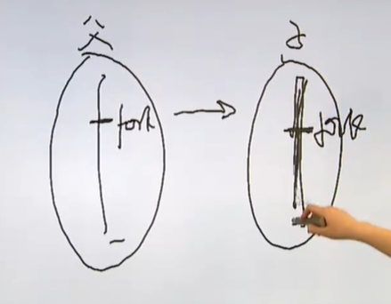

~~~c

 #include <unistd.h>
~~~

fork后父子进程的区别：fork的返回值不一样，pid不同，ppid不同，未

决信号（还没来得及相应）和文件锁不继承:baby:资源利用量清零0

####  init( );进程

1号 #1 是所有进程的祖先进程


~~~c
#include <stdio.h>
#include <stdlib.h>
#include <unistd.h>

int main ( ){
	pid_t pid;
   printf("[%d]begin!\n",getpid());
   pid = fork();//开始一式两份
   if(pid < 0)  //
   {
      perror("fotk()");
      exit(1);
   }
   
   if(pid == 0)
   {
      printf("[%d]:child is working!\n",getpid());
   }
   else
   {
      printf("[%d]Parent is working !\n",getpid());
   }
    printf("[%d]End!\n",getpid());
   
   exit(0);
}


~~~


~~~shell
#永远不要猜测父子进程谁先被调度，由调度器调度策略决定
~~~

~~~c
#include <stdio.h>
#include <stdlib.h>
#include <unistd.h>

int main ( ){
	pid_t pid;
   printf("[%d]begin!\n",getpid());
   pid = fork();//开始一式两份
   if(pid < 0)  //
   {
      perror("fotk()");
      exit(1);
   }
   
   if(pid == 0)
   {
      printf("[%d]:child is working!\n",getpid());
   }
   else
   {	sleep(1);
      printf("[%d]Parent is working !\n",getpid());
   }
    printf("[%d]End!\n",getpid());
   
   exit(0);
}
~~~

~~~shell
root@iZm5e6z8pr5mu3929czbyuZ:~/apue# ./fork 
[6478]begin!
[6479]:child is working!
[6479]End!
[6478]Parent is working !
[6478]End!

~~~


~~~shell
25745 pts/8    Ss     0:00      \_ -bash
 8462 pts/8    S      0:00      |   \_ ./fork
 8463 pts/8    S      0:00      |   |   \_ ./fork

~~~

~~~shell
#begin为什么会打印两次
###cat out
[10808]begin! #此处Begin是父进程留下的缓冲
[10809]:child is working!
[10809]End!
[10808]begin!
[10808]Parent is working !
[10808]End!

~~~

**刷新该刷新的内容 fflash( NULL);**

文件是全缓冲模式；shell是行缓冲模式

~~~c
//添加后
root@iZm5e6z8pr5mu3929czbyuZ:~/apue# cat ./out
[12450]begin!
[12451]:child is working!
[12451]End!
[12450]Parent is working !
[12450]End!

////////////////////////////
   int main ( ){
	pid_t pid;
   printf("[%d]begin!\n",getpid());
   //此时父子进程中各有上面的一句begin，因为shell是行缓冲所以在终端在不打印，但是文件是全缓冲，子进程保留有begin
   pid = fork();//开始一式两份
   if(pid < 0)  //
   {   
~~~

~~~c

#include <stdio.h>
#include <stdlib.h>
#include <unistd.h>

#define LEFT  30000000
#define RIGHT 30001000
int i,j,mark;

int main ( ){
	
   for(i = LEFT ;i<=RIGHT;i++)
   {
      pid= fork( );
      if(pid < 0){
         perror("fork()");
         exit(1);
      }
    if(pid == 0 ){
         
      mark = 1;
      for(j = 2; j < i/2;j++)
         if(i%j==0)
         {
            mark = 0;
            break;
         }
   
        if(mark)
        printf("%d is a primer\n",i);
       exit(0);
         
      }
    
   } 
	exit(0); 
}
~~~

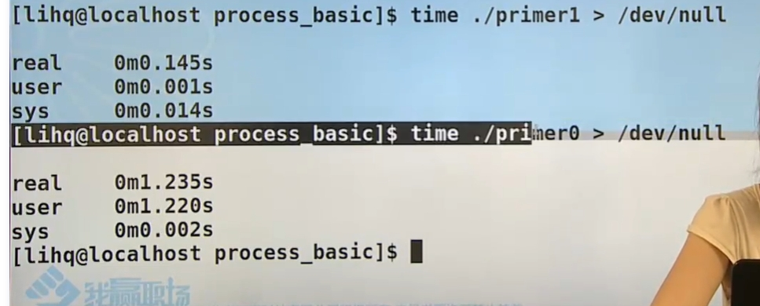

~~~shell
#多线程区别
root@iZm5e6z8pr5mu3929czbyuZ:~/apue# time ./primer1 > /dev/null 

real    0m1.153s
user    0m0.000s
sys     0m0.060s
root@iZm5e6z8pr5mu3929czbyuZ:~/apue# time ./primer0 > /dev/null

real    0m3.550s
user    0m3.548s
sys     0m0.000s

~~~

**僵尸进程是一闪而逝的**

父进程应该等着释放子进程pid

##### fork的两种用法

1. 一个父进程希望复制自己，使父进程和子进程执行不同的代码段，比如父进程等待客户端的服务请求，请求到达调用fork，交给子进程处理请求
2. 执行不同的程序，子进程从fork返回后立即调用**exec**


#### vfork( );

父子进程使用同样的内存块

 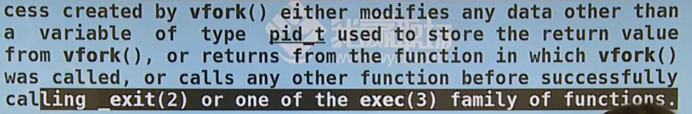

**写时拷贝技术**

谁改谁拷贝，fork出来后资源不相互使用


#### 3.进程的消亡及释放资源


```c
wait( );

waitpid( ); 

waitid( );

wait3();//freeBSD

wait4();
  		 #include <sys/types.h>
       #include <sys/wait.h>

       pid_t wait(int *status);

       pid_t waitpid(pid_t pid, int *status, int options);

       int waitid(idtype_t idtype, id_t id, siginfo_t *infop, int options);

```

waitpid可以是非阻塞的

 

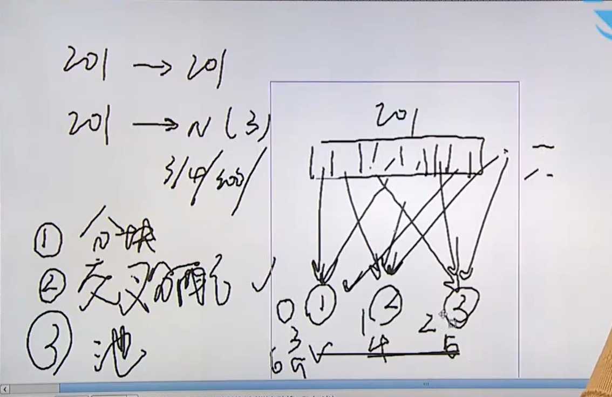


~~~c

#include <stdio.h>
#include <stdlib.h>
#include <unistd.h>
#include <sys/types.h>
#include <sys/wait.h>

#define LEFT  30000000
#define RIGHT 30002000
#define N     5
int i,n,j,mark;

int main ( )
{
	pid_t pid;	
      for(n=0;n < N ;n++)
      {
         pid= fork();
         if(pid < 0)
	{
		perror("fork():");
		exit(1);
	}
        if(pid ==0 )
	{
        	for(i = LEFT+n;i<=RIGHT;i+=N)
        	{
         
            	mark = 1;
            	for(j = 2; j < i/2;j++)
	    	{
              	if(i%j==0)
             	 {
               	mark = 0;
              	 break;
             	 }	
           	 }
          	  if(mark)
             		 printf("[%d]%d is a primer\n",n,i);
	}
       exit(0);
         
    }
   } 
     for(n = 0;i<=N;n++)
	
//	wait(&st);
	wait(NULL);//
	
	exit(0);

}

~~~


4. #### exec函数族的使用

每个子进程都是一样的有什么意思

~~~c

       #include <unistd.h>

       extern char **environ;

       int execl(const char *path, const char *arg, ...
                       /* (char  *) NULL */);
       int execlp(const char *file, const char *arg, ...
       int execlp(const char *file, const char *arg, ...
                       /* (char  *) NULL */);
       int execle(const char *path, const char *arg, ...
                       /*, (char *) NULL, char * const envp[] */);
       int execv(const char *path, char *const argv[]);
       int execvp(const char *file, char *const argv[]);
       int execvpe(const char *file, char *const argv[],
                       char *const envp[]);

~~~

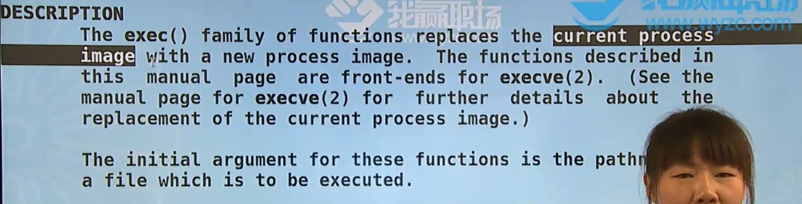


~~~C
#include <stdio.h>
#include <stdlib.h>
#include <unistd.h>
#include <sys/types.h>
#include <sys/wait.h>


int main()
{
   puts("Begin");
   fflush(NULL);
   execl("/bin/date","date","+%s",NULL);
   perror("execl():");
   exit(1);
   
   puts("End!");
   
   exit(0);
   
}

~~~


>
>
>```shell
>root@iZm5e6z8pr5mu3929czbyuZ:~/apue# ./execl 
>Begin
>1586431937
>```
>
>


不打印“End”


~~~shell
root@iZm5e6z8pr5mu3929czbyuZ:~/apue# ./execl > /tmp/out
root@iZm5e6z8pr5mu3929czbyuZ:~/apue# cat /tmp/out 
1586432056
~~~

**`execl()`**之前调用`fflash`

~~~c
 #include <stdio.h>
#include <stdlib.h>
#include <unistd.h>
#include <sys/types.h>
#include <sys/wait.h>

int main()
   
{
   pid_t pid;	
   puts("Begin");
   fflush(NULL);
   
   pid = fork();
   if (pid < 0 )
   {
      perror("fork()");
      exit(1);
   }
   
   if(pid == 0)
   {
      execl("/bin/date","date","+%s",NULL);
      perror("execl()");
      exit(1);
      
   }
   
    wait(NULL);  //子进程干活，父进程在wait
   
   
    puts("END!");
   exit(0);
}

~~~

```shell
root@iZm5e6z8pr5mu3929czbyuZ:~/apue# ./fex 
Begin
1586432756
END!
root@iZm5e6z8pr5mu3929czbyuZ:~/apue# ./fex > /tmp/null
root@iZm5e6z8pr5mu3929czbyuZ:~/apue# cat /tmp/null 
Begin
1586432773
END!
```


~~~c
 #include <stdio.h>
#include <stdlib.h>
#include <unistd.h>
#include <sys/types.h>
#include <sys/wait.h>

int main()
   
{
   pid_t pid;	
   puts("Begin");
   fflush(NULL);
   
   pid = fork();
   if (pid < 0 )
   {
      perror("fork()");
      exit(1);
   }
   
   if(pid == 0)
   {
      execl("/bin/sleep","sleep","100",NULL);
      perror("execl()");
      exit(1);
      
   }
   
    wait(NULL);  //子进程干活，父进程在wait
   
   
    puts("END!");
   exit(0);
}
~~~


~~~shell

14528 pts/10   S+     0:00  |   |       \_ sleep 100
13038 ?        Ss     0:00  |   \_ /usr/lib/openssh/sftp-server
13039 pts/11   Ss+    0:00  |   \_ -bash
14651 ?        Ss     0:00  |   \_ bash -c export LANG="en_US.UTF-8";export LANGUAGE="en_US.UTF-8";free;echo finalshell_separator;uptime;echo finalshell_separ
14656 ?        S      0:00  |       \_ sleep 1

~~~


argv[0]的作用


---

三个函数

- fork
- wait
- execl


#### 5.用户权限及组权限（身份如何切换）

执行某个命令是带着权限执行的

u+s

g+s

UID:

三个值

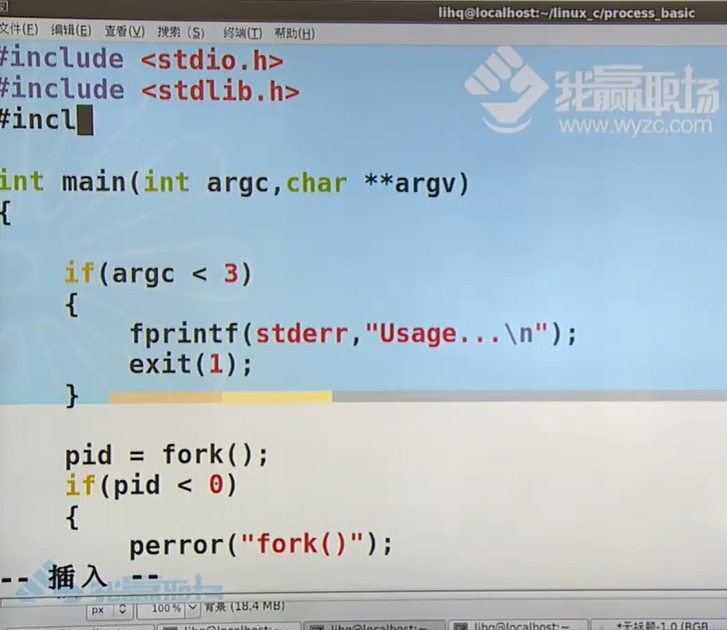

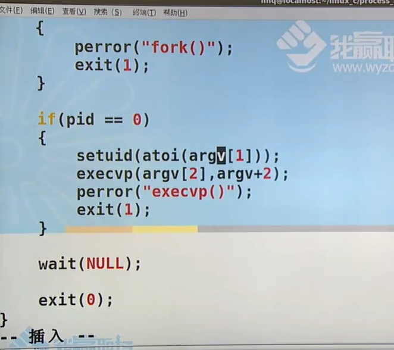

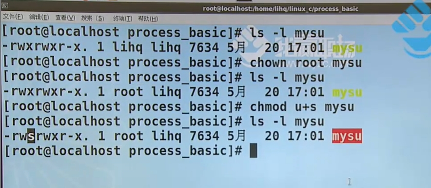


GID:


1. 观摩课：什么叫解释器文件、


1. #### `system( );`

~~~c
 #include <stdio.h>
#include <stdlib.h>
#include <unistd.h>
#include <sys/types.h>
#include <sys/wait.h>
int main()
{
   system("date +%s > /tmp/out");
   
   exit(0);
}
~~~

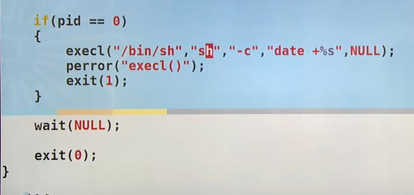


system理解成 fork+exec+wait的封装

#### 进程会计

acct

#### 进程时间

~~~cc
int times();

      #include <sys/times.h>

       clock_t times(struct tms *buf);

DESCRIPTION
       times() stores the current process times in the struct tms that buf points to.  The struct tms is as defined in <sys/times.h>:

           struct tms {
               clock_t tms_utime;  /* user time */
               clock_t tms_stime;  /* system time */
               clock_t tms_cutime; /* user time of children */
               clock_t tms_cstime; /* system time of children */
           };


~~~


1. 
2. 
3. 
4. 守护进程


**setsid();**

**ps -axj**

~~~c

pid_t getpgrp(void);
setsid
getpgid;
setpgid;

~~~


1. 系统日志


## 并发


异步事件的处理： 查询法，通知法


### 信号

#### 1.信号的概念

​	信号是软件中断


~~~shell
root@iZm5e6z8pr5mu3929czbyuZ:~/apue/parallet# kill -l
 1) SIGHUP       2) SIGINT       3) SIGQUIT      4) SIGILL       5) SIGTRAP
 6) SIGABRT      7) SIGBUS       8) SIGFPE       9) SIGKILL     10) SIGUSR1
11) SIGSEGV     12) SIGUSR2     13) SIGPIPE     14) SIGALRM     15) SIGTERM
16) SIGSTKFLT   17) SIGCHLD     18) SIGCONT     19) SIGSTOP     20) SIGTSTP
21) SIGTTIN     22) SIGTTOU     23) SIGURG      24) SIGXCPU     25) SIGXFSZ
26) SIGVTALRM   27) SIGPROF     28) SIGWINCH    29) SIGIO       30) SIGPWR
31) SIGSYS      34) SIGRTMIN    35) SIGRTMIN+1  36) SIGRTMIN+2  37) SIGRTMIN+3
38) SIGRTMIN+4  39) SIGRTMIN+5  40) SIGRTMIN+6  41) SIGRTMIN+7  42) SIGRTMIN+8
43) SIGRTMIN+9  44) SIGRTMIN+10 45) SIGRTMIN+11 46) SIGRTMIN+12 47) SIGRTMIN+13
48) SIGRTMIN+14 49) SIGRTMIN+15 50) SIGRTMAX-14 51) SIGRTMAX-13 52) SIGRTMAX-12
53) SIGRTMAX-11 54) SIGRTMAX-10 55) SIGRTMAX-9  56) SIGRTMAX-8  57) SIGRTMAX-7
58) SIGRTMAX-6  59) SIGRTMAX-5  60) SIGRTMAX-4  61) SIGRTMAX-3  62) SIGRTMAX-2
63) SIGRTMAX-1  64) SIGRTMAX  
~~~


#### 2. signal（）；


~~~c
       #include <signal.h>

       typedef void (*sighandler_t)(int);

       sighandler_t signal(int signum, sighandler_t handler);

~~~

~~~c
 
#include <stdio.h>
#include <stdlib.h>
#include <unistd.h>
#include <sys/types.h>
#include <sys/wait.h>
#include <signal.h>
int main()
{	
   int i;
   	
   system("date +%s > /tmp/out");
   signal(SIGINT,SIG_IGN);
   
   for(i = 0; i < 10 ;i++){
      write(1,"*",1);
      sleep(0.5);
   }
   
   
   
   
   exit(0);
}
~~~

~~~c

 
#include <stdio.h>
#include <stdlib.h>
#include <unistd.h>
#include <sys/types.h>
#include <sys/wait.h>
#include <signal.h>

static void handle(int s)
{
  write(1,"#",1);
}

int main()
{	
   int i;
   	
   system("date +%s > /tmp/out");
   signal(SIGINT,handle);
   
   for(i = 0; i < 10 ;i++){
      write(1,"*",1);
      sleep(2);
   }
   
   
   
   
   exit(0);
}


~~~


**信号会打断阻塞的系统调用**


#### 3. 信号的不可靠

信号的行为不可靠（没有人为的调用行为）

执行现场被冲掉

#### 4. 可重入函数

所有系统调用是可重入的，一部分是可重入的，返回值是一个指针

第一次调用没有结束，产生第二次调用导致第一次出错

异步信号安全的在处理期间会阻塞任何会引起不一致的信号发送

不可重入原因：

- 已知使用静态数据结构
- 调用了 **malloc** 或者 **free**
- 标准的I/O函数

APUE上哈游一些内容（**longjmp/siglongjmp**）/error();

#### 5.信号的相应（图重要）


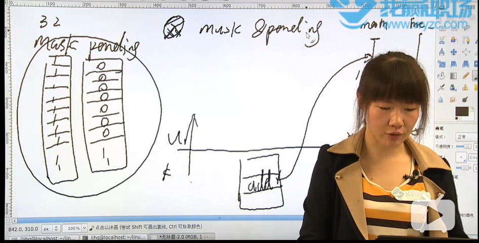


- 信号从收到到响应有一个不可避免的延迟
  - 中断打断，从内核态到用户态时候才知道收到什么信号，进行响应
- 思考：
  - 如何忽略掉一个信号的？
  - 标准信号为什么要丢失？（位图，来一万个同样的置1，位图不会累加计数 一直是一个1）
    - 从内核向用户太转变时，mask和pending按位与，然后执行，执行时要把他们置0
    - 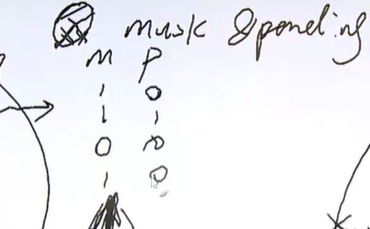
  - 标准信号的相应没有严格的响应顺序

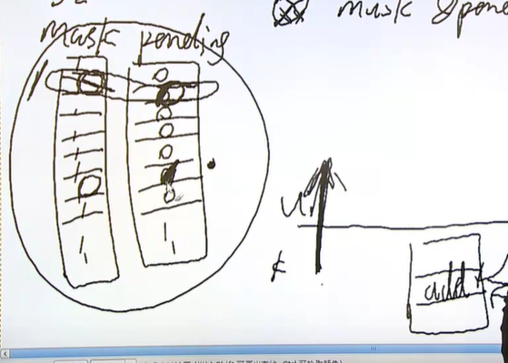

**mask**：信号屏蔽为决定是否查询接收某个信号，不能阻止信号的到来但是可以决定信号是否被响应，在什么时候被响应

**pending**：从内核态到用户态转移时和mask进行按位与，查看是接收到哪个信号


- 不能从信号处理函数中随意的往外跳（`sigsetjmp` `siglongjmp`

———


| Mask               | Pending                      |
| ------------------ | ---------------------------- |
| 初始化时 1         | 初始化时 0                   |
| 收到信号 1         | 收到信号 1                   |
| 响应过程 0         | 响应过程 0                   |
| 响应时又收到信号 0 | 位图不会累加计数 一直是一个1 |
| 结束时 1           | 结束时 1                     |
|                    |                              |

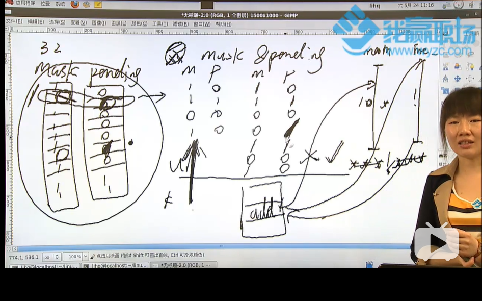

#### 6.**常用函数**

~~~c
kill;
raise;
alarm;
pause;
abort;
system;
~~~

##### kill

~~~

       #include <sys/types.h>
       #include <signal.h>

       int kill(pid_t pid, int sig);


~~~

- 当
  - pid > 0 信号发送给进程ID为pid的进程
  - pid == 0 发送给同一进程组的所有进程
  - pid < 0 发送给其他组ID等于PID的绝对值
  - pid == -1  有权限的所有进程
  - pid < -1 绝对值小于绝对值的ID

基本规则：

- 发送者的实际用户ID 或有效 用户ID  必须等于接受者实际用户ID或者有效用户ID 

**raise( );**

给当前进程发送sig

~~~c
kill(getpid(),sig);
raise(signo);
~~~

多线程中

~~~c
pthread_kill(pthread_self(),sig);
~~~

##### ---alarm( );

信号计时10MS以内不准确

对时间的记录准确

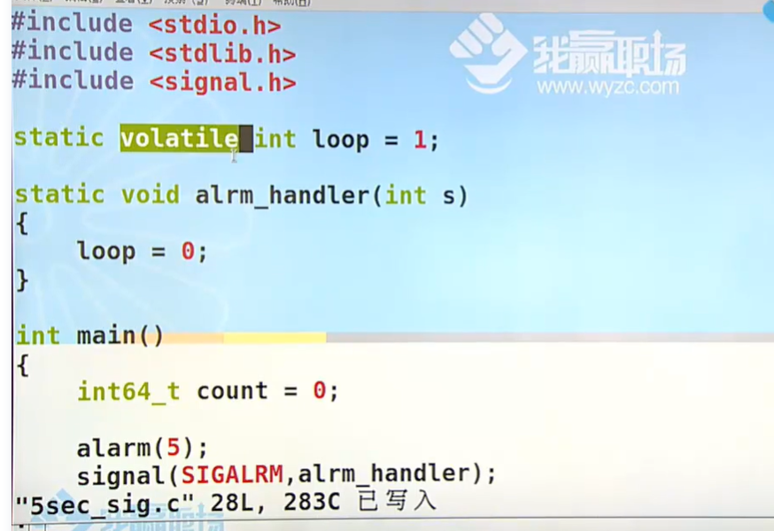


- alarm/signal的顺序

  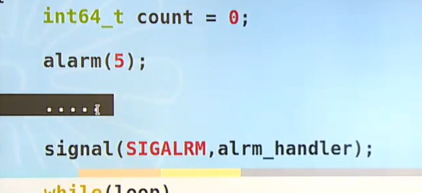

- 在做....的时候就时间到了，之后没有看到给信号注册的行为（alrm_handler）执行了默认行为

- 只要是设置时钟信号的行为一定会在发出第一个信号之前 


##### 令牌桶


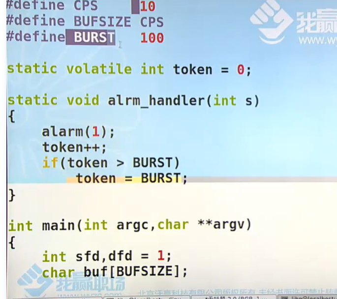

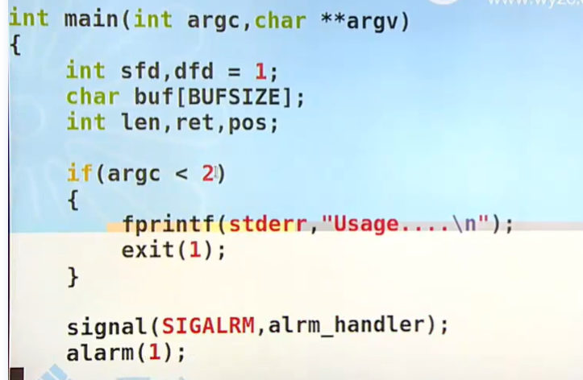

- 注册信号，发出第一个alarm

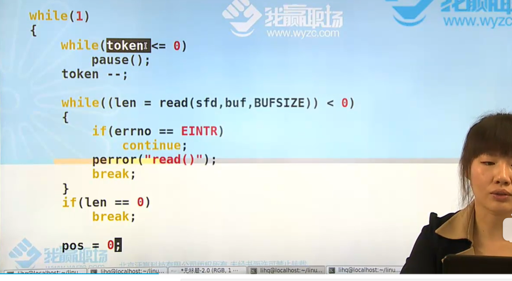


#### 7.信号集

~~~c
include <signal.h>
int sigemptyset(sigset_t *set);
int sigfillset(sigset_t *set);
int sigaddset(sigset_t *set,int signo);
int sigdelset(sigset_t *set,int signo);
return 0
error return -1；

   
~~~


#### 8.信号屏蔽字的处理

~~~c
int sigprocmask(int how, const sigset_t *set, sigset_t *oldset);


SIG_BLOCK
              The set of blocked signals is the union of the current set and the set argument.

SIG_UNBLOCK
              The  signals  in  set  are  removed  from the current set of blocked signals.  It is permissible to
              attempt to unblock a signal which is not blocked.

 SIG_SETMASK
              The set of blocked signals is set to the argument set.

~~~


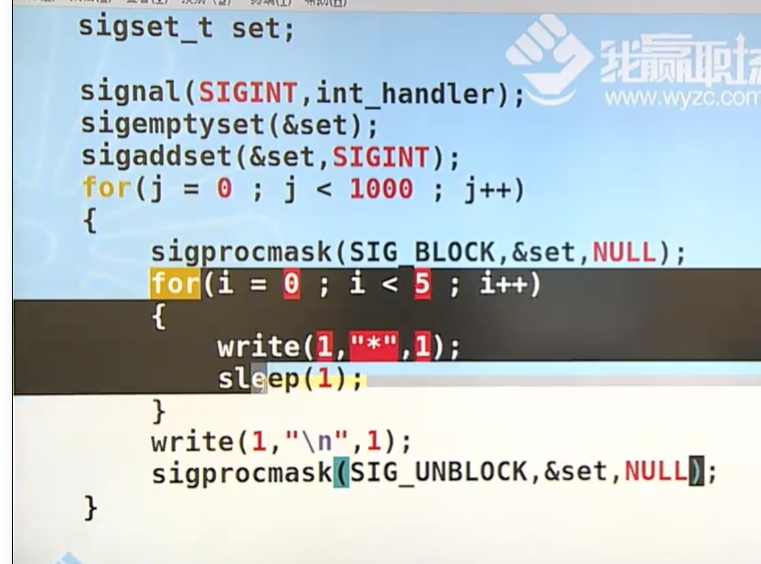


#### 9.扩展 

##### 	sigsuspend();

信号驱动程序

~~~c
#include <signal.h>

int sigsuspend(const sigset_t *mask);

~~~

#### 	sigaction( );需要仔细查看man手册


~~~c
           struct sigaction {
               void     (*sa_handler)(int);
               void     (*sa_sigaction)(int, siginfo_t *, void *);
               sigset_t   sa_mask;
               int        sa_flags;
               void     (*sa_restorer)(void);
           };

~~~

~~~c
#include <stdio.h>
#include <unistd.h>
#include <signal.h>
#include <errno.h>
 
static void sig_usr(int signum)
{
    if(signum == SIGUSR1)
    {
        printf("SIGUSR1 received\n");
    }
    else if(signum == SIGUSR2)
    {
        printf("SIGUSR2 received\n");
    }
    else
    {
        printf("signal %d received\n", signum);
    }
}
 
int main(void)
{
    char buf[512];
    int  n;
    struct sigaction sa_usr;
    sa_usr.sa_flags = 0;
    sa_usr.sa_handler = sig_usr;   //信号处理函数
    
    sigaction(SIGUSR1, &sa_usr, NULL);
    sigaction(SIGUSR2, &sa_usr, NULL);
    
    printf("My PID is %d\n", getpid());
    
    while(1)
    {
        if((n = read(STDIN_FILENO, buf, 511)) == -1)
        {
            if(errno == EINTR)
            {
                printf("read is interrupted by signal\n");
            }
        }
        else
        {
            buf[n] = '\0';
            printf("%d bytes read: %s\n", n, buf);
        }
    }
    
    return 0;
}
~~~

 在这个例程中使用 sigaction 函数为 SIGUSR1 和 SIGUSR2 信号注册了处理函数，然后从标准输入读入字符。程序运行后首先输出自己的 PID，如：My PID is 5904 
 这时如果从另外一个终端向进程发送 SIGUSR1 或 SIGUSR2 信号，用类似如下的命令：kill -USR1 5904

 则程序将继续输出如下内容：
 SIGUSR1 received
 read is interrupted by signal

 **这说明用 sigaction 注册信号处理函数时，不会自动重新发起被信号打断的系统调用。**如果需要自动重新发起，则要设置 **SA_RESTART** 标志，比如在上述例程中可以进行类似一下的设置：sa_usr.sa_flags = SA_RESTART;
————————————————
版权声明：本文为CSDN博主「魏波-」的原创文章，遵循 CC 4.0 BY-SA 版权协议，转载请附上原文出处链接及本声明。
原文链接：https://blog.csdn.net/weibo1230123/article/details/81411827


##### 	setitimer( );

#### 10.实时信号

---

# 线程

#### 概念


#### 线程创建


~~~c
#include <stdlib.h>
#include <stdio.h>
#include <pthread.h>

static void *func(void *p)
{
   puts("Thread is working!");
   //return NULL;
   pthread_exit(NULL);
}
int main ( )
{
   pthread_t tid;
   int err;
   puts("Begin!");
   
   //1，线程标志回填
   
   err = pthread_create(&tid,NULL,func,NULL);
   
   if(err)
   {
    exit(1);
   }
   
   
   puts("End");
   
   
   
   exit(0);
}
~~~


- 线程的调度取决于调度器的调度
  - root@iZm5e6z8pr5mu3929czbyuZ:~/apue/pthread# ./thread 
    Begin!
    End
    Thread is working!
- 线程终止的3种方式
  - 线程从启动例程返回，返回值就是线程的退出码
  - 线程可以被同一进程中的其他线程取消
  - 线程调用`pthread_exit（）`函数
- 

~~~c

#include <stdlib.h>
#include <stdio.h>
#include <pthread.h>

static void *func(void *p)
{
   puts("Thread is working!");
   pthread_exit(NULL);
     
}
int main ( )
{
   pthread_t tid;
   int err;
   puts("Begin!");
   
   //1，线程标志回填
   
   err = pthread_create(&tid,NULL,func,NULL);
   
   if(err)
   {
 //    fprintf(stderr,"pthread_cread:%s\n",strerror(err));
   
	exit(1);
}
   pthread_join(tid,NULL);
   
   puts("End");
   
   
   
   exit(0);
}

~~~

- 创建完等着收尸呢，等待的过程一定是等待创建出去的线程一定运行完

栈的清理

- `pthread_cleanup_push( );`
- `pthread_cleanup_pop( );`
- 上面两个函数和进程中的钩子函数区别
  - 用户决定不了钩子函数是否要执行，即定义了就要执行
  - 上面两个用户可以选择值不值想
- 


#### 线程的终止

3种方式：

- 线程从启动例程返回，返回值就是线程的退出码
- 线程可以被同一进程中的其他线程取消
- 线程调用`pthread_exit( )`函数

pthread_join( ) ---> wait()

栈的清理：

~~~c
pthread_cleanup_push( );
pthread_cleanup_pop( );
~~~

**线程的取消选项**

线程取消：**pthread_cancel( );**

​	两种状态： 1.允许 2.不允许

​	允许取消：异步取消/推迟取消（默认)

​							定义了cancel点但是推迟至cancel点再去相应

cancel点： POSIX定义的cancel点都是可能引发阻塞的系统调用


- 在黑条条处是阻塞发生的点

- ```
    void pthread_testcancel(void); //本身是个取消点
    
  ```


#### 栈的清理

#### 线程同步

~~~c
#include <stdio.h>
#include <stdlib.h>
#include <pthread.h>

#define THRNUM 20
#define LINESIZE 1024

#define FNAME "/tmp/out"

static pthread_mutex_t mut = PTHREAD_MUTEX_INITIALIZER;


static void *thr_add(void *p)
{
   char linebuf[LINESIZE];
    FILE *fp;
    fp =  fopen(FNAME,"r+");
   
   pthread_mutex_lock(&mut);
   
   fgets(linebuf,LINESIZE,fp);
   
   fseek(fp,0,SEEK_SET);
   
   fprintf(fp,"%d\n",atoi(linebuf)+1);
   
   fclose(fp);
   pthread_mutex_unlock(&mut);
   pthread_exit(NULL);
}

int main( )
{
   int i,err;
   pthread_t tid[THRNUM];
   
   for(i=1;i<THRNUM;i++)
   {
      err = pthread_create(tid + i,NULL,thr_add,NULL);
      
      if(err)
      {
         //fprintf(stderr,"pthread_created%s\n",stderr(err));
         exit(1);
      }
   for(i = 0;i<THRNUM;i++)
      pthread_join(tid[i],NULL);
      
   }
   
   pthread_mutex_destory(&mut);
   
   exit(0);
}


~~~


线程池

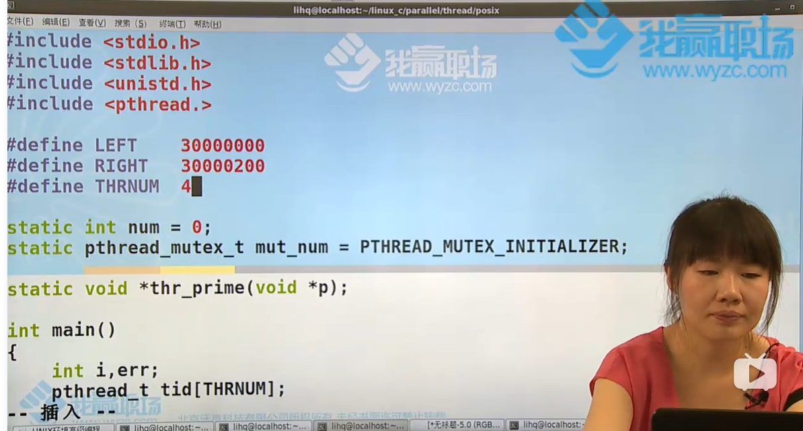

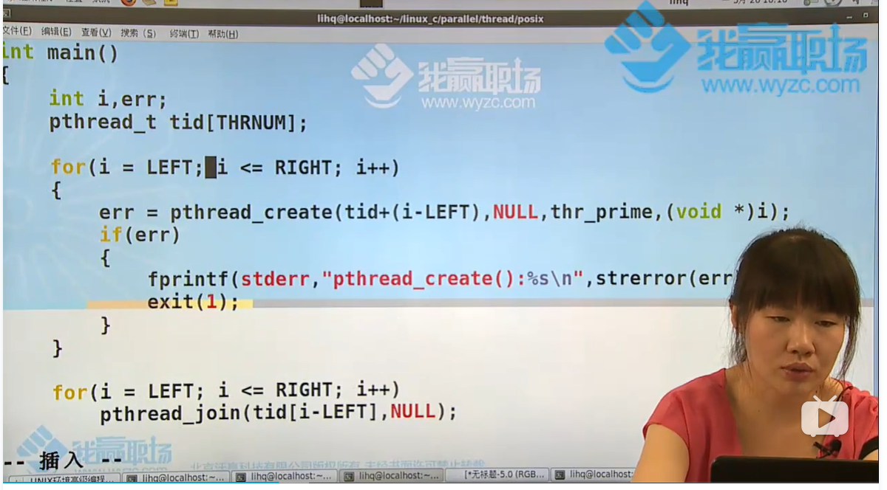

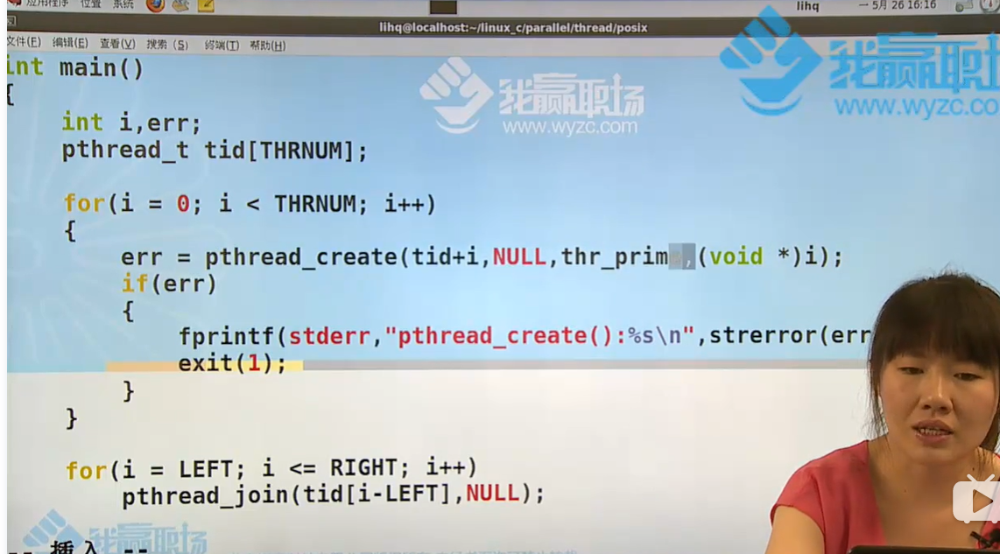


~~~c
#include <stdio.h>
#include <stdlib.h>
#include <unistd.h>
#include <sys/types.h>
#include <sys/wait.h>
#include <pthread,h>

#define LEFT  30000000
#define RIGHT 30002000
#define N     5
static int num = 0;
static pthread_mutex_t mut_num = PTHREAD_MUTEX_INITIALIZER;
static void *thr_prime(void *p);

int main ( )
{
      int err;
   
   	pthread_t tid[N];
   for(i = 0;i < N;i++)
   {
      err = pthread_create(tid+i,NULL,thr_prime(void *p));
      if (err)
      {
         perror("creator! false!");
         exit(1);
      }  
   }
   for(i = LEFT; i <= RIGHT;i++)
   {
      pthread_mutex_lock(&mut_num);
      while(num != 0)
      {
         pthread_mutex_unlock(&mut_num);
         pthread_mutex_lock(&mut_num);
      }
      num = i;
   }
   
   for(i=0;i < N;i++)
   {
      pthread_join(tid[i],NULL);
    
   }
   
   pthread_mutex_destory(&mut_num);
   static void *thr_prime(void *p)
   {
      int i,j,mark;
      i = num;
      mark = 1;
      for(j = 0;j < i/2;j++)
      {
         if(i%j==0)
                 {
                mark = 0;
                 break;
                 }  
      }
      if(mark)
         printf("[%d]%d is a primer\n",n,i);
      
      
      
      
   }
     
        if(pid ==0 )
        {
                for(i = LEFT+n;i<=RIGHT;i+=N)
                {
         
                mark = 1;
                for(j = 2; j < i/2;j++)
                {
                if(i%j==0)
                 {
                mark = 0;
                 break;
                 }      
                 }
                  if(mark)
                         printf("[%d]%d is a primer\n",n,i);
        }
       exit(0);
         
    }
   } 
     for(n = 0;i<=N;n++)
        
//      wait(&st);
        wait(NULL);//
        
        exit(0);

}

~~~


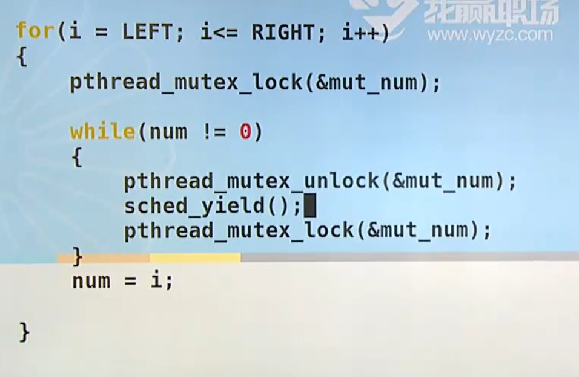


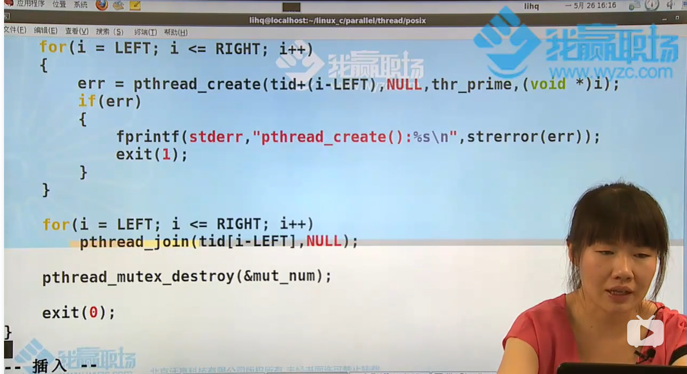


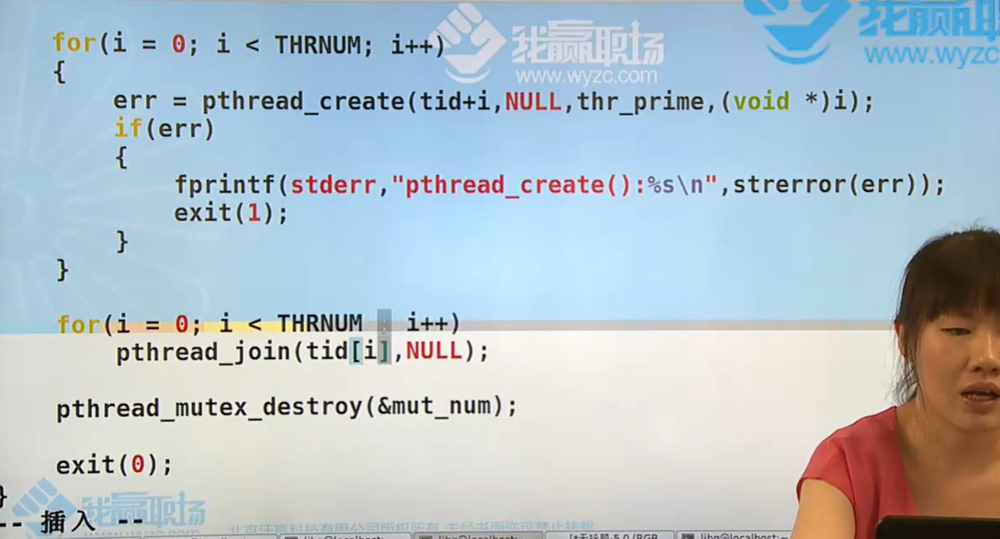

#### **线程相关的属性**

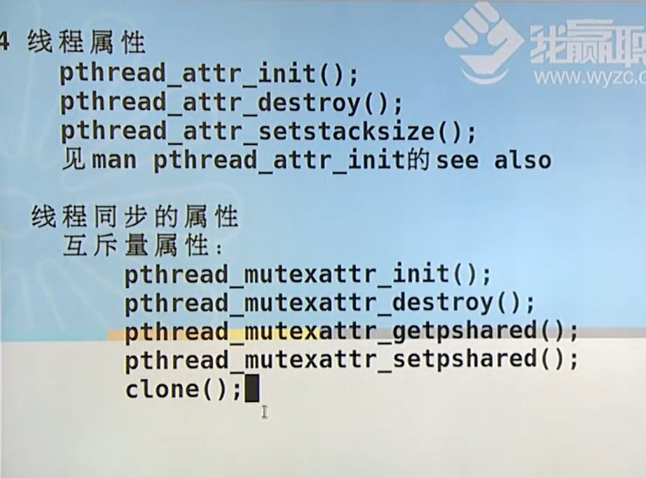


#### 线程同步的属性

#### **可重入**


#### 线程与信号、FORK


~~~shell


~~~


---

# 高级I/O

> 非阻塞IO  --- 阻塞IO

**补充：有限状态机**

### 非阻塞IO

​	复杂流程：自然流程不是结构化的

​	简单流程：自然流程是结构化的

低速系统：

- 文件数据不存在

- 数据不能被相同文件类型立即接受

- ---

锁的隐含继承和释放

- 锁与进程和文件两者相关联
  - 文件终止锁释放
  - 无论描述符何时关闭，该进程通过这一面舒服引用的文件上的任何一把锁都会释放
- 由fork产生的子进程不继承父进程所设置的锁
- 在执行 **exit**后新程序可以继承袁志祥程序的锁

在文件末尾加锁

- 相对于文件的当前长度指定一把锁，但又不能调用`fstat`来得到当前文件的长度，因为没有加锁
  - 当前偏移量和文件尾端可能会不断变化而这种变化又不应影响现有锁的状态，所以内核独立于当前和文件末尾而记住锁

#### 建议锁和强制锁

- 合作进程
- 


~~~c
#include <stdio.h>
#include <stdlib.h>


#define TTY1 "/dev/tty11"
#define TTY2 "/dev/tty12"


enum
{
   STATE_R = 1,
   STATE_W,
   STATE_Ex,
   STATE_T
};
struct fsm_st
{
   int state;
   int sfd;
   int dfd;
   char buf[BUFFERSIZE];
}

static void fsm_driver(struct fsm_st *fsm)
{
   switch(fsm->state)
   {
         case STATE_R:
         	read()	
         	break;
         case STATE_W:
         	break;
         case STATE_Ex:
				break;
         case 	STATE_T:
            break;
   		break;
   }
}

static void relay(int fd1,int fd2)
{
   int fd1_save;
   struct fsm_st fsm12,fsm21;
   
   fd1_save = fcntl(fd1,F_GETFL);
   fcntl(fd1,F_SETFL,fd1_save|O_NONBLOCK);
   
   fd2_save =  fcntl(fd2,F_SETFL);
   fcntl(fd2,F_SETFL,fd2_save|O_NONBLOCK);
   
   fsm12.state = STATE_R;
   fsm12.sfd   = fd1;
   fsm12.dfd   = fd2;
   fsm21.state = STATE_R;
   fsm21.sfd   = fd2;
   fsm21.dfd   = fd1; 
   
   while(fsm12.state != STATE_T || fsm21.state != STATE_T)
   {
      fsm_driver(&fsm12);
      fsm_driver(&fsm21);
   }
   
   
   fcntl(fd1,F_SETFL,fd1_save);
   fcntl(fd2,F_Setfl,fd2_save);
   
}


int main ()
{	
   int fd1 ,fd2;
   fd1 = open(TTY1,_RDWR);
   if(fd1 < 0)
   {
      perror("open()");
      exit(1);
   }
   
   fd2 = open(TTY2,O_RDWR|O_NONBLOCK);
   if(fd2 < 0)
   {
      perror("open()");
      exit(1);
   }
   
   relay(fd1,fd2);
   

   
   close(fd1);
   close(fd2);
   
   
   exit(0);
}
~~~


### IO多路转换

从一个文件描述符读，写到另外一个文件描述符

~~~c
while((n = read(STDIN_FILENO,buf,BUFSIZE)) > 0 )
   if(write(STDOUT,FILENO,buf,n) != n)
      err_sys("write error!");
~~~

- 当我们不能对两个输入中的任何一个使用阻塞`read`因为我们不知道到底哪一个输入会得到数据；
- 处理这个问题的方法是将一个进程变成两个进程（fork) ,每个进程处理一条数据通路。书册P403

#### 函数 `select`和`pselect`

- 我们关心的描述符
- 对于每个描述符我们所关心的条件
- 愿意等待多长时间

##### 从select返回时，内核告诉我们

- 准备好的描述符总量
- 对于读写异常这单个条件中的每一个，哪些描述符准备好

~~~c
SYNOPSIS
       /* According to POSIX.1-2001, POSIX.1-2008 */
       #include <sys/select.h>

       int select(int nfds, fd_set *readfds, fd_set *writefds,
                  fd_set *exceptfds, struct timeval *timeout);

~~~


poll( );

epoll：linux的方言，文件描述符的标识

### 其他读写函数

### 储存映射IO

### 文件锁


