### 储存分配

~~~c++
malloc； //分配指定字节数的储存区
#include <stdlib.h>
void *malloc (size_t size);
void *caloc (size_t nobj, size_t size);
void *realloc(void *ptr ,size_t newsize);

void free(void *ptr)
~~~

- 系统调用
- 标准I/O (优先使用，可移植性)
- FIFO 是一个结构体类型
- man 3 /man 7 常用

---

- 两个报错函数

  - `perror( )`
  - `strerror()`

  **有逆操作的基本可以判定是返回值返回到 “堆” 上了 ，fopen fclose**

  **谁打开，谁关闭。谁申请，谁释放**

  **是资源就有上限**

  ~~~shell
  ulimit -a
  ~~~

  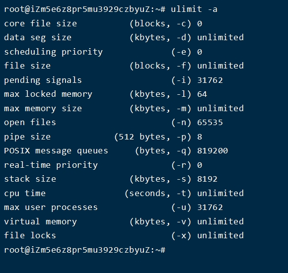

fopen（）：r r+是要求文件存在的

`0666 & ~umask`

临时文件：

对用户数据有必要暂时保存，**tempfile**

文件描述符：(整型数，)

文件I/O操作：open，close，read，write，lseek

**文件IO、标准IO区别**

举例：送快递

区别： 响应速度，吞吐量（标准IO量大，缓冲机制，合并系统调用）

面试：如何使一个程序变快

提示：**标准IO和系统IO不可混用**

filno

**文件共享**

多个任务共同操作一个文件或者协同完成任务

面试：写程序删除一个文件的第十行

补充函数： `truncate、ftruncate`

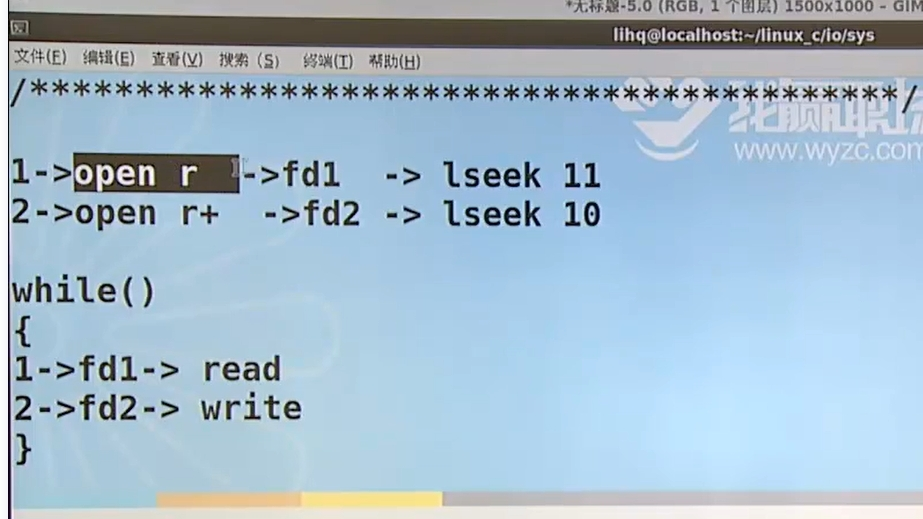

原子操作

程序中的重定向：dup、dup2

同步： sync、fsync、fdatasync

fcntl( );

ioctl( );(篇幅长)

/dev/fd/目录：

~~~c
       #include <stdio.h>

       FILE *fopen(const char *path, const char *mode);
		//把一个标准的已经打开的fd进行重新封装，文件IO转化为标准IO
       FILE *fdopen(int fd, const char *mode);

       FILE *freopen(const char *path, const char *mode, FILE *stream);

~~~


**FILE**

 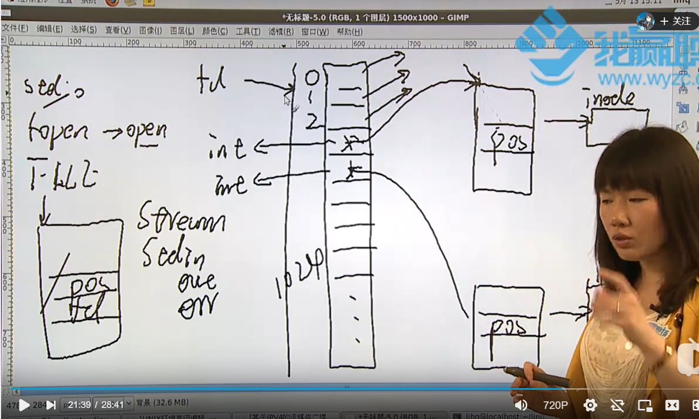

这个数组存在于进程空间的，每一个进程都会有这么个数组，上图是一个进程中打开两个文件

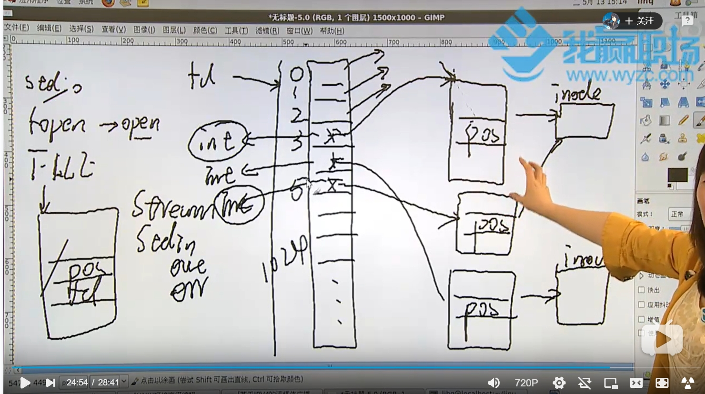

**打开计数**

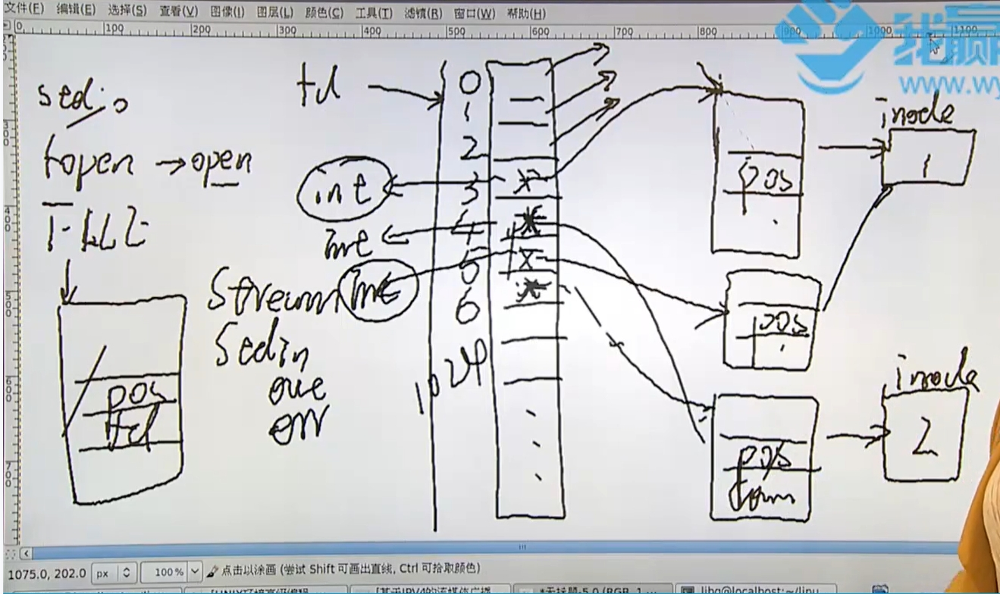

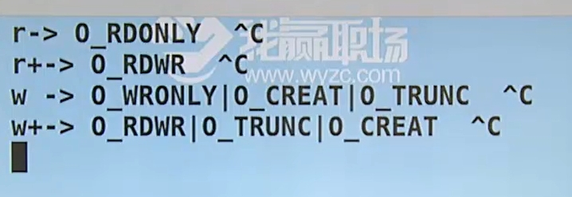

```c
  #include <sys/types.h>
       #include <sys/stat.h>
       #include <fcntl.h>

       int open(const char *pathname, int flags);
       int open(const char *pathname, int flags, mode_t mode);

       int creat(const char *pathname, mode_t mode);

       int openat(int dirfd, const char *pathname, int flags);
       int openat(int dirfd, const char *pathname, int flags, mode_t mode);


```

- 有flag create则是三个参数，没有create则是两个参数
- 变参函数/如何区别是重载还是变参
  - 多传几个参数，有语法错误的是重载
  - gcc -Wall 把警告打印出来

**strace 命令**

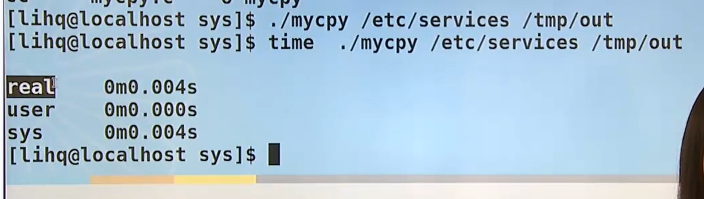

~~~c
lseek 11 + read +lseek 10 + write;


l ->open r 
2 ->open r+
~~~


**原子操作**

不可分割的操作

作用：解决竞争和冲突

**tmpnam**给一个可用名字，还没来得及创建，时间片用完了

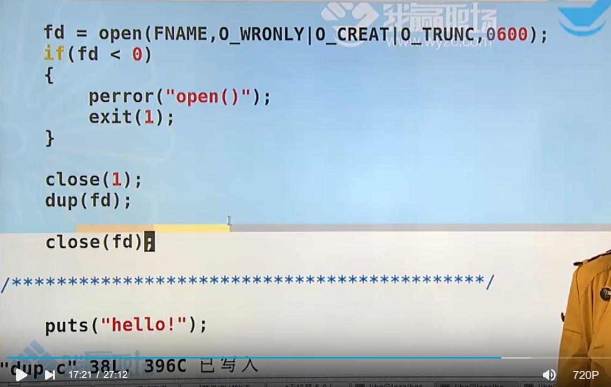

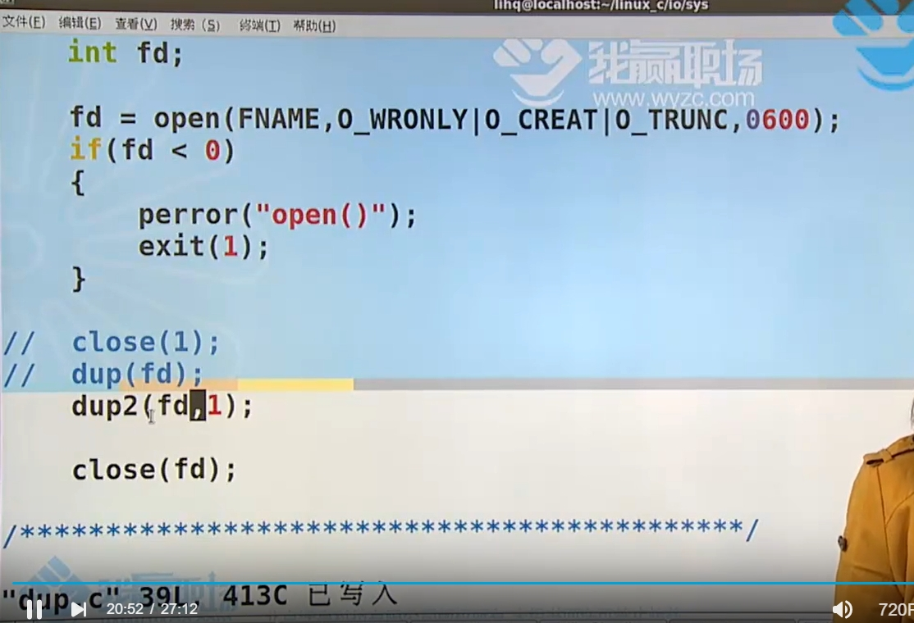

- 不要以为自己在写main函数大的工程在执行自己的小模块时，不改变前面的不影响后面的

- 不要有内存泄漏

sync：全局同步

**fcntl**：管家级函数,文件描述符所变得魔术几乎都来自于该函数，比如对dup2的封装

**ioctl**：设备相关内容都归他管


~~~c
#include <unistd.h>
#include <fcntl.h>

int fcntl(int fd, int cmd, ... /* arg */ );

~~~

**文件系统**

1.目录和文件

获取文件属性


2.系统数据文件和信息

3.进程环境

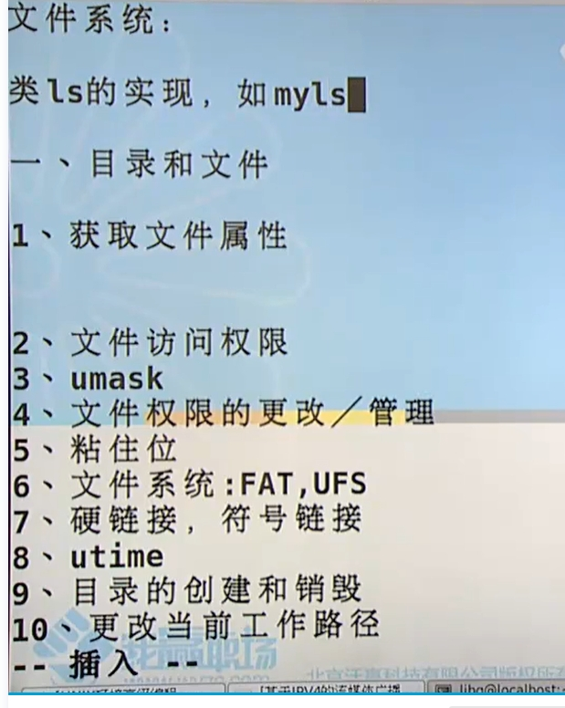

~~~c
  All of these system calls return a stat structure, which contains  the
       following fields:

           struct stat {
               dev_t     st_dev;         /* 包含这个文件的设备ID号ID of device containing file */
               ino_t     st_ino;         /* inode number */
               mode_t    st_mode;        /* 权限信息protection */
               nlink_t   st_nlink;       /* 硬链接数number of hard links */
               uid_t     st_uid;         /* user ID of owner */
               gid_t     st_gid;         /* group ID of owner */
               dev_t     st_rdev;        /* device ID (if special file) */
               off_t     st_size;        /* 字节数total size, in bytes */
               blksize_t st_blksize;     /*一个块有多大 blocksize for filesystem I/O */
               blkcnt_t  st_blocks;      /* number of 512B blocks allocated */

               /* Since Linux 2.6, the kernel supports nanosecond
                  precision for the following timestamp fields.
                  For the details before Linux 2.6, see NOTES. */

               struct timespec st_atim;  /* time of last access */
               struct timespec st_mtim;  /* time of last modification */
               struct timespec st_ctim;  /* time of last status change */

~~~

~~~c
root@iZm5e6z8pr5mu3929czbyuZ:~# stat teaser.png 
  File: 'teaser.png'
  Size: 332341          Blocks: 656        IO Block: 4096   regular file
Device: fd01h/64769d    Inode: 933328      Links: 1
Access: (0644/-rw-r--r--)  Uid: (    0/    root)   Gid: (    0/    root)
Access: 2019-10-31 14:17:53.970496881 +0800
Modify: 2019-10-31 14:17:52.574445688 +0800
Change: 2019-10-31 14:17:52.574445688 +0800
 Birth: -
读、写、亚数据时间
~~~

~~~c
#include <stdio.h>
#include <stdlib.h>
#include <sys/types.h>
#include <sys/stat.h>
#include <unistd.h>

/***
		 int stat(const char *pathname, struct stat *buf);
       int fstat(int fd, struct stat *buf);
       int lstat(const char *pathname, struct stat *buf);
*********/
static flen(const char *fname)
{
   struct stat statres;
   if(stat(fname,&stateres) < 0 )
   {
   	   perror("stat()");
      	exit(1); 
   }
   return stateres.st_size;
   
   
}

int main( int argc, char **argv){
   
   if (argc < 2 )
   {
      fprintf("stderr,usge...\n");
      exit(1);
   }
   printf("%d\n",flen(argv[1])); 
    
   exit(0);
}


~~~

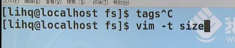

~~~c
dcb-lsp
   p:管道文件
~~~

~~~shell
           S_ISREG(m)  is it a regular file?

           S_ISDIR(m)  directory?

           S_ISCHR(m)  character device?

           S_ISBLK(m)  block device?

           S_ISFIFO(m) FIFO (named pipe)?

           S_ISLNK(m)  symbolic link?  (Not in POSIX.1-1996.)

           S_ISSOCK(m) socket?  (Not in POSIX.1-1996.)

~~~

~~~c
#include <stdio.h>
#include <stdlib.h>
#include <sys/types.h>
#include <sys/stat.h>
#include <unistd.h>

static int  ftype(const char *fname)
{	
   struct stat statres;
  if( stat(fname,&statres)<0){
      perror("stat( )");
      exit(1);
     
   }
   if(S_ISREG(statres.st_mode))
      return '-';
    else if (S_ISDIR(statres.st_mode))
       return 'd';
       else 
          return '?';
}
int main (int argc ,char *argv[]){
   if(argc < 2 ){
      fprintf(stderr,"Usage...");
      exit(1);
   }
  printf("%c\n", ftype(argv[1]));
   
   exit(0);
}
~~~

**文件类型**

- 定义好的宏进行识别
- 位图识别

**st_mode**是一个16位的位图，用于表示文件类型，文件访问权限及特殊权限位

#### umask

**防止产生权限过松的文件**

**chmode**

~~~c
 #include <sys/stat.h>

int chmod(const char *pathname, mode_t mode);
int fchmod(int fd, mode_t mode);

 #include <fcntl.h>           /* Definition of AT_* constants */
#include <sys/stat.h>

int fchmodat(int dirfd, const char *pathname, mode_t mode, int flags);


~~~

**粘住位**

t位

#### UFS文件系统

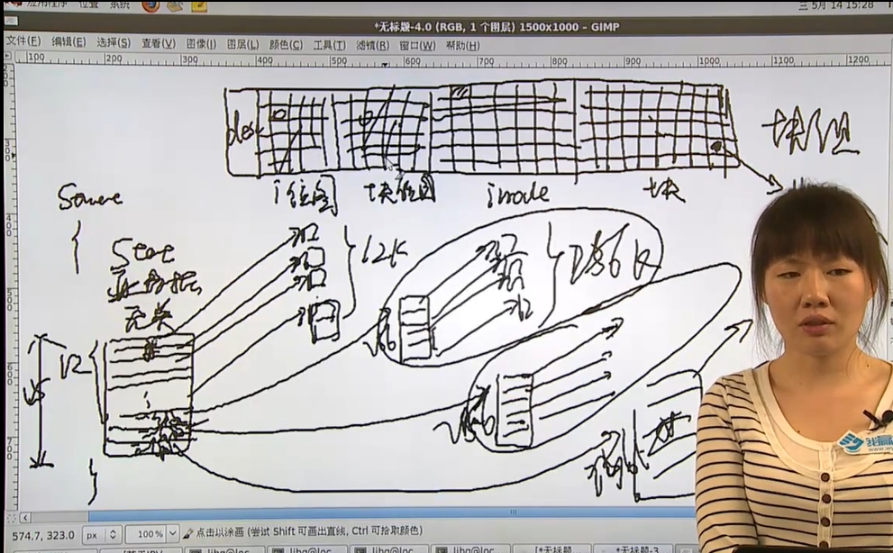

硬链接ln的计数减为一后再考虑是否删除文件

---

### 进程环境

#### 1.main函数

`int mian(int argc ,char **argv[] )`


#### 2.进程的终止

正常终止：

	-  从main函数返回，return 0
	-   调用 `exit0`
	-  调用 **_exit** 或 **_Exit**
	-  最后一个人线程从其启动例程返回（一个线程本身
	-  最后一个线程调用pthread_exit

异常终止：

- 调用 **abort**
- 接到一个信号并终止
- **最后一个线程对其取消请求作出响应**

~~~c
#include <stdlib.h>

int main (int argc ,char *argv[]){
   int i ;
   printf("argc= %d\n",argc);
   for (i = 0 ;argv[i]!= NULL;i++)
      puts(argv[i]);
   return 0;//正常终止,给父进程看的
   exit(0);
}

The  exit() function causes normal process termination and the value of status & 0377 is returned to the parent
       (see wait(2)).

~~~


atexit( ):**钩子函数**

**atexit - register a function to be called at normal process termination**

在进程正常终止的时候被调用

 #include <stdlib.h>

       int atexit(void (*function)(void));

~~~c
#include <stdio.h>
#include <stdlib.h>

static void f1(void){
   puts("f1 is working!");
}
static void f3(void){
   puts("f3 is working!");
}

static void f2(void){
   puts("f2 is working!");
}

int main( ){
   puts("begin");
   atexit(f1); //不代表函数调用，先挂到钩子上
   atexit(f2);
   atexit(f3);
   puts("end");
}
~~~

~~~c

root@iZm5e6z8pr5mu3929czbyuZ:~/apue# ./atexit
begin
end
f3 is working!
f2 is working!
f1 is working!
root@iZm5e6z8pr5mu3929czbyuZ:~/apue#

~~~


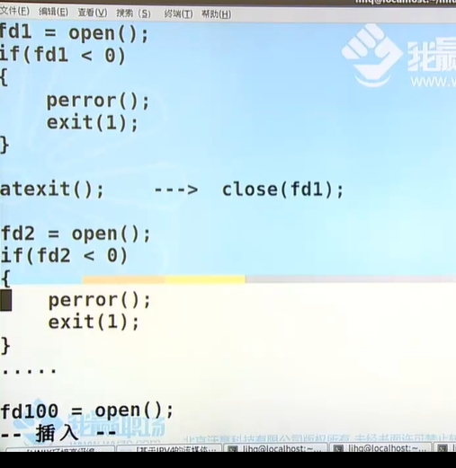


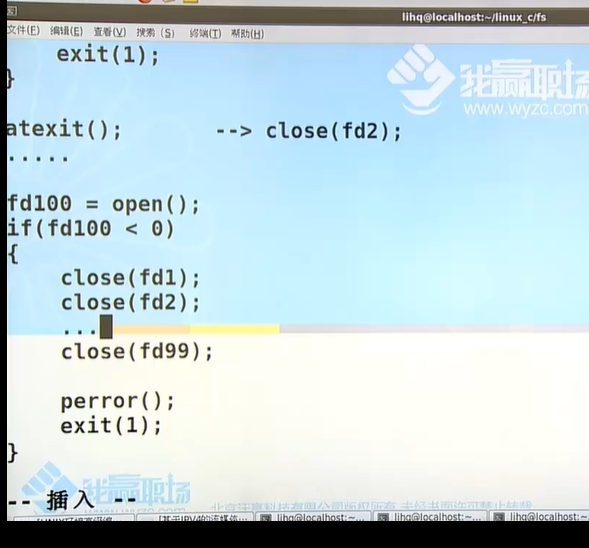


- 遇到申请资源比如open函数，之后在函数之后挂上钩子函数，就可以防止在之后某个操作失败时防止资源泄漏
- atexit / on_exit
- 带下划线的是系统调用
-  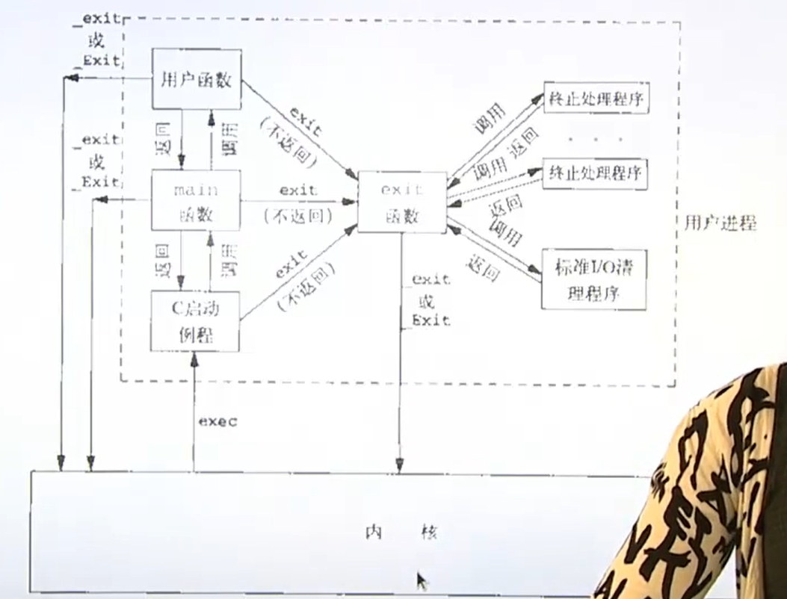


什么时候用 exit 涣散饿时候偶_exit

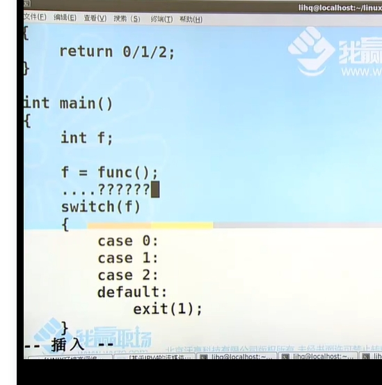


- 错的不行了。什么都不敢做的时候调用 **_exit**

- abort分析

#### 3.命令行参数的分析

-  getopt( )

- getopt_long( )

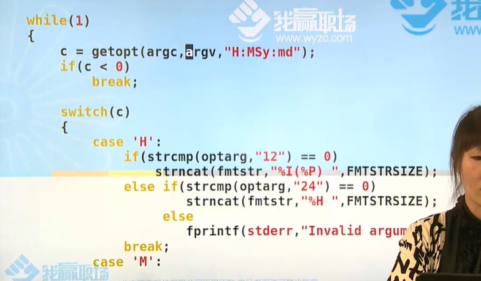

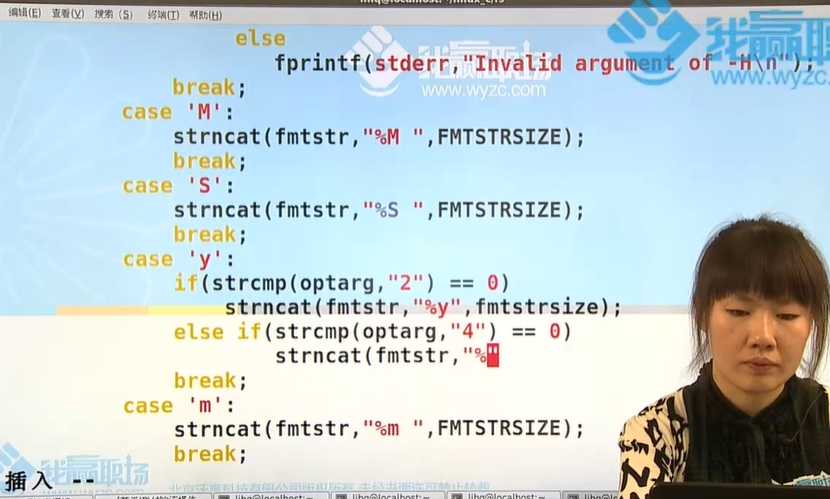


#### 4.环境变量

**export**查看环境变量

程序媛和管理员之间的约定

**environ** 存放环境变量的全局变量

~~~c

#include <stdio.h>
#include <stdlib.h>

extern char **environ;

int main ( )
{	int i = 0;
   for (i = 0 ;environ[i] != NULL;i++)
      puts(environ[i]);
   exit(0);
}
~~~

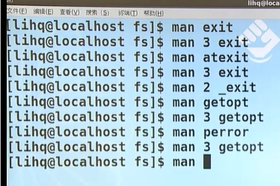


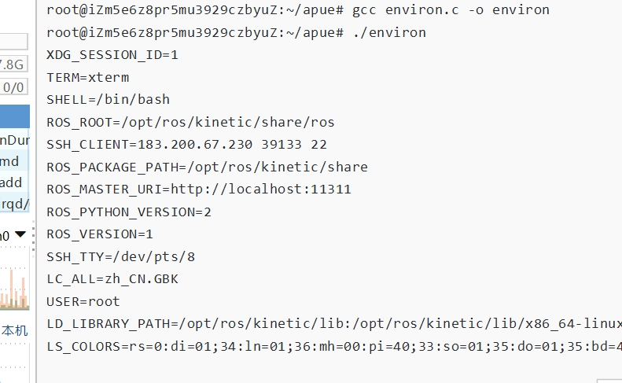


~~~c

#include <stdio.h>
#include <stdlib.h>


int main ( )
{	
      puts(getenv("LANG"));
   exit(0);
}
~~~


**KEY = VALUE**

getenv( )

setenv( )

putenv( )

#### 5 C程序空间布局

0-3G  user 0x0804800-------0xc0000000

argv/env

---

stack

---

null

---

堆空间

---

BSS 段

---

已初始化段

text

最后1G 内核空间

 

栈

啦啦啦啦啦啦

堆


**pmap（1）指令**

~~~c

~~~


#### 6 库

​	动态库

​	静态库

​	手工装载库（内核模块加载）

​	**dlopen**

​	**dlclose**

​	**dlerror**

​	**dlsym**


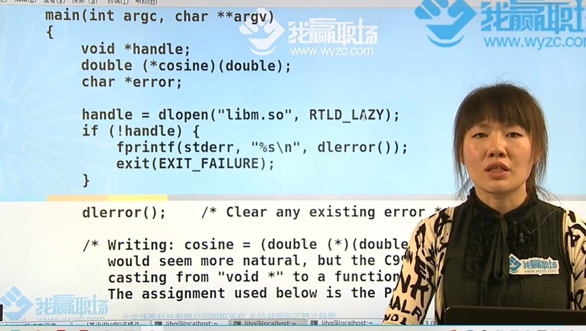

​	****

#### 7 函数跳转


~~~c
setjmp();
longjmp( );
//安全跨函数跳转，长返回/跳转
~~~

~~~c
#include <stdlib.h>
#include <stdio.h>

static void a(void){
   printf("%s( ):begin.\n",__FUNCTION__);
   
   printf("%s( ):call b( )\n",__FUNCTION————)
   
   a( );
   
    printf("%s:b( )end",__FUNCTION__);
      
   printf("%send\n",__FUNCTION__);
   
   
}

static void b(void){
   printf("%s( ):begin.\n",__FUNCTION__);
   
   printf("%s( ):call c( )\n",__FUNCTION————)
   
   a( );
   
    printf("%s:c( )end",__FUNCTION__);
      
   printf("%send\n",__FUNCTION__);
   
   
}

static void c(void){
   printf("%s( ):begin.\n",__FUNCTION__);
   
   printf("%s( ):call d( )\n",__FUNCTION————)
   
   a( );
   
    printf("%s:d( )end",__FUNCTION__);
      
   printf("%send\n",__FUNCTION__);
   
   
}


int main ( ){
   printf("%s( ):begin.\n",__FUNCTION__);
   
   printf("%s( ):call a( )\n",__FUNCTION————)
   
   a( );
   
    printf("%s:a( )end",__FUNCTION__);
      
   printf("%send\n");
   
   exit(0);
   
}
~~~

- 设置跳转点时候的工作

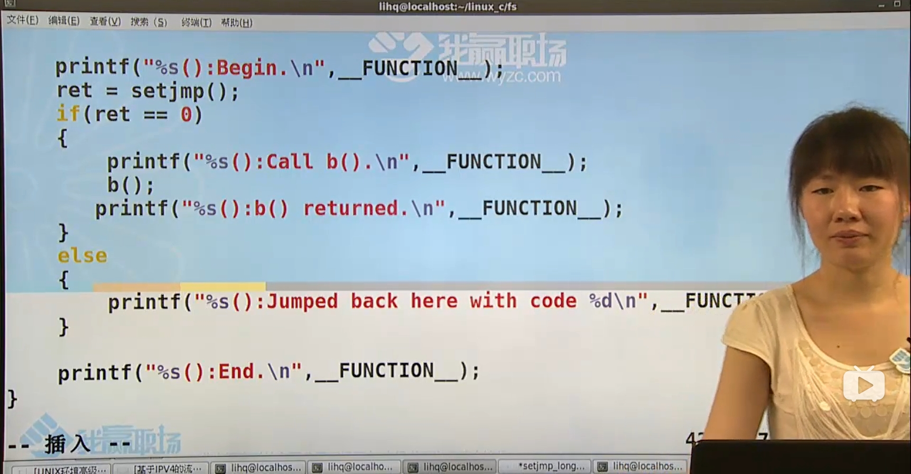

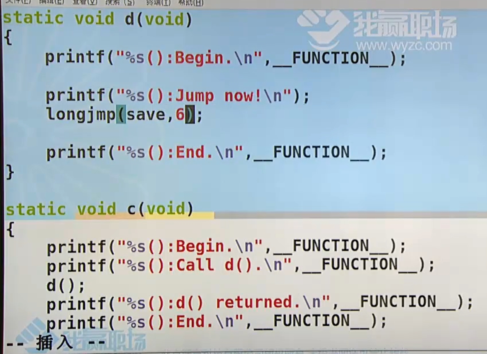


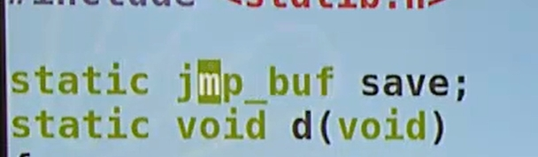


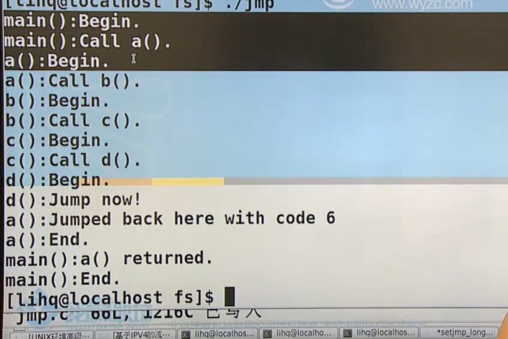


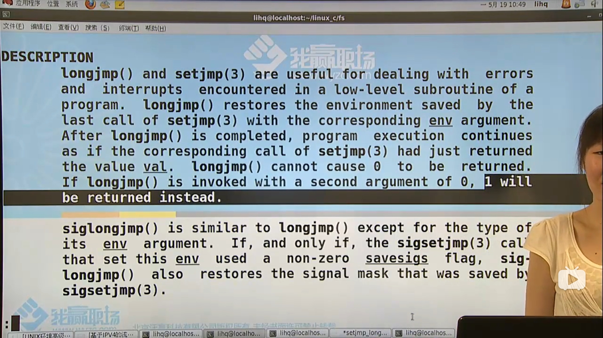


#### 8 资源的获取及控制


**ulimit  -a**

~~~c
root@iZm5e6z8pr5mu3929czbyuZ:~/apue# ulimit -a
core file size          (blocks, -c) 0
data seg size           (kbytes, -d) unlimited
scheduling priority             (-e) 0
file size               (blocks, -f) unlimited
pending signals                 (-i) 31762
max locked memory       (kbytes, -l) 64
max memory size         (kbytes, -m) unlimited
open files                      (-n) 65535
pipe size            (512 bytes, -p) 8
POSIX message queues     (bytes, -q) 819200
real-time priority              (-r) 0
stack size              (kbytes, -s) 8192
cpu time               (seconds, -t) unlimited
max user processes              (-u) 31762
virtual memory          (kbytes, -v) unlimited
file locks                      (-x) unlimited

~~~

#### 函数

 `getrlimit( );` 获取资源量

 `setrlimit( );`

~~~c
       #include <sys/time.h>
       #include <sys/resource.h>

       int getrlimit(int resource, struct rlimit *rlim);
       int setrlimit(int resource, const struct rlimit *rlim);

       int prlimit(pid_t pid, int resource, const struct rlimit *new_limit,
                   struct rlimit *old_limit);


//普通用户可以降低自己的硬性限制，不能升高硬性限制	，root可以升高硬限制	

    struct rlimit {
               rlim_t rlim_cur;  /* Soft limit */
               rlim_t rlim_max;  /* Hard limit (ceiling for rlim_cur) */
           };

~~~

### 进程基本知识

1. 进程标识符 PID

   ​	类型 **pid_t**  有符号十六位整型数 3w+

   

   


1. 进程是如何产生
   1. `vfork( );`
   2. `fork`
2. 进程的消亡及释放资源
3. exec函数族的使用
4. 用户权限及组权限（身份如何切换）
5. 观摩课：什么叫解释器文件
6. `system( );`
7. 进程会计
8. 进程时间
9. 守护进程
10. 系统日志