**单位内老黄蛇一般都比老黄牛多，鞭打快牛是常态，老实人的存在就是用来吃亏的，评功论奖要向会拍马屁(会来事)的老黄蛇倾斜，队伍才好抓，中层领导才好干，上层领导要是还走这一套是走不远的，风险大。另外，埋头干事的老黄蛇是最多的，工作不主动，就盯着自己的一亩三分地，多干点肉都要掉下来，没事儿就东张西望的看路找眼色(抬头看路)，还都觉得自己是老实人,然而中层领导就应该提拔这样的人**

# 第十章：泛型算法

> 标准库没有给容器添加功能，而是提供一组算法，算法独立于特定的容器，这些算法是通用的 generic 泛型的。**可用于不同类型的容器和不同类型的元素**

~~~c++
auto resault = find(vec.cbegin(),vec.end(),val);
~~~

### 初识泛型算法

##### 只读算法

##### 写容器算法

##### back_inserter

保证算法有足够元素空间来容纳输出数据的方法是 **插入迭代器**


### 定制操作

### 再探迭代器

### 泛型算法结构

## 关联容器

~~~c++
pair<string,vector<int>> line;
~~~

~~~c++
pair<T1,T2> p;
pair<T1,T2> p(v1,v2);
pair<T1,T2> p = {v1,v2};
p.first
p.second
p1 relop p2
   
~~~

~~~c++
pair<string,int>
process(vector<string> &v){
   if (!v.empty)
      return {v.back(),v.back().size()}; //列表初始化
   if(!v.empty)
      return make_pair(v.back,v.back().size());
   else
      return pair<string,int>();//隐式构造返回值
}
~~~

#### 操作

~~~c++
key_type    //此容器的关键字类型
mapped_type //每个关键字对应的类型
value_type //对于set 和ket_type相同
   		  //对于map 为pair<const key_type, mapped_type>
~~~

set中保存的值是关键字

map中元素是关键字-值对

我们不能改变一个元素的关键字，因此这些pair的关键字部分是 `const`的

~~~c++
map<string,int>::value_type v3 ; //pair<const string,int>
map<string,int>::map_type v4; // int 

~~~

只有map类型定义了 mapped_type ：：unordered_map , unordered_multimap , multimap , map 

#### 关联容器的迭代器

解引用迭代器得到一个 value_type 的值的引用，对map而言 value_type 是pair类型，first成员和second成员


~~~c++
auto map_it = word_count.begin();//获得指向word_count 的一个元素的迭代器
count << map_it->first;//打印元素的关键字
count << "" << map_it-second;//打印此元素的值
map_it->first = "new key"; // first代表关键字，是const的不能改变
++map_it->second ; //可以通过迭代器改变元素
~~~

##### set的迭代器是const的

set的关键字只读的

##### 遍历关联容器

##### 关联容器算法

提供了一个 find 接口，通过给定的关键字直接获取元素，比泛型find快很多

##### map的insert

~~~c++
word_count.insert({word,1});
word_count.insert(make_pair(word,1));
word_count.insert(pair<string,size_t)(word,1);
word_count.insert(map<string,size_t>::value_type(word,1));
~~~


| c.insert(v)     | v是value_type类型的对象，用来构造一个数                      |
| --------------- | ------------------------------------------------------------ |
| c.emplace(args) | 只有当元素的关键字不存在时才插入，函数返回一个pair，包含一个迭代器 |
|                 |                                                              |
|                 |                                                              |
|                 |                                                              |
|                 |                                                              |

当对map进行下标操作时返回一个 mapped_type类型，当对map进行解引用时返回一个value_type类型

# 操作系统

> 在linux文件系统中，是以块为单位存储信息的，为了找到某一个文件在存储空间中存放的位置，用i节点对一个文件进行索引。I节点包含了描述一个文件所必须的全部信息。所以i节点是文件系统管理的一个数据结构


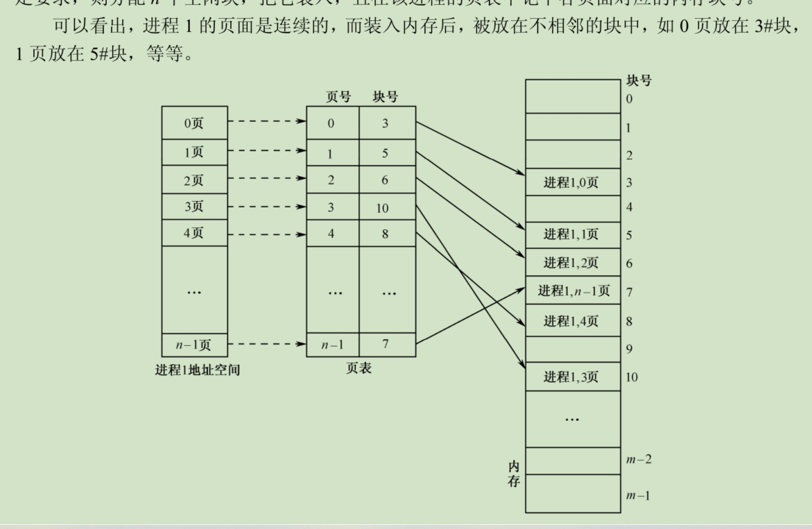

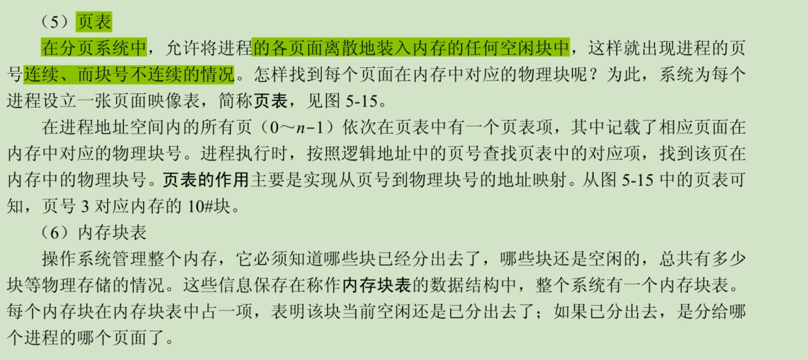

通常，页表都放在内存中。当进程需要访问某个逻辑地址中的数据时，**分页地址映像硬件自**
**动按页面大小将 CPU 得到的有效地址（相对地址）分成两部分：页号和页内地址(p, d)，**见图 5-16。
在这个示例中，前 20 位表示页号，后 12 位表示页内地址。以页号 p 为索引去检索页表。这种查
找操作由硬件自动进行。从页表中得到该页的物理块号，把它装入物理地址寄存器中。**同时，将**
**页内地址 d 直接送入物理地址寄存器的块内地址字段中。**这样，物理地址寄存器中的内容就是由
二者拼接成的实际访问内存的地址，从而完成从逻辑地址到物理地址的转换。图 5-16 是分页系统
的地址转换机构。

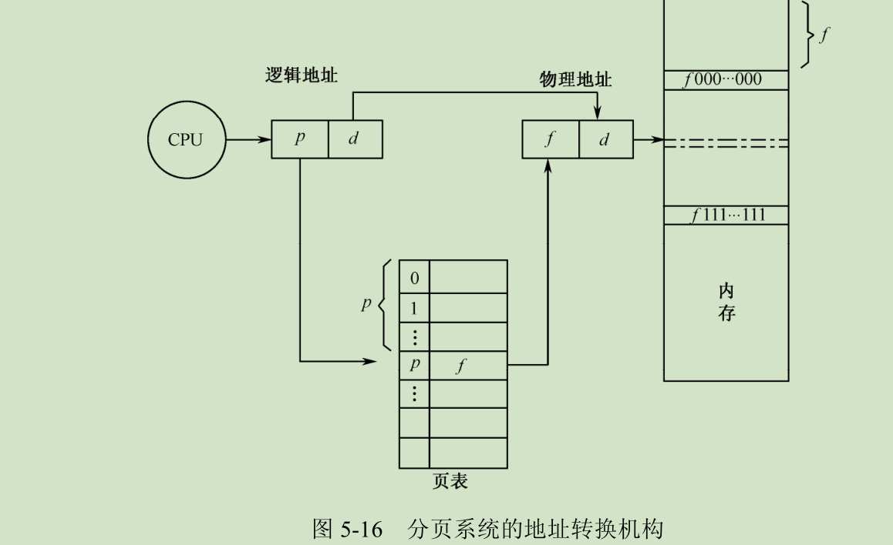

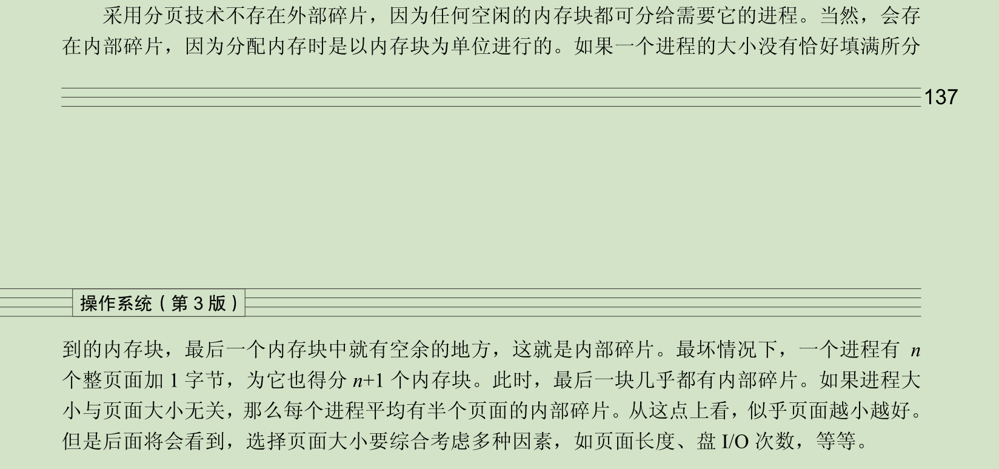

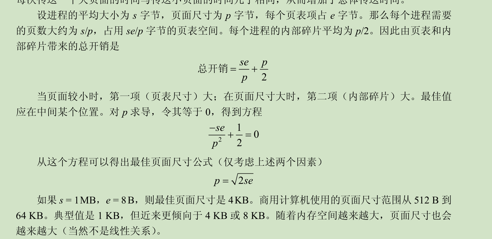

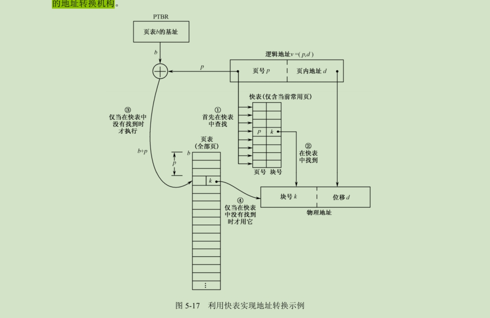

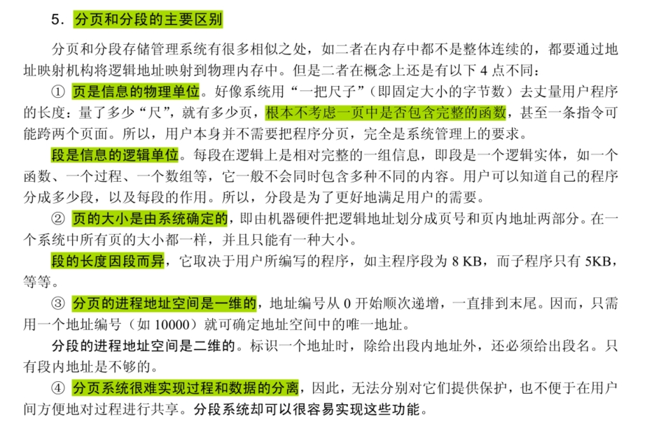

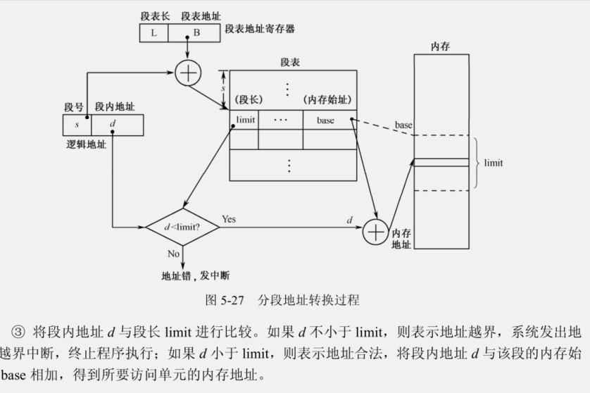

# 操作系统第三章 ：死锁


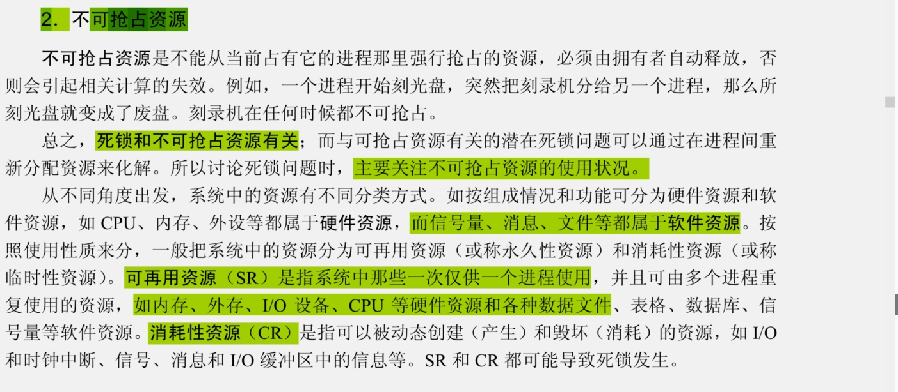

所谓死锁，是指在一个**进程集合中的每个进程都在等待仅由该集合中的另一个进程才能引发**
**的事件而无限期地僵持下去的局面。**计算机系统产生死锁的根本原因就是资源有限且操作不当。


由以上分析可知，当计算机系统同时具备下面 4 个必要条件时，会发生死锁。换句话说，只
要下面 4 个条件中有一个不具备，系统就不会出现死锁。
1．**互斥条件**

独占资源在一段时间内只能由一个进程占有，不能同时被两个及其以上的进程占有。例如，
平板式绘图仪、CD-ROM 驱动器、打印机等。必须在占有该资源的进程主动释放它之后，其他进
程才能占有该资源。这是由资源本身的属性所决定的。

2．**占有且等待条件**

**进程至少已经占有一个资源，但又申请新的资源**。由于该资源已被另外进程占有，此时该进
程阻塞。但是它在等待新资源时，仍继续占有已分到的资源。

**3．不可抢占条件**

一个进程所占有的资源在用完之前，其他进程不能强行夺走该资源，只能由该进程用完之后
主动释放。

**4．循环等待条件**

存在一个进程等待序列{p 1 , p 2 ,…, p n }，其中，p 1 等待 p 2 所占有的某个资源，p 2 等待 p 3 所占有
的某个资源，……，而 p n 等待 p 1 所占有的某个资源，从而形成一**个进程循环等待环。**
上面提到的这 4 个条件在死锁时会同时发生。也就是说，只要有一个必要条件不满足，则
死锁就可以排除。另外，这 4 个条件也不是完全无关的，如循环等待条件就隐含着前三个条件
的结果。


**必须同时具备 4 个条件才能出现死锁。**

##### 环路

总之，如果资源分配图中没有环路，那么系统不会陷入死锁状态。如果存在环路，那么系统

有可能出现死锁，但不确定


### 3.3 死锁的预防


###### 3.3.1 破坏互斥条件

一方面，独占资源必定具有互斥条件。

另一方面，可共享的资源不需要互斥存取，它们不会包含在死锁之中。

###### 3.3.2 破坏占有且等待条件

需要保证一个进程无论什么时候都可申请它没有占有的任何其他资源。**一种办法是预分资源策略，即在一个进程开始执行之前就申请并分到所需的全部资源，**从而它在执行过程中就不再需要申请另外的资源。由于预先就为它把所需资源都准备好了，从而保证它能运行到底。在实现时，一个进程申请资源的系统调用要先于其他的系统调用。这就是资源的静态分配。

**另一种办法是“空手”申请资源策略，即每个进程仅在它不占有资源时才可以申请资源。**一
个进程可能需要申请并使用某些资源，在它们申请另外附加资源之前，必须先释放当前分到的全
部资源。

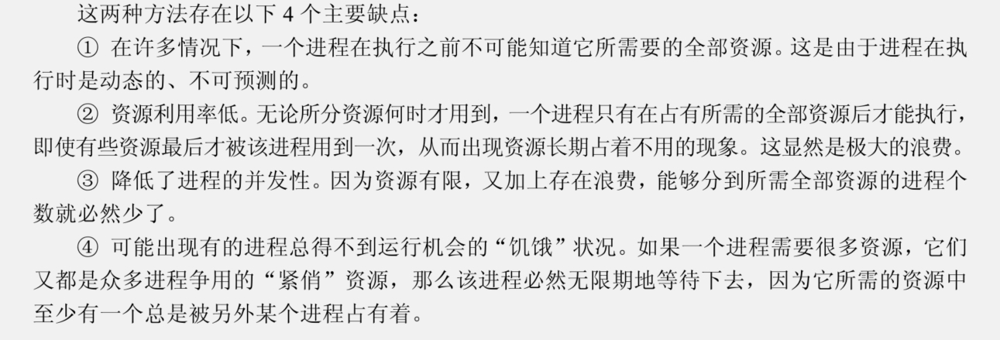


###### 3.3.3 破坏非抢占条件

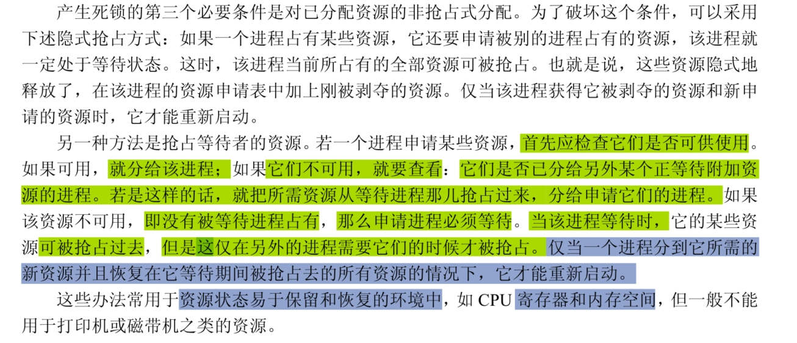


3.3.4 破坏循环等待条件

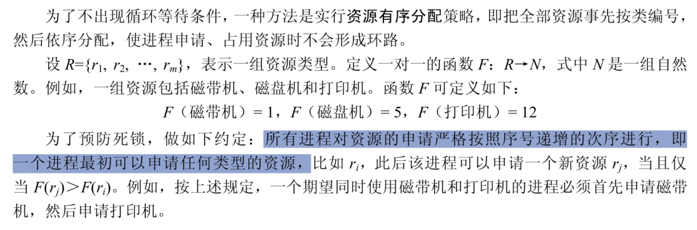

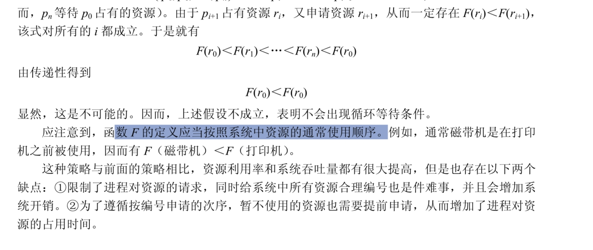


### 3.4 死锁的避免

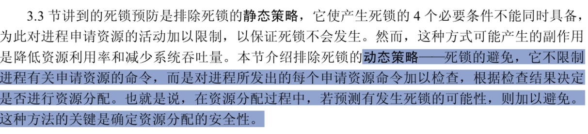


##### 3.4.1 安全状态

**安全序列**  针对当前分配状态来说，系统至少能够按照某种次序为每个进程
分配资源（直至最大需求），并且使它们依次成功地运行完毕，这种进程序列{p 1 , p 2 ,…, p n }就是安
全序列。

如果存在这样一个安全序列，则系统此时的分配状态是安全的；如果系统不存在这样一
个安全序列，则系统是不安全的。


#### 银行家算法

针对多体资源类的情况，最著名的避免死锁的算法
叫做“银行家算法”（Banker’s Algorithm）。这是由 Dijstra 首先提出并加以解决的。


## 死锁的检测和恢复

一种简便的办法
****是系统为进程分配资源时，不采取任何限制性措施，但是提供检测和解脱死锁的手段，即能够发**
**现死锁，并从死锁状态中解脱出来。因此，在实际的操作系统中，往往采用死锁的检测与恢复方**
**法来排除死锁**** 

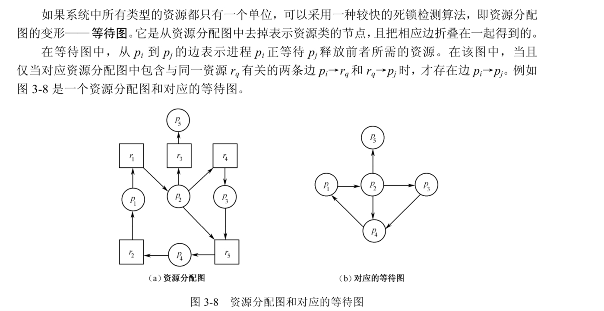


从上面分析看出，死锁检测算法需要进行很多操作，因而产生何时调用检测算法的问题。它
取决于两个因素：①死锁出现的频繁程度；②有多少个进程受到死锁的影响。
如果频繁出现死锁，就应频繁调用死锁检测算法。一种方法是每当有资源请求时就做检测。
当然，越早发现死锁问题越好，但这样做会占用大量 CPU 时间。另一种方法是定时检测，每隔一
段时间（如若干分钟）查一次，或者当 CPU 使用率降到某个下限值时去做检测。因为当死锁涉及
较多进程时，系统中没有多少进程可以运行，CPU 就会经常闲置。

#### 3.5.3 从死锁中恢复

主要有三种方式：通过抢占资源、回退执行和杀掉进程实现恢复


##### 1．通过抢占资源实现恢复


##### 2．通过回退执行实现恢复

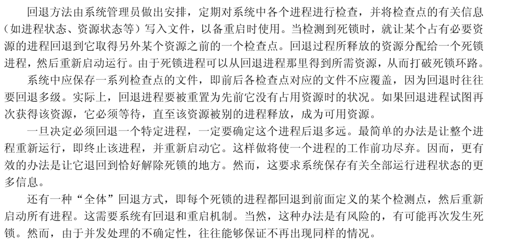

##### 3．通过杀掉进程实现恢复

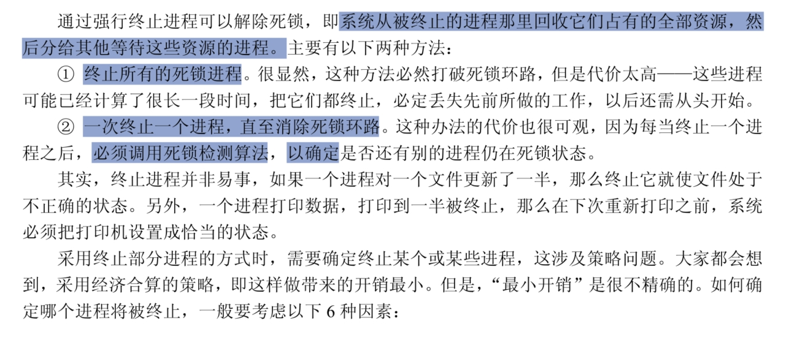


| **① 进程的优先级。<br/>**                                    |
| ------------------------------------------------------------ |
| **② 进程已计算了多长时间，该进程在完成预定任务之前还要计算多长时间。<br/>** |
| **③ 该进程使用了多少和什么类型的资源（例如，这些资源可简单地抢占吗？）。<br/>** |
| **④ 为完成任务，它还需要多少资源？<br/>**                    |
| **⑤ 有多少个进程被终止？<br/>**                              |
| **⑥ 这个进程是交互式进程，还是批处理进程？**                 |
|                                                              |

#### 3.5.4 “饥饿”和活锁的概念

##### 1.“饥饿”概念

系统会出现这样一种情况：在可以预计的时间内，某个或某
**些进程永远得不到完成工作的机会，因为它们所需的资源总是被别的进程占有或抢占**。这种状况
称作“饥饿”或者“饿死”（Starvation）。

可以看出，饥饿不同于死锁，但与死锁相近。**死锁的进程都必定处于阻塞状态，而饥饿进程**
**不一定被阻塞，可以在就绪状态。**
**利用先来先服务的资源分配策略可以避免饥饿现象。**利用这种方式，等待最久的进程可以成
为下一个被服务的进程。随着时间的推移，任何给定进程最终都会成为最“老”的，从而获得所
需的资源，进而完成自己的工作。

##### 2．活锁概念

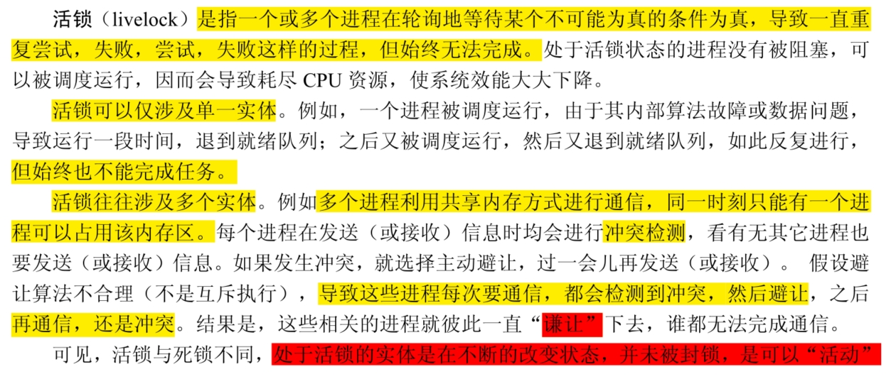


**活锁和饥饿的区别在于，活锁是忙式等待，占用 CPU 且不会主动让出 CPU；而饥饿是调度**
**时总是让出 CPU，造成无限期地等下去**

### 3.6 处理死锁的综合方式

**处理死锁的三种基本方法，这就是死锁的预防、死锁的避免、死锁的检测和恢复。这**
**三种方法有不同的资源分配策略和不同的方式，各有其优点和缺点**

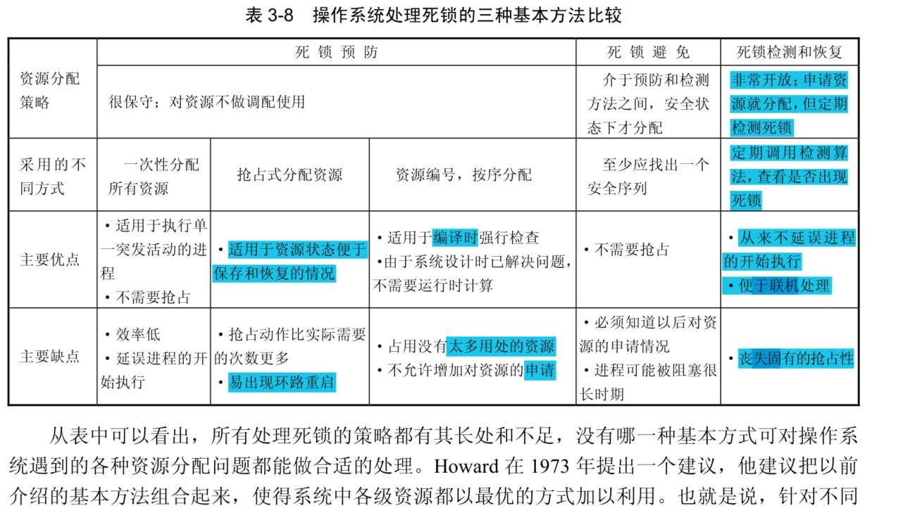

**① 把所有资源组合成若干不同的资源类。**

**② 为了预防在资源类间因循环等待而出现死锁，预先使用线性排序策略对它们编号。**

**③ 在一个资源类内部，采用最适合于该类资源的算法。**

例如，考虑下述资源分类的情况：
① **可对换空间**：用于对换进程的辅助存储器上的存储块。
② **进程资源**：可分配的设备，如磁带机、文件等。
③ **内存：**可按页或段为单位分给进程。
④ **内部资源：**如 I/O 通道等。


上面列出的顺序表示**分配给资源的序号。**考虑一个进程在其生存期中所经历的一系列步骤，
这种编号是合理的。在每个资源类内部可以采用下述策略：

**① 可对换空间。采用预先一次性分配方式，破坏占有且等待的死锁条件。**因为通常知道进程
的最大存储需求，所以这种办法是可行的。这种方式能够避免死锁发生。

**② 进程资源。因为能让进程预先声明自己需要多少这类资源，所以采用死锁避免的方法往往**
**是有效的。**通过对这类资源的编号也能预防死锁。

**③ 内存。利用抢占内存的方式是预防死锁的最合适的策略。**当一个进程被抢占，它就简单地
对换到辅助存储器上，释放所占用的内存空间，从而消除死锁。

**④ 内部资源。通过资源编号可以预防死锁。**

**还有第 4 种方法，即采取**
**“鸵鸟政策”—— 完全忽略死锁问题。**如果一个系统采用这种方法，它既不保证死锁从不发生，
又不提供死锁检测和恢复的机制，那么，遇到死锁确实发生了，没有办法知道死锁出现的情况。
在此情况下，未被发现的死锁会导致系统性能下降，因为资源被进程占有，而这些进程无法运行；
而且越来越多的进程会进入死锁状态，因为当它们申请这些资源时无法得到满足，从而被阻塞，
而且它们很可能还占有其他资源；最后，整个系统停止工作。为使系统工作，只好手工重新启动。
尽管这种方式似乎不是处理死锁问题的可行方式，然而它却用于某些操作系统（如 UNIX 系
统）**。在很多系统中，死锁并不经常发生（如一年一次），该方式在代价上就比死锁预防、死锁避**
**免、死锁检测和恢复这三种方式便宜得多**。所以，工程设计人员和数学家对此问题的观点不同，
前者考虑死锁出现的频度与其危害的严重程度，而后者要想方设法彻底防止死锁的产生，不管代
价如何。
在某些情况下，系统可能处于冻结状态，但并未死锁。例如，一个实时进程正以最高优先级
运行（或者任一进程以非抢占方式运行），并且它从不把控制权返回操作系统。这时，系统出现冻
结状态，无法做别的事情。针对这种非死锁条件，必须利用手工恢复方式让系统重新正常工作。
很显然，这比使用那些解除死锁的技术要简单。


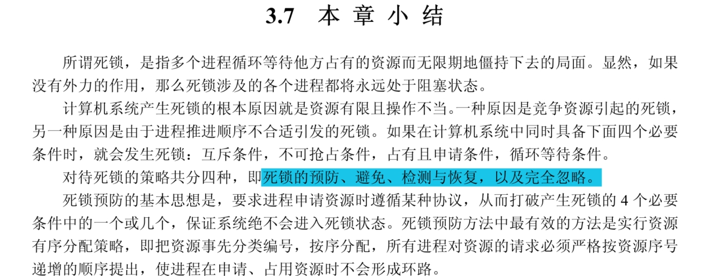


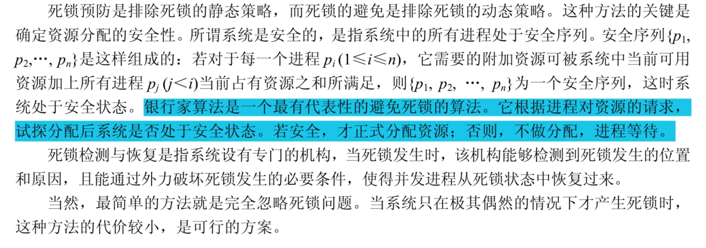


# 智能指针

~~~c++

shared_ptr<T> SP 空智能指针
unique_ptr<T> up 
p 作为条件判断，若p指向一个对象则为true
*p 解引用p获得指向的对象
p-mem ====== (*p).mem
p.get() 得到p中保存的真实指针
swap(q,p)
q.swap(p)
~~~

~~~c++

make_shared<T> (args) // 返回shar_ptr 指向一个动态分配的类型为T的对象，使用args初始化对象
shared_ptr<T> p(q) //拷贝赋值，q中的指针必须转化能为T*，递增q中的计数器

p = q  // 所保存的指针都能互相转换，递减p的技术，递增q的计数，q计数为0则释放资源
   
p.unique()  //p.use_count() == 1 返回true 否则返回 flase
p.use_count() //   返回与p共享对象的智能指针数量，可能很慢

~~~


#### make_shared

最安全的分配和使用动态内存的方法是调用一个名为 **make_shared**的标准函数

~~~c++
shared_ptr<string> p4 = make_shared<string>(19,'aaa')
~~~

调用make是传递的参数必须与string的某个构造函数相匹配

~~~c++
auto p7 = make_shared<vector<string>>();
~~~

#### shared_ptr 拷贝&赋值

关联的计数器， **引用计数** 

* 作为参数赋值给函数
* 进行拷贝构造
* 返回一个函数返回值

计数变为零那么，会自动释放管理的对象

######  shared_ptr 析构函数会递减指向的对象的引用计数，成为零时释放

~~~
如果智能指针放在一个容器中，而后不需要全部元素，反而只使用一部分，要记得用eraser
删除不再需要的元素
~~~

#### 使用了动态生存周期的类

三种原因

- 不知道自己需要多少对象
- 不知道所需对象的准确类型
- 程序需要在多个对象间共享数据

资源与对象独立的生存周期

~~~c++
blob<string> b1;
{
   blob<string> b2 = {"a","aa","aaa"};
   bi = b2;
   //假如b2 被销毁但是b2中的元素不能被销毁
}
~~~

与动态内存的一个常见的原因是需要允许多个对象共享相同的状态

~~~c++
class Blob{
   public:
   typedef std::vector<std::string>::size_type size_type;
   Blob();
   Blob(std:initializer_list<std::string> il);
   size_type size()const {return data->size};
   bool empty() const {return data->empty};
   //添加删除元素
   void push_back(const std::string &t){data->push_back(t);}
   void pop_back();
   //访问元素
   std::shared_ptr<std::vector<std::string>> data;
   //如果data[i]不合法抛出异常
   void check(size_type i , const std::string &msg) const;
};
~~~

~~~c++
Blob::Blob: data(make_shared<vector<string>>()) {}
Blob(std:initializer_list<std::string> il): data(make_shared<vector<string>>()) {}
~~~

~~~c++
void check(size_type i,const string &msg) const{
   if (i >= data->size())
      throw out_of_range(msg);
}
~~~

~~~c++
string& Blob::front()
{
   check(0,"empty");
   return data->front();
}
string& Blob::back()
{
   check();
   return data->back();
}
`````````
~~~

#### 直接管理内存

##### 使用new

`int *pi = new int;//pi指向动态分配的未初始化的无名对象`

~~~c++
vector<int> *p = new vector<int>{1,2,3,4,5,6,7,8,9,0};
string *p = new int;
~~~

只有括号里只有单一初始化其时才可以使用auto

~~~c++
auto p1 = new auto(obj);
auto p2 = new auto{a,b,c}; //error 括号中只能有单个初始化器
~~~

##### 动态分配的const对象

~~~c++
const int *p =new const int(33213213);
const string *p = new const string;
~~~

**动态分配的const初始化对象必须进行初始化**返回的指针是const的

##### delete 

`delete p;`

* 释放销毁给定指针指向的对象
* 释放对应的内存

##### 指针值和delete

不能重复释放；只能释放由他生成的对象


空悬指针

在指针即将离开作用域之前释放掉它所关联的内存

### shared_ptr 和 new结合使用


不能讲一个内置指针隐式转化为一个智能指针们必须使用直接初始化形式，也不能在智能指针上返回一个普通指针。

~~~c++
shared_ptr<int> p1 = new int(1024); //ERROR new返回 int* 是不能创建出智能指针的
shared_ptr<int> p2(new int(1024)); // TRUE

shared_ptr_ptr<int> clone(int p){
   return new int(p);    // ERROR 隐式转换为shared_ptr<int> 
}

shared_ptr<int> clone(int p){
   return shared_ptr<int>(new int(p));
}
~~~

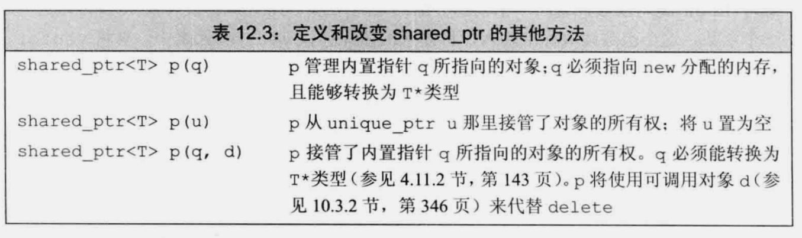


